## Conversation API Channel Support

This document gives detailed description of Conversation API channel support.

### Viber Business Messages

Viber Business Messages (VBM) supports 3 types of business account: 1way, 2way
and session:

* 1way is an account which can send one-way messages only - the contact cannot
enter a reply from the device
* 2way accounts allow contacts to reply
* session accounts cannot initiate the conversation to the contact. Instead,
the conversation must be started by the contact. Session accounts only support
text and image messages.

For all types of accounts the phone number is the contact identifier of the
recipient of the business messages (i.e., channel recipient identity).

Conversation API supports 1way and 2way Viber BM accounts.

#### Channel Configuration

##### Sending Config

To start sending VBM messages you need a Conversation API **app** with
`channel_credentials` for VIBERBM channel. Example, **app** is given in the
following snippet:

```json
{
    "channel_credentials": [
        {
            "channel": "VIBERBM",
            "static_bearer": {
                "claimed_identity": "{{VBM_SERVICE_ID}}"
            }
        }
    ]
}
```

You need to replace `{{VBM_SERVICE_ID}}` with your VBM service ID.
Also make sure the IP addresses of the Conversation API VIBERBM adapters
are whitelisted in your VBM account configuration.
Contact Conversation API team for details of which IPs should be whitelisted.

##### Receiving Config

To start receiving contact messages (replies) and delivery receipts for sent
messages you need to configure the `CallBack URL` and `Message URL` of your
VBM account to point to Conversation API VIBERBM adapter URL corresponding to
your Conv API **app**.
Contact Conversation API team if unsure which are the adapter URLs you need
to use.

You also need to configure at least one Conversation API webhook which
will trigger POST callbacks to the given URL.
The triggers which are relevant for VBM are:

* MESSAGE_DELIVERY - delivery receipts for business messages
* MESSAGE_INBOUND - inbound messages e.g., contact replies 
* UNSUPPORTED - Conversation API delivers VBM user opt-in/out events as UNSUPPORTED channel notifications 

#### Rich Message Support

This section provides detailed information about which rich messages are
natively supported by VBM channel and what transcoding is applied in
other cases.

##### Sending Messages

###### Text Messages

Text messages are natively supported by VBM channel.

---

Conversation API POST `messages:send`

```json
{
    "message": {
        "text_message": {
            "text": "Text message from Sinch Conversation API."
        }
    }
}
```

Rendered message:

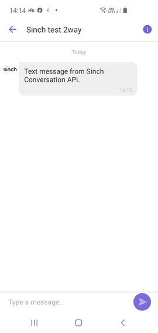

###### Media Messages

VBM support Image messages natively:

---

Conversation API POST `messages:send`

```json
{
    "message": {
        "media_message": {
            "url": "https://1vxc0v12qhrm1e72gq1mmxkf-wpengine.netdna-ssl.com/wp-content/uploads/2019/05/Sinch-logo-Events.png"
        }
    }
}
```

Rendered message:

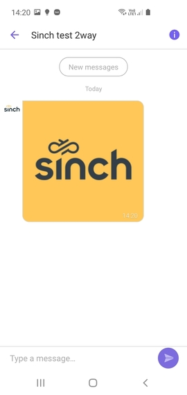

---

Video and other types of media messages render as a link:

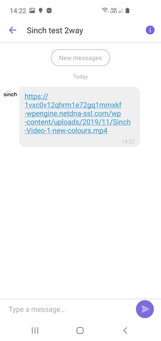


###### Choice Messages

VBM channel provides native support for single choice (URL, Call, or Location) **Choice Messages**:

---

__URL Choice__

Conversation API POST `messages:send`

```json
{
    "message": {
        "choice_message": {
            "text_message": {
                "text": "What do you want to do?"
            },
            "choices": [
                {
                    "url_message": {
                        "title": "More info",
                        "url": "https://www.sinch.com"
                    }
                }
            ]
        }
    }
}
```

Rendered message:

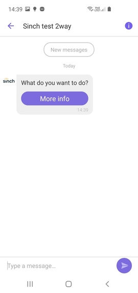

---

__Call Choice__

Call choice renders a button which opens Viber keypad with the phone
number in the request.

```json
{
    "message": {
        "choice_message": {
            "text_message": {
                "text": "What do you want to do?"
            },
            "choices": [
                {
                    "call_message": {
                        "title": "Call Choice Message",
                        "phone_number": "+46732000000"
                    }
                }
            ]
        }
    }
}
```

Rendered message:

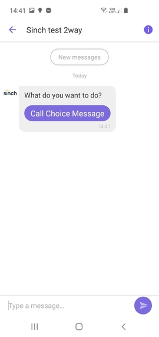

---

__Location Choice__

Location choice renders a button which opens Google Maps with the coordinates
of the location.

```json
{
    "message": {
        "choice_message": {
            "text_message": {
                "text": "What do you want to do?"
            },
            "choices": [
                {
                    "location_message": {
                        "title": "Location Choice Message",
                        "label": "Enriching Engagement",
                        "coordinates": {
                            "latitude": 55.610479,
                            "longitude": 13.002873
                        }
                    }
                }
            ]
        }
    }
}
```

Rendered message:

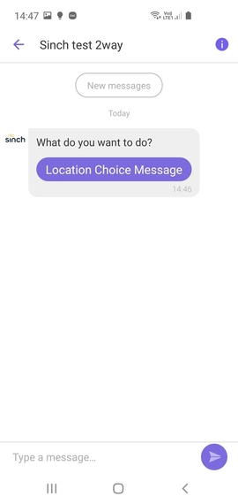

---

__Text Choice or Multiple Choices__

There is no native support for suggested replies or multiple choices in VBM.

```json
{
    "message": {
        "choice_message": {
            "text_message": {
                "text": "What do you want to do?"
            },
            "choices": [
                {
                    "text_message": {
                        "text": "Suggested Reply Text"
                    }
                },
                {
                    "url_message": {
                        "title": "More info",
                        "url": "https://www.sinch.com"
                    }
                },
                {
                    "call_message": {
                        "title": "Call Choice Message",
                        "phone_number": "+46732000000"
                    }
                },
                {
                    "location_message": {
                        "title": "Location Choice Message",
                        "label": "Enriching Engagement",
                        "coordinates": {
                            "latitude": 55.610479,
                            "longitude": 13.002873
                        }
                    }
                }
            ]
        }
    }
}
```

Rendered message:

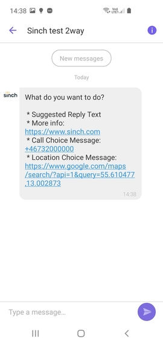

###### Card Messages

VBM supports natively Card messages with one URL, Call, or Location choice.
The media message in the Card should point to an image.

---

Conversation API POST `messages:send`

```json
{
    "message": {
        "card_message": {
            "title": "This is the card title",
            "description": "This is the card description",
            "media_message": {
                "url": "https://1vxc0v12qhrm1e72gq1mmxkf-wpengine.netdna-ssl.com/wp-content/uploads/2019/05/Sinch-logo-Events.png"
            },
            "choices": [
                {
                    "url_message": {
                        "title": "More info",
                        "url": "https://www.sinch.com"
                    }
                }
            ]
        }
    }
}
```

Rendered message:

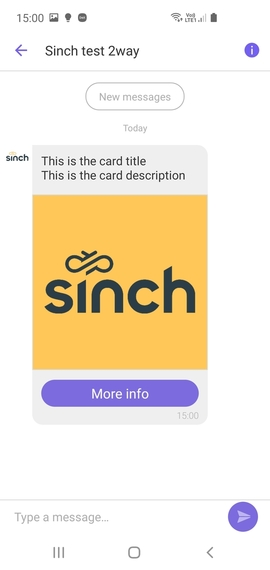

---

Card messages with non-image media, multiple choices or a single suggested reply choice render
as text:

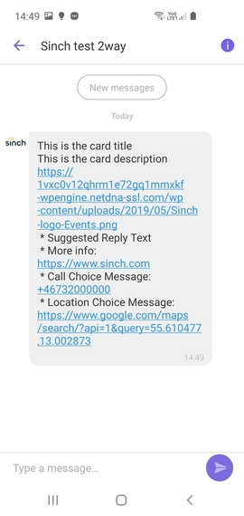

###### Carousel Messages

VBM does not support natively Carousel messages and this is why they are
transcoded and sent as text message by Conversation API.

---

Conversation API POST `messages:send`

```json
{
    "message": {
        "carousel_message": {
            "cards": [
                {
                    "title": "This is the card 1 title",
                    "description": "This is the card 1 description",
                    "media_message": {
                        "url": "https://techcrunch.com/wp-content/uploads/2017/08/butterfly-bubble.jpg?w=1390&crop=1"
                    },
                    "choices": [
                        {
                            "text_message": {
                                "text": "Suggested Reply Text"
                            }
                        }
                    ]
                },
                {
                    "title": "This is the card 2 title",
                    "description": "This is the card 2 description",
                    "media_message": {
                        "url": "https://www.idus.se/en/wp-content/uploads/files/sites/2/2015/04/Message-150x150.png"
                    },
                    "choices": [
                        {
                            "url_message": {
                                "title": "URL Choice Message:",
                                "url": "https://www.sinch.com"
                            }
                        }
                    ]
                },
                {
                    "title": "This is the card 3 title",
                    "description": "This is the card 3 description",
                    "media_message": {
                        "url": "https://1vxc0v12qhrm1e72gq1mmxkf-wpengine.netdna-ssl.com/wp-content/uploads/2019/05/Sinch-logo-Events.png"
                    },
                    "choices": [
                        {
                            "call_message": {
                                "title": "Call Choice Message:",
                                "phone_number": "46732000000"
                            }
                        }
                    ]
                }
            ]
        }
    }
}
```

Rendered message:

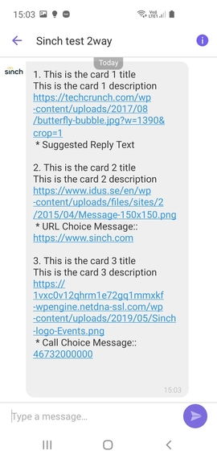

###### Location Messages

VBM does not support natively Location messages and so they are
transcoded and sent as text message by Conversation API.

---

Conversation API POST `messages:send`

```json
{
    "message": {
        "location_message": {
            "title": "Location Message",
            "label": "Enriching Engagement",
            "coordinates": {
                "latitude": 55.610479,
                "longitude": 13.002873
            }
        }
    }
}
```

Rendered message:

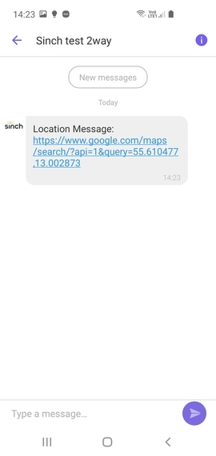

##### Receiving Messages

VBM support only text replies or contact initiated messages.

Conversation API POST to `MESSAGE_INBOUND` webhook:

```json
{
  "app_id": "01E3S8B6YCMRNR0GGM94H80ACX",
  "accepted_time": "2020-04-24T08:02:50.184581Z",
  "message": {
    "id": "01E6NKBV63YG6K01ENEW7S1N80",
    "direction": "TO_APP",
    "contact_message": {
      "text_message": {
        "text": "Hi from contact"
      }
    },
    "channel": "VIBERBM",
    "conversation_id": "01E6K4A8PGZ6MV0GD3C7M901MZ",
    "contact_id": "01E6K4A8N3NANZ05VM0FS80EHD",
    "metadata": "",
    "accept_time": "2020-04-24T08:02:50.179021Z"
  }
}
```

##### Receiving Delivery Receipts

Messages sent on VBM channel have three statuses: DELIVERED, READ and FAILED.
Below is an example for DELIVERED receipt - READ and FAILED differ by the
`status` and `reason` only.
Conversation API POST to `MESSAGE_DELIVERY` webhook:

```json
{
  "app_id": "01E3S8B6YCMRNR0GGM94H80ACX",
  "accepted_time": "2020-04-23T09:55:04.766Z",
  "message_delivery_report": {
    "message_id": "01E6K7CMXY3KHH0AGCTY6D04F2",
    "conversation_id": "01E6JY5HMCADX31SANQ0YE0CH6",
    "status": "DELIVERED",
    "channel": "VIBERBM",
    "reason": "",
    "metadata": ""
  }
}
```

##### Receiving User Opt-In/Out

VBM can at any time opt-in/out of receiving messages by given VBM account.

###### Opt-In

Conversation API POST to `UNSUPPORTED` webhook:

```json
{
  "app_id": "01E3S8B6YCMRNR0GGM94H80ACX",
  "accepted_time": "2020-04-24T08:06:04.078344Z",
  "unsupported_callback": {
    "channel": "VIBERBM",
    "payload": "{\"message_token\":\"5434382642129923939\",\"message_status\":4,\"message_time\":1587715563958,\"phone_number\":\"46702470247\",\"service_id\":111}"
  }
}
```

###### Opt-Out

Conversation API POST to `UNSUPPORTED` webhook:

```json
{
  "app_id": "01E3S8B6YCMRNR0GGM94H80ACX",
  "accepted_time": "2020-04-24T08:06:57.176156Z",
  "unsupported_callback": {
    "channel": "VIBERBM",
    "payload": "{\"message_token\":\"5434382864469978544\",\"message_status\":5,\"message_time\":1587715616968,\"phone_number\":\"46702470247\",\"service_id\":111}"
  }
}
```
