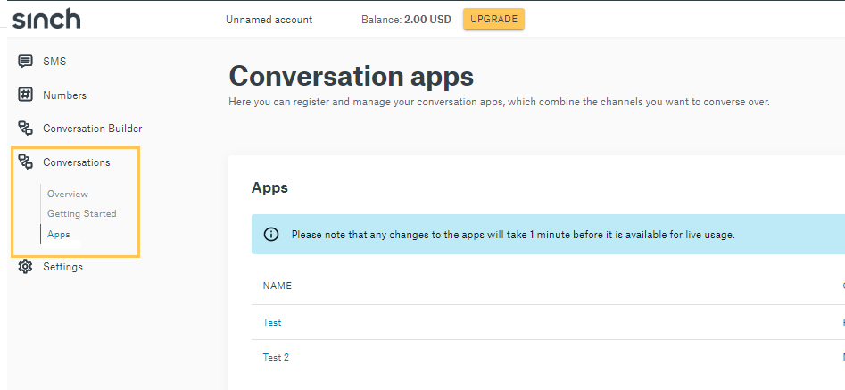
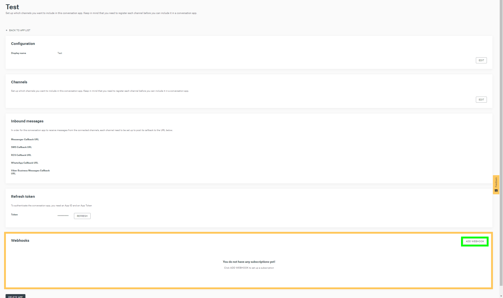
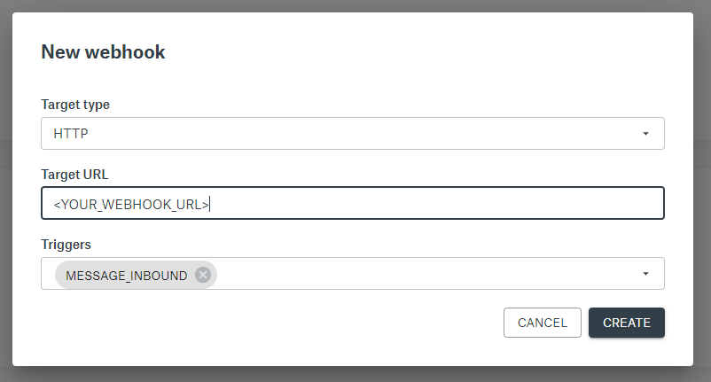
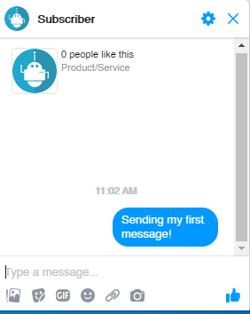
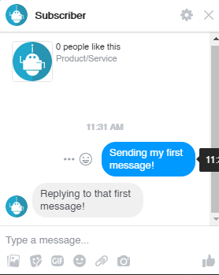

## Receive Message via webhook

This guide will show you how to receive messages from your channel. For this setup, we will look into how to receive a message from Facebook Messenger channel. 
Make sure to have your Facebook account and Conversation App setup before preceding to the next steps.


## Create a simple webhook using Node.js

First create a new node app and then run the following on the command line to create the needed dependency.

`npm install express body-parser --save ` This will install the [Express](https://www.npmjs.com/package/express) http server framework module. 

Now add the following code to your index.js

```javascript
const express = require("express"),
      bodyParser = require("body-parser"),
      app = express().use(bodyParser.json());
      port = 3000;

app.post("/webhook", (req, res) => {
     let body = req.body;
     let {
     message: {
       contact_message: {
         text_message: { text },
       },
     },
  } = body;
  console.log(text);
  res.sendStatus(200);
});

app.listen(port, () => console.log(`Listening to ${port}..`));
```
This code will allow you to listen for incoming messages and will parse out the text message content.
If you want to see the payload not parsed, add `console.log(JSON.stringify(body, null, 2));`

Before you can handle incoming traffic to your local server, you need to open up a tunnel to your local server, for that you can use [ngrok](https://ngrok.com/) tunnel. Open a terminal/command prompt and type: `ngrok http 3000`

The Node app and Ngrok should be running at the same time at port 3000.


---


## Configure webhook in Conversation App
Go to your Conversation App dashboard and select
`Conversations` on the left side menu.

 Then select `Apps` from the drop-down menu and select the App you want to add a webhook too. 

 

 For this example, I will be using **Test** as my app.

 Once you have selected your App, scroll down to **Webhook** section and select the **Add Webhook** button. There will be a pop-up with empty required fields.

 

Fill in the following:

Set **Target Type** to HTTP

Set **Target URL** as your ngrok url

Set **Triggers** with only `MESSAGE_INBOUND`

Since we are only dealing with messages coming in, `MESSAGE_INBOUND` will be the only trigger used.



Now your webhook is setup with Conversation App.

---

## Start a Conversation

Now that your webhook is setup with Conversation App and ngrok along with your node app are running and listening to port 3000- it's time to test the webhook.


Open up Facebook Messenger and send a message to your test account. If you do not have an account, please look into [Send a message with Facebook Messenger](doc:conversation-send-a-message-with-fb-messsenger) before proceeding.



if you did everything correctly, you will receive a `status 200 OK` on ngrok and the text message on your console log.


---

## Sending a reply via Webhook

Copy the following code on top of your current webhook and then re-run your node application. 

```javascript 

const express = require('express');
      bodyParser = require('body-parser');
      app = express().use(bodyParser.json());
      port = 3000;

// Conversation api credentials
const fetch = require('node-fetch'),
      SINCH_ACCOUNT_ID = 'SINCH_ACCOUNT_ID',
      SINCH_ACCOUNT_TOKEN='SINCH_ACCOUNT_TOKEN',
      SINCH_APP_ID = 'SINCH_APP_ID',


  getAuthToken = () => {
    return Buffer.from(`${SINCH_APP_ID}:${SINCH_ACCOUNT_TOKEN}`).toString(
      'base64',
    );
  },

// Sending a text message body
  sendMessage = (contact_id, text) => {
    const URL = `https://api.conversation-api.prod.sinch.com/v1beta/accounts/${SINCH_ACCOUNT_ID}/messages:send`;
    const options = {
      method: 'POST',
      headers: {
        'Content-Type': 'application/json',
        Authorization: `Basic ${getAuthToken()}`,
      },
      body: JSON.stringify({
        app_id: SINCH_APP_ID,
        recipient: {
          contact_id,
        },
        message: {
          text_message: {
            text,
          },
        },
        channel_priority_order: ['MESSENGER'],
      }),
    };
     return fetch(URL, options);
  };


app.post('/webhook', (req, res) => {
    let body = req.body;
    let {
        message: {
            contact_message: {
                text_message: { text },
            },
        },
    } = body;
// Adding a simple if statement when you receive a text message
  if (text) {
        sendMessage('<Contact_ID>', 'Replying to that first message!').then(r => r.json()).then(res => console.log(res));
    }
    console.log(`MESSAGE RECEIVED:  ${text}`);
    res.sendStatus(200);
});

app.listen(port, () => console.log(`Listening to ${port}..`));
```
if everything is done correctly, you will receive a message back from your webhook on Messenger



Now your webhook is ready to receive and send a message back!

If you want to send something other than a text message on Messenger, refer to
[Sending a Rich message with Facebook Messenger](doc:conversation-send-rich-messages-with-fb-messenger)
