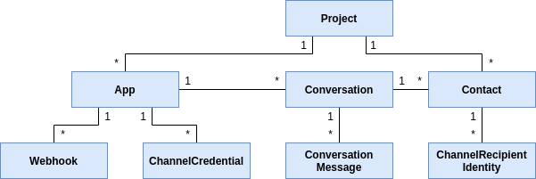

## Introduction

In its most basic use case the Sinch Conversation API offers one single API endpoint for sending and receiving messages across the most popular channels using one unified format. For more advanced messaging use cases, it offers the notion of a conversations, contacts, switching between Bot and Human chats and much more for the advanced chatbot and conversational messaging application developer.

Different message channel (bearer) features and functions are supported through built-in transcoding. As a developer you have the option to use either a global message template and for it to be automatically transcoded to each message channel format, or simply ignore transcoding and specify an exact layout for the channel you are interested in.

The benefits of this approach are that a developer need only become familiar with one Messaging API and yet have the power of conversation across all supported channels, still offering full control over channel specific features if required.

Further, it doesnt matter which conversation channel the customer engages over, or switch between, a single callback contains all aspects of the conversation for easy integration into the Sinch’s portfolio of services, or any third party platform.

Put simply, with the Sinch Conversation API, you are always in control of your customer conversation whether it be over SMS, RCS, WhatsApp or Facebook Messenger. Of course, the API will support additional channels as they become popular.

Currently Sinch Conversation API is in closed beta. If you are interested in the early access program please contact [Sinch representative](https://www.sinch.com/contact-us/).

### Key concepts



#### Project

The **project** entity, in the ER-diagram above, is considered to be the root entity from the Conversation API's point-of-view. All the Conversation API resources are grouped under a **project**, which can be said to act as a container. Each **project** is, under the hood, belonging to a Sinch **account** which is created when creating an account in the [Sinch Portal](https://dashboard.sinch.com). It is, currently, only possible to have one **project** per **account**.

#### App

The **app** entity corresponds to the API user, with a set of [**channel credentials**](doc:conversation#channel-credential) for each underlying connected channel. The app has a list of [**conversations**](doc:conversation#conversation) between itself and different [**contacts**](doc:conversation#contact) which share the same [**project**](doc:conversation#project).
The app is tied to a set of webhooks which defines the destination for various events coming from the Conversation API.
The easiest way to create and configure a Conversation API app is through [Sinch Portal](https://dashboard.sinch.com/convapi/apps)
An **app** has the following configurable properties:

| Field                             | Description                                                                                                                        |
| --------------------------------- | ---------------------------------------------------------------------------------------------------------------------------------- |
| Display name                      | The name visible in [Sinch Portal](https://dashboard.sinch.com/convapi/apps)                                                       |
| Conversation metadata report view | Specifies the amount of [**conversation**](doc:conversation#conversation) metadata that will be returned as part of each callback. |

#### Channel credential

A **channel credential** is the authentication means used to authenticate against an underlying connected channel. A **channel credential** is tied to one [**app**](doc:conversation#app).
The order of the channel credentials registered for an app is significant. It defines the channel priority order on app level used when defining which channels to sent first.
The app channel priority is overridden by contact channel priority order and by message specific channel priority order.

A **channel credential** has the following configurable properties:

| Field           | Description                                                                                          |
| --------------- | ---------------------------------------------------------------------------------------------------- |
| Channel         | Which channel these credentials are used with.                                                       |
| Credential      | Specifies the type and values for the credentials used for a channel                                 |
| Channel senders | A list of sender identities to use when sending a message. It is used for example with `SMS` channel |

#### Webhook

A **webhook** is a POST capable URL destination for receiving callbacks from the Conversation API.
Beside URL, each **webhook** includes a set of triggers which dictates which events are to be sent to the **webhook**.

A **webhook** has the following configurable properties:

| Field       | Description                                                                                                                                                                   |
| ----------- | ----------------------------------------------------------------------------------------------------------------------------------------------------------------------------- |
| Target      | The target url where events should be sent to                                                                                                                                 |
| Target type | Type of the target url. Currently only DISMISS and HTTP are supported values. DISMISS indicates the events will not be sent                                                   |
| Secret      | Optional secret to be used to sign the content of Conversation API callbacks. Can be used to verify the integrity of the callbacks                                            |
| Triggers    | A set of triggers that this webhook is listening to. Example triggers include MESSAGE_DELIVERY for message delivery receipts and MESSAGE_INBOUND for inbound contact messages |

##### Validating callbacks

Callbacks triggered by a registered **webhook**, with a secret set, will contain the following headers:

| Field       | Description                                                                                                                                                                   |
| ----------- | ----------------------------------------------------------------------------------------------------------------------------------------------------------------------------- |
| x-sinch-webhook-signature-timestamp | Timestamp, in UTC, of when the signature was computed                                             |
| x-sinch-webhook-signature-nonce      | A unique nonce that can be used to protect against reply attacks                                         |
| x-sinch-webhook-signature-algorithm    | The HMAC signature algorithm that was used to compute the signature |
| x-sinch-webhook-signature      |  The signature computed by the Conversation API. The raw HTTP body, the timestamp, and the nonce are signed by the signature. More concretely, the signature is computed as HMAC(secret, raw callback body \|\| . \|\| x-sinch-webhook-signature-nonce \|\| . \|\| x-sinch-webhook-signature-timestamp). The inputs to the HMAC function should be encoded in UTF-8                                                      |

The receiver of signed callbacks should perform the following steps:

1. Compute a signature, as described above, and compare it with the signature included in the headers. The callback should be discarded in case of mismatching signatures.
2. Make sure that the timestamp is within an acceptable time window. I.e., the difference between the current time, in UTC, and the timestamp in the headers is sufficiently small.
3. Make sure that the nonce is unique. This could be done by keeping track of previously received nonces.

#### Contact

The **contact** entity is a collection entity that groups together underlying connected **channel recipient identities**. It is tied to a specific [**project**](doc:conversation#project) and is therefore considered public to all [**apps**](doc:conversation#app) sharing the same [**project**](doc:conversation#project).

A **contact** has the following configurable properties:

| Field              | Description                                                                                                                                         |
| ------------------ | --------------------------------------------------------------------------------------------------------------------------------------------------- |
| Channel identities | List of channel identities. Specifies how the contact is identified on underlying channels                                                          |
| Channel priority   | Specifies the channel priority order used when sending messages to this contact. This can be overridden by message specific channel priority order. |
| Display name       | Optional display name used in chat windows and other UIs                                                                                            |
| Email              | Optional email of the contact                                                                                                                       |
| External id        | Optional identifier of the contact in external systems                                                                                              |
| Metadata           | Optional metadata associated with the contact.                                                                                                      |

#### Channel recipient identity

A **channel recipient identity** is an identifier for the [**contact**](doc:conversation#contact) for a specific channel. E.g. an international phone number is used as identifier for _SMS_ and _RCS_ while a PSID (Page-Scoped ID) is used as identifier for _Facebook Messenger_.
Some channels use app-scoped channel identity. Currently, FB Messenger and Viber are using app-scoped channel identities
which means contacts will have different channel identities for different [**apps**](doc:conversation#app).
For Facebook Messenger this means that the contact channel identity is associated with the [**app**](doc:conversation#app)
linked to the FB page for which this PSID is issued.

A **channel recipient identity** has the following configurable properties:

| Field                      | Description                                                               |
| -------------------------- | ------------------------------------------------------------------------- |
| Channel                    | The channel that this identity is used on                                 |
| Channel recipient identity | The actual identity, e.g. an international phone number or email address. |
| App id                     | The Conversation API's **app** ID if this is app-scoped channel identity. |

#### Conversation

A collection entity that groups several **conversation messages**. It is tied to one specific [**app**](doc:conversation#app) and one specific [**contact**](doc:conversation#contact).

#### Conversation message

An individual message, part of a specific [**conversation**](doc:conversation#conversation).

#### Metadata

There are currently three entities which can hold metadata: [**message**](doc:conversation#conversation-message), [**conversation**](doc:conversation#conversation) and [**contact**](doc:conversation#contact).
The metadata is an opaque field for the Conversation API and can be used by the API clients to
retrieve a context when receiving a callback from the API.
The metadata fields are currently restricted to 1024 characters.

### Authentication

The Conversation API uses OAuth2 **access tokens** to authenticate API calls. The first step to obtaining an **access token** is to create an **Access Key** in the [Sinch portal](https://dashboard.sinch.com/convapi/keys). A **client_id** and **client_secret** will be provided when creating an **Access Key** in the portal. The **project** ID will also be visible on the **Access Key** page in the portal. The credential pair can then be used to obtain an **access token**, given in the response, in the following way:

```console
curl https://auth.sinch.com/oauth2/token -d grant_type=client_credentials --user <client_id>:<client_secret>
```

A call to the Conversation API can then be done by including the obtained **access_token** in the request header. See below for an example:

```console
curl -H "Authorization: Bearer <access token>" https://eu.conversation.api.sinch.com/v1beta/projects/<Project ID>/apps
```

### Supported channels

-  SMS
-  WhatsApp
-  RCS
-  Facebook messenger

And more on the roadmap for 2020.

### Regions

Currently Sinch Conversation API is available in:

| Region | Host                                  |
| ------ | ------------------------------------- |
| EU     | https://eu.conversation.api.sinch.com |

### Postman collection

Sinch offers a Postman collection for easy setup and testing during development.
https://www.getpostman.com/collections/ec98cd8a811476359d2b
After importing the collection, fill in the following variables: PROJECT with your PROJECT ID, APP with app id, CLIENT_ID with your CLIENT_ID, and CLIENT_SECRET with your client secret.  
To fill WEBHOOK_URL, simply visit  
https://webhook.site/  
and use the generated link - the one under the 'Your unique URL' label.
Values for other variables can be obtained by calling corresponding requests:

- CONTACT - id of contact created by calling 'Create contact' request
- WEBHOOK_ID - id of webhook created by calling 'Create webhook' request
- CONVERSATION - Conversation is created automatically when sending a new message (for example with 'Text Message' request). Send a message, then call 'List conversations of App/Contact' to get id of conversation for this variable

### Errors

When requests are erroneous, the Sinch Conversation API will respond with standard HTTP status codes, such as `4xx` for client errors and `5xx` for server errors. All responses include a JSON body of the form:

```json
{
  "error": {
    "code": 401,
    "message": "Request had invalid credentials.",
    "status": "UNAUTHENTICATED",
    "details": [{
      "@type": "type.googleapis.com/google.rpc.RetryInfo",
      ...
    }]
  }
}
```

The table below describes the fields of the error object:

| Name    | Description                         | JSON Type        |
| ------- | ----------------------------------- | ---------------- |
| code    | HTTP status code                    | number           |
| message | A developer-facing error message    | string           |
| status  | Response status name                | string           |
| Details | List of detailed error descriptions | array of objects |

#### Common error responses

| Status | Description                                                            |
| ------ | ---------------------------------------------------------------------- |
| 400    | Malformed request                                                      |
| 401    | Incorrect credentials                                                  |
| 403    | Correct credentials but you dont have access to the requested resource |
| 500    | Something went wrong on our end, try again with exponential back-off   |
| 503    | Something went wrong on our end, try again with exponential back-off   |
