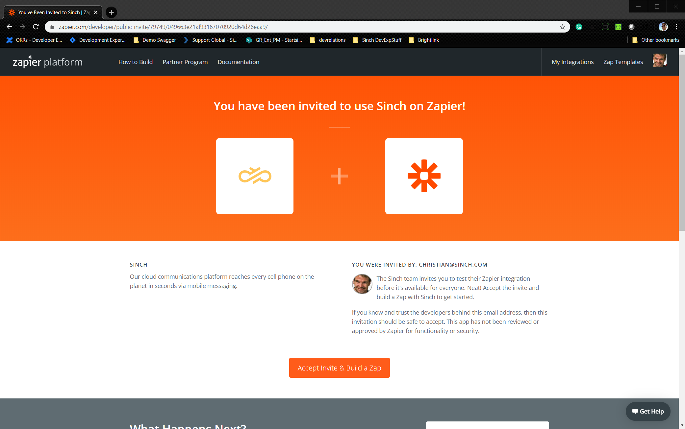
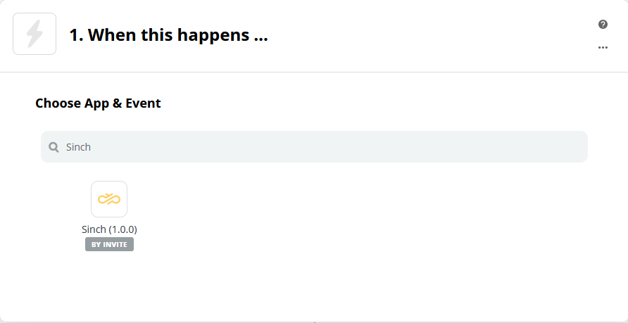
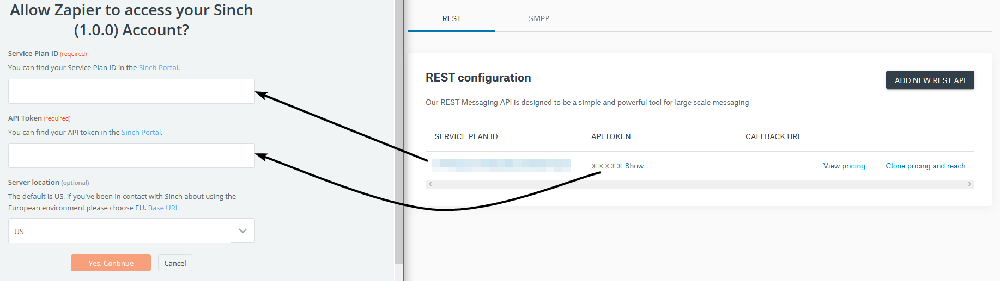
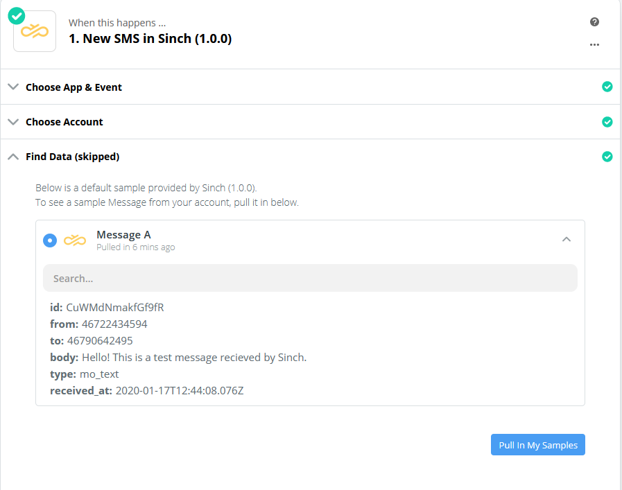
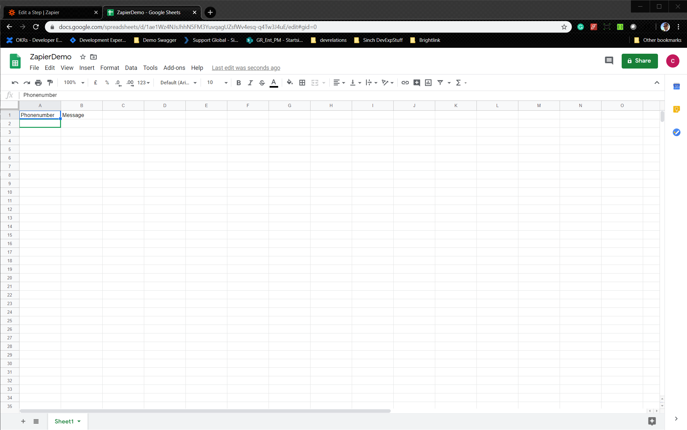
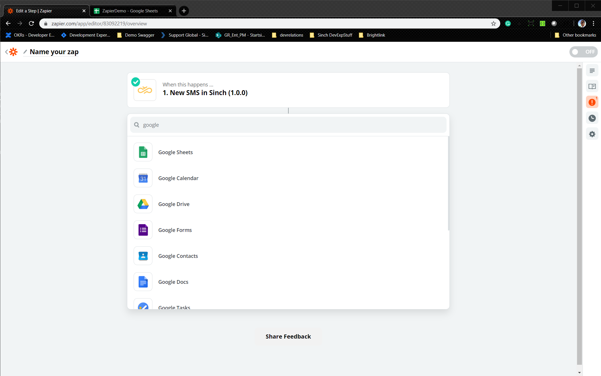
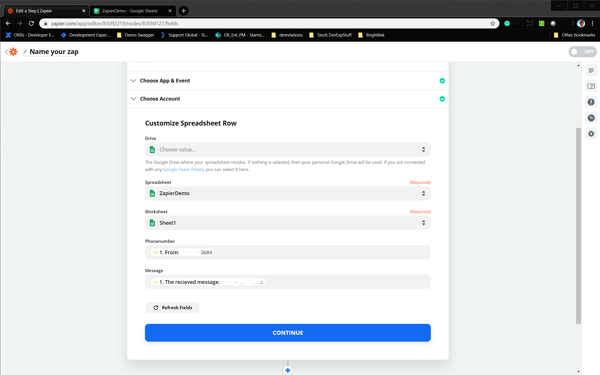
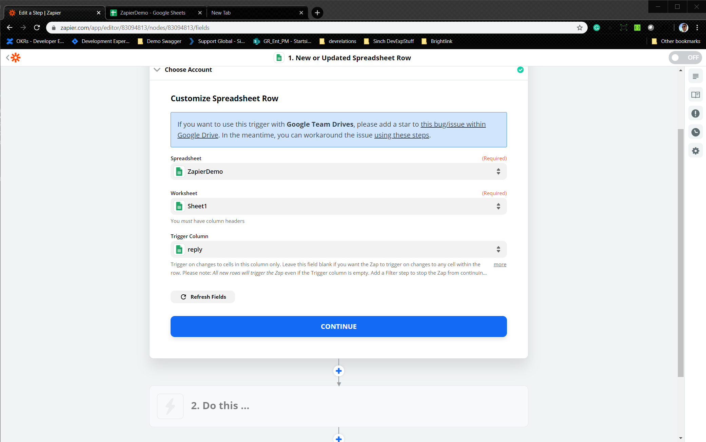
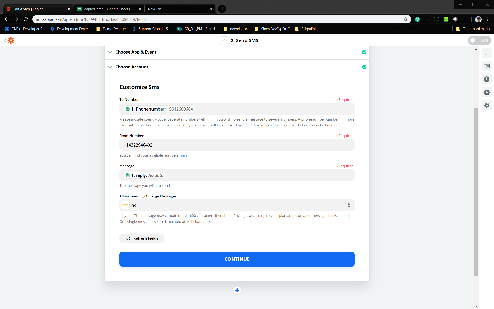

> **Note**
> 
> This is a preivew of the Sinch Zap app.

### Before you can create your Zap

1. Your [Sinch account](https://dashboard.sinch.com/signup). (If you are in the United States, you also need a [free test phone  number](https://dashboard.sinch.com/numbers/your-numbers/numbers).)
2. If you don’t have one, you can create a Zapier account [here](https://zapier.com/sign-up/)

If you already have them you can jumpt to [Using Sinch as a Zapier Trigger](#Using-Sinch-as-a-Zapier-Trigger)

### Sign up for a Sinch account

Before you can send your first SMS, you need a [Sinch
account](https://dashboard.sinch.com/signup). (If you are in the United States, you also need a [free test phone  number](https://dashboard.sinch.com/numbers/your-numbers/numbers).)

Click on activate

To use the number with the rest API select REST and click ***Get Free number***.

## Using Sinch as a Zapier Trigger
To get started with the Sinch app, you click follow this [link](https://zapier.com/developer/public-invite/79749/049663e21af93167070920d64d26eaa9/).

Klick "Accpet invite and build zap"  

In this first example you will use the Sinch Trigger  to fill out a google sheet spread sheet everytime you recieve an SMS to your sinch number.

## Choose App And Event
When creating a Zap, you will have to find the Sinch app, it should be enough to just type in Sinch when choosing app and event. 

Currently we’re offering a trigger event “New SMS”, it will trigger on any new messages that is sent to your Sinch number.

## Choose account
The next step is to “Sign in to Sinch” and you should see a prompt asking you to fill out some fields. Now your Service Plan ID and API token comes in handy! You will find all the information you need in the [dashboard](https://dashboard.sinch.com/sms/api/rest)

Copy and paste your Service Plan ID and API Token into the Zapier prompt and continue.
It should now look something like this:

## Find Data
Now, if you do not have any messages in your service plan, there won’t be any data to collect for Zap but you should see some samples. 

## Populate data in sheets
Frist creaate a google sheet adn add two headers rows Phonenumber and Message

Then in your zap, clieck continue and search for Google sheets

Connect your account and select create spreadsheet. Go thru all the steps and select Phonenumber column to have the From paramater from the Sinch Zap and the message 

Click test and review, go back your sheet and you should now see a new row in your sheet.

Click done editing and name your zap. 

## Send SMS using Zapier Actions
Lets add a column to the Sheet above and call it reply. 
Click the blick + button in your zapier dashboard to create a new Zap. Now we are going to use the google sheets as an Trigger so search up google sheets, and select the trigger new or updated spreadsheet row. Find your sheet by walking thru the prompts and select reply as the trigger column. 

Test and review, click on do this and find Sinch 1.0.0, choose New SMS as action and confirm your account.  

What we are doing here is saying everytime you enter/update a reply in an existing row, send that reply to your the phonenumber we have in the first column.
Click test and review and you should have a sms to your phone sent to you.   

This was just to show the power of incoming SMS and outgoing sms in Zapier and now you can explore all your favorite applications and see if they have a Zapier app that you can connect SMS messaging to using the Sinch Zap.

