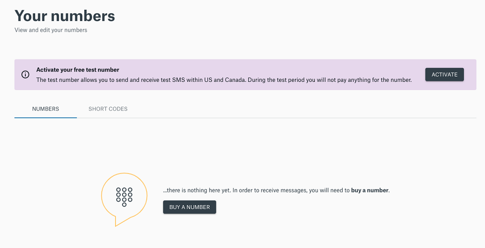
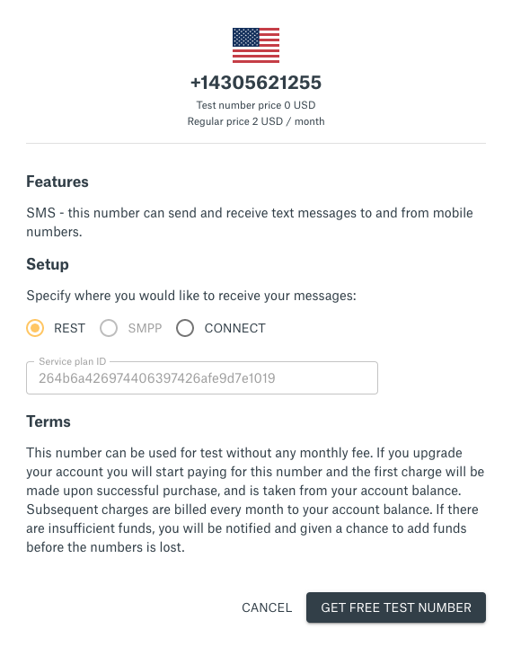

> **Note**
> 
> This is a preivew of the Sinch Zap app.

### Before you can create your Zap, you need to have:

1. A [Sinch account](https://dashboard.sinch.com/signup). (If you are in the United States, you also need a [free test phone  number](https://dashboard.sinch.com/numbers/your-numbers/numbers).)
2. A Zapier Acccount,  If you don’t have one, you can create a Zapier account [here](https://zapier.com/sign-up/)

If you already have them you can jumpt to [Using Sinch as a Zapier Trigger](doc:sms-zapier#section-using-sinch-as-a-zapier-trigger)

### Sign up for a Sinch account

Before you can send your first SMS, you need a [Sinch
account](https://dashboard.sinch.com/signup). (If you are in the United States, you also need a [free test phone  number](https://dashboard.sinch.com/numbers/your-numbers/numbers).)

Click on activate

To use the number with the REST API select REST and click ***Get Free number***.

## Using Sinch as a Zapier Trigger
To get started with the Sinch app, install the Sinch App on Zapier [link](https://zapier.com/developer/public-invite/79749/049663e21af93167070920d64d26eaa9/).

Klick "Accept invite and build zap"  

In this first example you will use the Sinch Trigger  to fill out a Google Sheet everytime you receive an SMS to your Sinch number.

## Choose App Event
When creating a Zap, search for "Sinch" when choosing app and event. 

Select “New SMS” as trigger, it will trigger on any new messages that is sent to your Sinch number.

## Choose account
The next step is to “Sign in to Sinch” where you will see a prompt asking you to fill out some fields. Find your ***Service Plan ID*** and ***API token*** in the [Sinch dashboard](https://dashboard.sinch.com/sms/api/rest).

Copy and paste your ***Service Plan ID*** and ***API Token*** into the Zapier prompt and continue.
It should now look something like this:

## Find Data
If you do not have any messages in your service plan, there won’t be any data to collect for Zap but you should see some samples, otherwise you will some of your old messages as samples.  

## Populate data in sheets
Create a Google Sheet and add two headers columns: **Phonenumber** and **Message**

Next in your Zap, click **continue** and search for **Google Sheets**

Connect your account and select **Create spreadsheet**. Go thru all the steps and select the ***Phonenumber** column to have the From parameter from the Sinch Zap. Do the same for message. 

Click test and review, In your **Google sheet** you will see a new row.

Click done editing and name your Zap. 

## Send SMS using Zapier Actions
Add a column to your **Google Sheet**  and call it reply. 
Click the **+** button in your Zapier dashboard to create a new Zap. In this Zap we are going to use the *Google sheets* as the Trigger. Search for **Google sheets**, Select the trigger **New or updated spreadsheet row**. Find your sheet by clicking thru the prompts and select reply as the trigger column. 

Test and review, click on **Do this** and find Sinch 1.0.0, select **New SMS** as action and confirm your account.  

What we are doing here is saying everytime you enter/update a reply in an existing row, send that reply to your the phonenumber we have in the first column.
Click test and review and you should have a sms to your phone sent to you.   

This guide shows the power of recieving SMS and sending SMS in Zapier. Now you can explore all your favorite applications and see if they have a Zapier app that you can connect SMS SMS messaging Zap.

