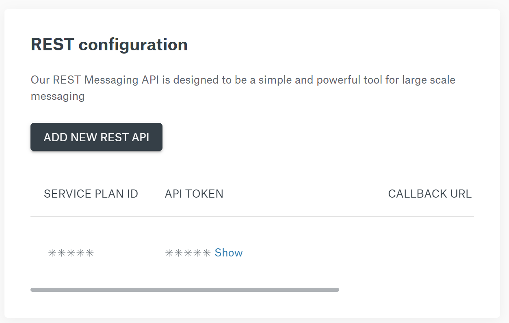
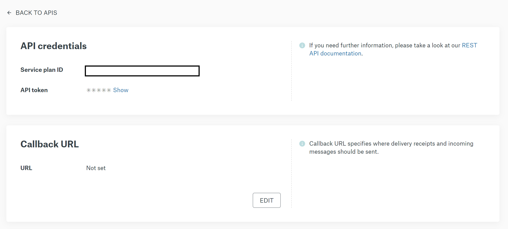
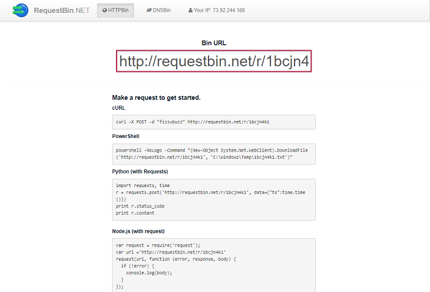
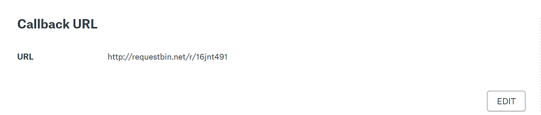
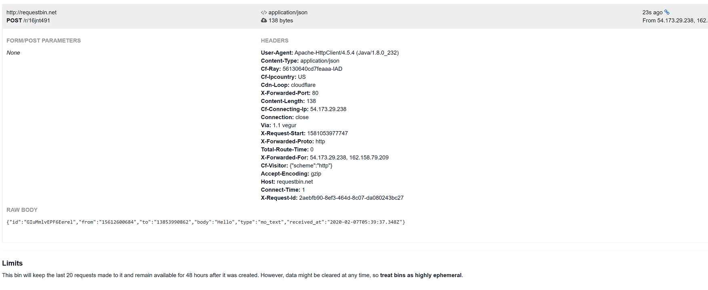
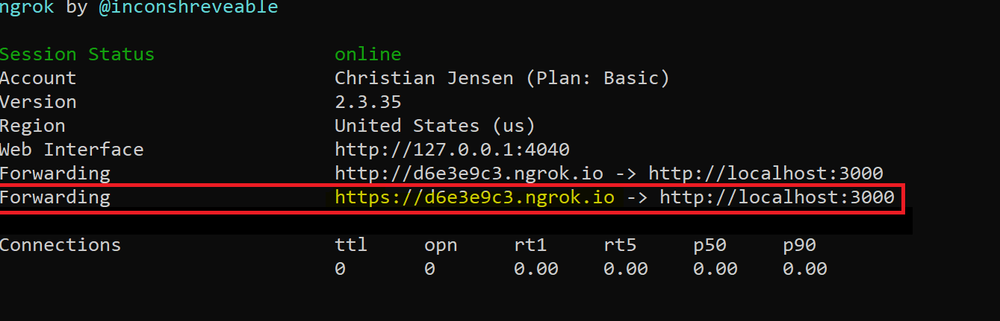
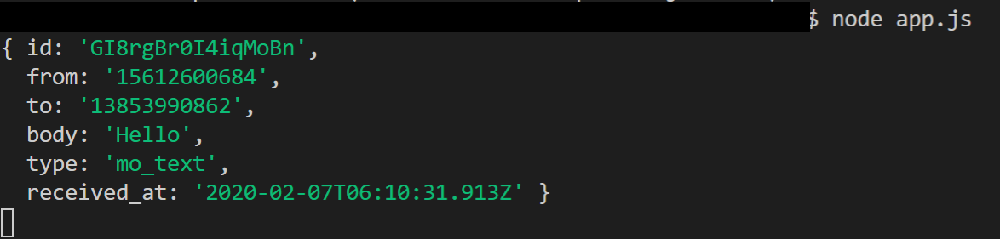

## Send your first SMS

Learn how to send SMS messages with the Sinch API in a few minutes. In this guide, we  show you how to:

1. Create an account and get your free test number (US only)
2. Send your first SMS

### Sign up for a Sinch account

Before you can send your first SMS, you need a [Sinch
account](https://dashboard.sinch.com/signup). (If you are in the United States, you also need a [free test phone  number](https://dashboard.sinch.com/numbers/your-numbers/numbers).)


Click on activate


To use the number with the rest API select REST and click ***Get Free number***.

### Code

Create a new node app and copy this into app.js

```nodejs
var request = require("request");
var options = {
  method: 'POST',
  url: 'https://us.sms.api.sinch.com/xms/v1/{service_plan_id}/batches',
  headers: {accept: 'application/json', 'content-type': 'application/json', 
      "Authentication: Bearer {your token}"},
  body: '{"to":"{To Number}","from":"{your free test number}","body":"This is a test message"}'
};

request(options, function (error, response, body) {
  if (error) throw new Error(error);
  console.log(body);
});
```

Before you can execute the code that sends an SMS message, you need to modify it in a few places.

#### Replace the token values

Replace the values `{service_plan_id}`, `{your token}`, `{your free test number}` and `{To number}` with your values, you can find service plan and token in your dashboard. Go to https://dashboard.sinch.com/sms/api/rest and log in. Click on the "show" link to reveal your token.



To find the From-number, click on the service plan id link and scroll to the bottom of the page.

Change the `{To number}` to your phone number.

That's all that is needed, run your app. When you are using a test number, the body of the message is replaced with sample text. If you want to send any message content [contact](https://dashboard.sinch.com/sms/overview) your account manager.

Read more about the [batches endpoint](https://developers.sinch.com/reference/#sendsms)

## Receive SMS via web-hook

The next step is to handle when you send an SMS to your Sinch number.

### Configure Callback URL for your SMS service

Before you implement the server to handle incoming SMS, you need to configure your SMS service to handle callbacks. Head over to https://dashboard.sinch.com/sms/api/rest and click on your service and you should see a section something like below.



If you just want to look at what we post you can use http://requestbin.net/

Click create and you should see something like this:



Copy bin URL to the callback URL info and click save.



That's it, send an SMS to your Sinch
[number](https://dashboard.sinch.com/numbers/your-numbers/numbers)

Refresh your request bin page to see the request data we send on incoming sms.



### Handle incoming SMS with Node.js

create a new node app and paste this into app.js

```javascript
const url = require('url');
const http = require('http');
const server = http.createServer((req, res) =>
{
    let data = []
    req.on('data', chunk => {
      data.push(chunk)
    })
    req.on('end', () => {
        console.log(JSON.parse(data));
    })
    res.end();
  })
  server.listen(3000);
```

Before you can handle incoming traffic to your local server, you need open up a tunnel to your local server, for that you can use [ngrok](https://ngrok.com/) tunnel. Open a terminal/command prompt and type: `ngrok http 3000`

Copy the https address in your window run app.js in the command prompt 'node app.js'



Head over and change the callback URL in the dashboard for your SMS service.

1. In the terminal windows start the app.js `node app.js`
2. Send an SMS to your Sinch Number
3. You should now see the request coming in



You can read more about all the different endpoints in the [API reference guide](https://developers.sinch.com/v1.0.1/reference)