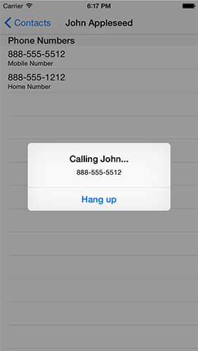
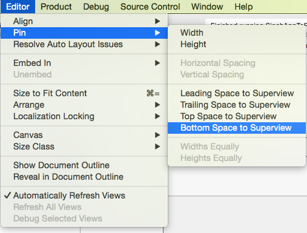
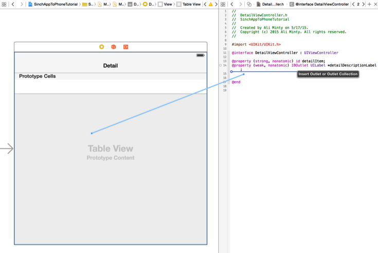

In this tutorial, we will be creating a contacts app for iOS that uses the Sinch SDK to make [app-to-phone calls](https://www.sinch.com/products/voice/). To get the most out of this tutorial, you will need a basic understanding of the following areas:

>   - XCode and Storyboard
>   - Objective-C
>   - Address Book API
>   - CocoaPods

You’ll also want a phone close by for testing later in the tutorial.

At the end of the tutorial, you will have something that looks a bit like this:


## 1. Setup

Open up XCode and create a new project using the Master-Detail Application template. This template will give us a nice base to start with, as it already has some of the components we need. Make sure that you choose Objective-C under language and iPhone under device.

We’ll want to set up CocoaPods to work with our app. Open the directory for the project you just created in Terminal and type:

    pod init

Then open the file named Podfile and add the following line:

    pod ‘SinchRTC’

After saving the file, install all the tools you will need by simply typing:

    pod install

After this, you’ll see an XCode workspace file with the extension “**.xcworkspace**”. We’ll need to work out of that file from now on instead of our project file. That way, all of our app’s components will work together.

If you aren’t familiar with the default Master-Detail Application template, build and run to play around with the app. You can see that we populate a table using the plus button and can select an entry to see a detailed view.

To get an idea of what we’re aiming for, we want our app to pre-populate the table with contacts using the Address Book API. After that, we should be able to select an entry to see that contact’s phone number(s), which we can then select to make a call.

Ok, time to get to the code\!

## 2. Working with contacts

First, go to **MasterViewController.h** and add the Address Book import statement:

```objectivec
#import <AddressBook/AddressBook.h>
```

Now, head over to **MasterViewController.m**. Delete the method **insertNewObject** and add the following method:

```objectivec
- (void)fillContacts {}
```

Now go to **viewDidLoad**. We first want to check if we can access the user’s contacts. If so, we can call fillContacts to populate our table. Delete all the code in `viewDidLoad` except for `[super viewDidLoad]` and add the following code at the end:

```objectivec
if (ABAddressBookGetAuthorizationStatus() == kABAuthorizationStatusDenied ||
        ABAddressBookGetAuthorizationStatus() == kABAuthorizationStatusRestricted){

        UIAlertView *cantAddContactAlert = [[UIAlertView alloc] initWithTitle: @"Cannot Add Contact" message: @"You must give the app permission to add the contact first." delegate:nil cancelButtonTitle: @"OK" otherButtonTitles: nil];
        [cantAddContactAlert show];
    } else if (ABAddressBookGetAuthorizationStatus() == kABAuthorizationStatusAuthorized){
        [self fillContacts];
    } else{
        ABAddressBookRequestAccessWithCompletion(ABAddressBookCreateWithOptions(NULL, nil), ^(bool granted, CFErrorRef error) {
            dispatch_async(dispatch_get_main_queue(), ^{
                if (!granted){
                    UIAlertView *cantAddContactAlert = [[UIAlertView alloc] initWithTitle: @"Cannot Add Contact" message: @"You must give the app permission to add the contact first." delegate:nil cancelButtonTitle: @"OK" otherButtonTitles: nil];
                    [cantAddContactAlert show];
                    return;
                }
                [self fillContacts];
            });
        });
    }
```

Here we see if our app can use the user’s contacts. If not, we let the user know. If so, we go ahead and call **fillContacts**. If the user hasn’t specified whether or not our app has permission to use his or her contacts, we ask them and respond appropriately.

Now we need a way to store contact information. To do this, go to `File>New>File…` and create a new Cocoa Touch Class. I always prepend my class names with a “C”, so I’ll name the class “**CContact**” since we want a class to hold contact information. Make sure the subclass is NSObject, the language Objective-C.

For this app, we’ll only need four pieces of information: first name, last name, mobile number, and home number. Head over to **CContact.h** and add these properties and this class method to the interface:

```objectivec
@property (nonatomic, copy) NSString *firstName;
@property (nonatomic, copy) NSString *lastName;
@property (nonatomic, copy) NSString *mobileNumber;
@property (nonatomic, copy) NSString *homeNumber;


+ (id)createContactWithFirst:(NSString *)firstName Last:(NSString *)lastName
                MobileNumber:(NSString *)mobileNumber HomeNumber:(NSString *)homeNumber;
```

Now go to **CContact.m** and implement the class method that we just declared:

```objectivec
+ (id)createContactWithFirst:(NSString *)firstName Last:(NSString *)lastName
                MobileNumber:(NSString *)mobileNumber HomeNumber:(NSString *)homeNumber
{
    CContact *newContact = [[self alloc] init];
    [newContact setFirstName:firstName];
    [newContact setLastName:lastName];
    [newContact setMobileNumber:mobileNumber];
    [newContact setHomeNumber:homeNumber];
    return newContact;
}
```

Ok, we’re done setting up our contact class. Now let’s go to **MasterViewController.m** to use it. First, import **CContact.h** at the top:

```objectivec
#import "CContact.h"
```

We want each cell in our UITableView to correspond to a **CContact** object, so go to **tableView:cellForRowAtIndexPath**. You’ll see these lines of code:

```objectivec
NSDate *object = self.objects[indexPath.row];
cell.textLabel.text = [object description];
```

That’s not quite what we want. Change them to look like this:

```objectivec
CContact *object = self.objects[indexPath.row];
cell.textLabel.text = [NSString stringWithFormat:@"%@ %@", [object firstName], [object lastName]];
```

Now we’ll be able to properly display cells. Go to `prepareForSegue:sender` and replace **NSDate** with **CContact**.

Time to move on to `fillContacts`. Let’s be a bit specific as to what information we want to keep track of. We’ll impose the following conditions:

>   - A contact must have at least one number
>   - A contact’s number will be omitted if it is not a U.S. number

First, add the following code to `fillContacts`:

```objectivec
ABAddressBookRef addressBookRef = ABAddressBookCreateWithOptions(NULL, nil);

 NSArray *allContacts = (__bridge NSArray *)ABAddressBookCopyArrayOfAllPeople(addressBookRef);
 for (id record in allContacts){
     ABRecordRef thisContact = (__bridge ABRecordRef)record;

     NSString *fName;
     NSString *lName;
     NSString *mNumber;
     NSString *hNumber;

     int numberCount = 0;

     ABMultiValueRef phonesRef = ABRecordCopyValue(thisContact, kABPersonPhoneProperty);

     if (ABMultiValueGetCount(phonesRef) > 0) {
         // 1
     }

     CFRelease(phonesRef);


 }
```

Here, we get all of the contacts, go through them in a for-loop, and check if each one has more than one number. Now, replace the `// 1` comment with:

```objectivec
fName = (__bridge NSString *)ABRecordCopyValue(thisContact, kABPersonFirstNameProperty);
            lName = (__bridge NSString *)ABRecordCopyValue(thisContact, kABPersonLastNameProperty);
            for (int i=0; i < ABMultiValueGetCount(phonesRef); i++) {
                CFStringRef phoneLabel = ABMultiValueCopyLabelAtIndex(phonesRef, i);
                CFStringRef phoneValue = ABMultiValueCopyValueAtIndex(phonesRef, i);

                NSString *phoneNumber = (__bridge NSString *)phoneValue;

                // parse out unwanted characters in number
                NSString *parsedPhoneNumber;
                for (int i = 0; i < phoneNumber.length; i++) {
                    char currentChar = [phoneNumber characterAtIndex:i];
                    if (currentChar >= '0' && currentChar <= '9') {
                        NSString *digitString = [NSString stringWithFormat:@"%c",currentChar];
                        if (parsedPhoneNumber.length == 0) {
                            parsedPhoneNumber = [NSString stringWithString:digitString];
                        }
                        else{
                            NSString * newString = [parsedPhoneNumber stringByAppendingString:digitString];
                            parsedPhoneNumber = [NSString stringWithString:newString];
                        }
                    }
                }

                // check if number is foreign
                if ((parsedPhoneNumber.length < 11)
                    || (parsedPhoneNumber.length == 11 && [parsedPhoneNumber hasPrefix:@"1"])) {

                    numberCount++;

                    if (CFStringCompare(phoneLabel, kABPersonPhoneMobileLabel, 0) == kCFCompareEqualTo) {
                        mNumber = phoneNumber;
                    }

                    if (CFStringCompare(phoneLabel, kABHomeLabel, 0) == kCFCompareEqualTo) {
                        hNumber = phoneNumber;
                    }
                }

                CFRelease(phoneLabel);
                CFRelease(phoneValue);
            }

             // 2
```

Wow, that’s a lot\! Let’s take a look at what we’ve just added.

First we get our contact’s first and last name. We have to do a bit of work getting the values as strings, as they are given to us as **ABRecordRef** objects. We then enter a for-loop to look at all of our current contact’s phone numbers. We get the phone number and its label.

Next, we need to do a bit of manipulation to see if our number is a U.S. number. The number is given to us as it appears on the phone, so we’ll need to parse the number to get rid of any non-digit characters. We then check to see if the number is a U.S. number. If it is, we can store it depending on its label. Take note of the numberCount variable that we increment once we’ve added a number.

Now, replace the `// 2` comment with:

```objectivec
if (numberCount > 0) {
                CContact *newContact = [CContact createContactWithFirst:fName Last:lName MobileNumber:mNumber HomeNumber:hNumber];

                if (!self.objects) {
                    self.objects = [[NSMutableArray alloc] init];
                }
                [self.objects addObject:newContact];
                NSIndexPath *indexPath = [NSIndexPath indexPathForRow:_objects.count-1 inSection:0];
                [self.tableView insertRowsAtIndexPaths:@[indexPath] withRowAnimation:UITableViewRowAnimationAutomatic];
                [self.tableView reloadData];
            }
```

This is where we add our current contact to the UITableView. We put this code in an if-statement using the numberCount variable in the case that a contact has more than one number, but none of them are U.S. numbers.

We’re done with **MasterViewController.m**. Build and run to see if you get a list of contacts.

## 3. Storyboard

Now go to **Main.storybaord**. First, change the title label in the Master view from “Master” to “Contacts”. Then, scroll to the right so you can see the Detail view. Delete the Label that’s currently there and add a Table View that fills the whole screen. We’re going to use Auto Layout to make sure our Table View’s position and size proportions stay constant between devices and phone orientations.

Select the Table View by clicking on it. Then go to Editor\>Pin and select “Bottom Space to Superview.”



Do this for “Top Space to Superview,” “Trailing Space to Superview,” and “Leading Space to Superview.” Remember to select the Table View before adding each pin. If done correctly, you’ll get a nice blue outline around your Table View, indicating that your Auto Layout pins were placed properly.


Then, add a Table View Cell to the Table View:


Now, switch to the Assistant Editor and have your right pane display **DetailViewController.h**. Go ahead and delete the detailDiscriptionLabel. Hold down control and click and drag from the Table View to your interface to add a UITableView property. We’re going to display the selected contact’s numbers here, so give the table an appropriate name, such as numberTable.


Do the same with the Detail title, which will be a UINavigationItem. Call it something descriptive like contactTitle.

## 4. Contact details

Go to **DetailViewController.h** and import **CContact**. Then, change the interface line to read as follows:

```objectivec
@interface DetailViewController : UIViewController <UITableViewDelegate, UITableViewDataSource, UIAlertViewDelegate>
```

Now go to **DetailViewController.m**, locate configureView, and replace its contents with:

```objectivec
if (self.detailItem) {
        self.contactTitle.title = [NSString stringWithFormat:@"%@ %@", [self.detailItem firstName], [self.detailItem lastName]];
    }
```

Find viewDidLoad and add these lines to set our table’s delegate and data source:

```objectivec
[_numberTable setDelegate:self];
[_numberTable setDataSource:self];
```

Add the following functions in order to specify our table’s layout:

```objectivec
- (NSInteger)numberOfSectionsInTableView:(UITableView *)tableView{
    return 1;
}

- (NSInteger)tableView:(UITableView *)tableView numberOfRowsInSection:(NSInteger)section{
    return 2;
}


-(NSString *)tableView:(UITableView *)tableView titleForHeaderInSection:(NSInteger)section{
    return @"Phone Numbers";
}

- (UITableViewCell *)tableView:(UITableView *)tableView cellForRowAtIndexPath:(NSIndexPath *)indexPath
{
    UITableViewCell *cell = [tableView dequeueReusableCellWithIdentifier:@"Cell"];
    if (cell == nil) {
        cell = [[UITableViewCell alloc] initWithStyle:UITableViewCellStyleSubtitle reuseIdentifier:@"Cell"];
    }

    NSString *cellText = @"";
    NSString *detailText = @"";


    switch (indexPath.row) {
        case 0:
            cellText = [self.detailItem mobileNumber];
            detailText = @"Mobile Number";
            break;
        case 1:
            cellText = [self.detailItem homeNumber];
            detailText = @"Home Number";
            break;
    }

    cell.textLabel.text = cellText;
    cell.detailTextLabel.text = detailText;

    return cell;
}
```

Try building and running. You should find that we display our contact’s name at the top of the screen, as well as a table of his or her phone number(s).

## 5. Making calls

We’ll want to make a call once we select a person’s phone number. If you haven’t already, go to [sinch.com](https://portal.sinch.com/#/signup) and sign up for free. Then, go to your dashboard and go to your apps. Create a new clientapi app. Take note of your app’s unique key and secret.

Go to **DetailVieController.h** and add the following import statement:

```objectivec
#import <Sinch/Sinch.h>
```

Next, we’ll add to the interface line again. It should now read:

```objectivec
@interface DetailViewController : UIViewController <UITableViewDelegate, UITableViewDataSource, UIAlertViewDelegate, SINCallClientDelegate>
```

Go to DetailViewController.m. We’re going to declare some variables in the implementation. Change it to look like this:

```objectivec
@interface DetailViewController (){
    id<SINClient> _client;
    id<SINCall> _call;
}
@end
```

We’ll only need to use these variables to make a call using the Sinch SDK. Next, implement the following method:

```objectivec
-(void)initSinchClient
{
    _client = [Sinch clientWithApplicationKey:@""
                            applicationSecret:@""
                              environmentHost:@"clientapi.sinch.com"
                                       userId:@"phoneCaller"];
    _client.callClient.delegate = self;
    [_client setSupportCalling:YES];
    [_client start];
}
```

Here we simply set up the Sinch client. This is where you need to put your app key and secret that you took note of earlier. Call this method in viewDidLoad by adding:

```objectivec
[self initSinchClient];
```

To make a call, we’ll show an alert view when a number is pressed. The alert view’s cancel button will serve as our hang up button.

In order to perform an action when a number is selected, implement the `tabelView:didSelectRowAtIndexPath` method:

```objectivec
- (void)tableView:(UITableView *)tableView didSelectRowAtIndexPath:(NSIndexPath *)indexPath
{
    NSString *alertTitle = [NSString stringWithFormat:@"Calling %@...", [self.detailItem firstName]];

    UITableViewCell *cell = [tableView cellForRowAtIndexPath:indexPath];
    NSString *alertMessage = cell.textLabel.text;

    UIAlertView *messageAlert = [[UIAlertView alloc]
                                 initWithTitle:alertTitle message:alertMessage delegate:self cancelButtonTitle:@"Hang up" otherButtonTitles:nil];

    [messageAlert show];
    // 1
}
```

Next, we’ll want to correctly format the selected number so we can make a call with it. Replace the `// 1` comment with:

```objectivec
// parse out unwanted characters in number
    NSString *parsedPhoneNumber;
    for (int i = 0; i < alertMessage.length; i++) {
        char currentChar = [alertMessage characterAtIndex:i];
        if (currentChar >= '0' && currentChar <= '9') {
            NSString *digitString = [NSString stringWithFormat:@"%c",currentChar];
            if (parsedPhoneNumber.length == 0) {
                parsedPhoneNumber = [NSString stringWithString:digitString];
            }
            else{
                NSString * newString = [parsedPhoneNumber stringByAppendingString:digitString];
                parsedPhoneNumber = [NSString stringWithString:newString];
            }
        }
    }

    NSString *number;
    if (parsedPhoneNumber.length == 10) {
        number = [NSString stringWithFormat:@"+1%@", parsedPhoneNumber];
    }
    else {
        number = [NSString stringWithFormat:@"+%@", parsedPhoneNumber];
    }

    if (_call == nil)
    {
        _call = [[_client callClient] callPhoneNumber:number];
    }

    [tableView deselectRowAtIndexPath:indexPath animated:YES];
```

After parsing the number and adding the appropriate prefix, we call our number if a call is not already in place.

Finally, let’s make the alert view’s cancel button hang up the call. Implement the following method:

```objectivec
- (void)alertView:(UIAlertView *)alertView clickedButtonAtIndex:(NSInteger)buttonIndex {
        [_call hangup];
}
```

Try it out\! If you’re using the iOS Simulator, add a number that you can test through the system’s contacts app.

## 6. What now?

You now have a fully functional [app-to-phone calling](https://www.sinch.com/products/voice/) app that uses the Sinch SDK. You can also add more features to your app; Sinch offers a number of other services, such as SMS and app-to-app calling, which are simple to implement in your app.

<a class="gitbutton pill" target="_blank" href="https://github.com/sinch/docs/blob/master/docs/tutorials/ios/build-an-ios-address-book-contact-picker.md">
                        <span class="icon medium">
                            <svg xmlns="http://www.w3.org/2000/svg" role="img" viewBox="0 0 24 24"><title>GitHub icon</title><path d="M 12 0.297 c -6.63 0 -12 5.373 -12 12 c 0 5.303 3.438 9.8 8.205 11.385 c 0.6 0.113 0.82 -0.258 0.82 -0.577 c 0 -0.285 -0.01 -1.04 -0.015 -2.04 c -3.338 0.724 -4.042 -1.61 -4.042 -1.61 C 4.422 18.07 3.633 17.7 3.633 17.7 c -1.087 -0.744 0.084 -0.729 0.084 -0.729 c 1.205 0.084 1.838 1.236 1.838 1.236 c 1.07 1.835 2.809 1.305 3.495 0.998 c 0.108 -0.776 0.417 -1.305 0.76 -1.605 c -2.665 -0.3 -5.466 -1.332 -5.466 -5.93 c 0 -1.31 0.465 -2.38 1.235 -3.22 c -0.135 -0.303 -0.54 -1.523 0.105 -3.176 c 0 0 1.005 -0.322 3.3 1.23 c 0.96 -0.267 1.98 -0.399 3 -0.405 c 1.02 0.006 2.04 0.138 3 0.405 c 2.28 -1.552 3.285 -1.23 3.285 -1.23 c 0.645 1.653 0.24 2.873 0.12 3.176 c 0.765 0.84 1.23 1.91 1.23 3.22 c 0 4.61 -2.805 5.625 -5.475 5.92 c 0.42 0.36 0.81 1.096 0.81 2.22 c 0 1.606 -0.015 2.896 -0.015 3.286 c 0 0.315 0.21 0.69 0.825 0.57 C 20.565 22.092 24 17.592 24 12.297 c 0 -6.627 -5.373 -12 -12 -12" /></svg>
                        </span>
                        Edit on GitHub!</a>