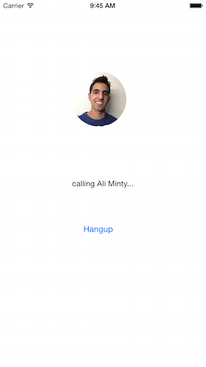

In this tutorial, we will be adding a feature to a previous project, the Facebook friend calling app. If you haven’t already, you can check that tutorial out [here](https://github.com/sinch/ios-call-your-facebookfriends).

The feature we’ll be implementing is displaying user profile images. Once we’re done, the app will look something like this:




## 1. Setup

Download the existing Facebook friend calling app from [Github](https://github.com/sinch/ios-call-your-facebookfriends) and install the necessary pods.

Then, be sure to create an app on your [Sinch Dashboard](https://portal.sinch.com/#/login). Fill in the application key and secret fields in **AppDelegate.m**.

Finally, register your app on the [Facebook Developer Site](https://developers.facebook.com).

## 2. Adding User Profile Picture

First go to **LoginViewController.m** and add the following method:

```objectivec
- (void) displayPictureForUser {
    NSURL *pictureURL = [NSURL URLWithString:[NSString stringWithFormat:@"https://graph.facebook.com/%@/picture?type=large&return_ssl_resources=1", [[FBSDKAccessToken currentAccessToken] userID]]];
    NSData *imageData = [NSData dataWithContentsOfURL:pictureURL];
    UIImage *img = [UIImage imageWithData:imageData];
    CGSize size = img.size;
    CGRect rectFrame = CGRectMake(90, 100, size.width, size.height);
    UIImageView* imgv = [[UIImageView alloc] initWithImage:img];
    imgv.frame = rectFrame;
    [self.view addSubview:imgv];
}
```

Here, we get a user’s profile picture from a URL as data. We then use that data to form a UIImage that we can display in a UIImageView. You can play around with `rectFrame` to get a profile image size and position that suites you.

We’ll call this method in two places, at the beginning of each of the file’s if-statements. Both statements should now look like this:

```objectivec
if ([FBSDKAccessToken currentAccessToken]) {

    [self displayPictureForUser];

    ...

}
```

## 3. Adding Call Profile Picture

This part will be very similar to the previous part, but we’ll do two things differently:

>   - We will specify which person’s picture to display as a method parameter
>   - The picture will be in a small bubble (for asthetic pleasure of course\!)

In **DetailViewController.m**, add the following method.

```objectivec
- (void) displayPictureForUser:(NSString *)userId {
    NSURL *pictureURL = [NSURL URLWithString:[NSString stringWithFormat:@"https://graph.facebook.com/%@/picture?type=large&return_ssl_resources=1", userId]];
    NSData *imageData = [NSData dataWithContentsOfURL:pictureURL];
    UIImage *img = [UIImage imageWithData:imageData];
    CGSize size = img.size;
    CGRect rectFrame = CGRectMake(130, 130, size.width/2, size.height/2);
    UIImageView* imgv = [[UIImageView alloc] initWithImage:img];
    imgv.frame = rectFrame;

    // make picture into circle
    imgv.layer.cornerRadius = size.width/4;
    imgv.layer.masksToBounds = YES;

    [self.view addSubview:imgv];
}
```

Then, call the method in `viewDidLoad`, which will look something like this:

```objectivec
- (void)viewDidLoad {
    [super viewDidLoad];
    [self displayPictureForUser:[self.detailItem friendID]];

    ...

}
```

That’s it\! Go ahead and test it out. You should be able to see profile pictures in the login screen as well as on the calling screen.

<a class="gitbutton pill" target="_blank" href="https://github.com/sinch/docs/blob/master/docs/tutorials/ios/build-an-ios-facebook-app-to-call-your-friends-part-2.md">
                        <span class="icon medium">
                            <svg xmlns="http://www.w3.org/2000/svg" role="img" viewBox="0 0 24 24"><title>GitHub icon</title><path d="M 12 0.297 c -6.63 0 -12 5.373 -12 12 c 0 5.303 3.438 9.8 8.205 11.385 c 0.6 0.113 0.82 -0.258 0.82 -0.577 c 0 -0.285 -0.01 -1.04 -0.015 -2.04 c -3.338 0.724 -4.042 -1.61 -4.042 -1.61 C 4.422 18.07 3.633 17.7 3.633 17.7 c -1.087 -0.744 0.084 -0.729 0.084 -0.729 c 1.205 0.084 1.838 1.236 1.838 1.236 c 1.07 1.835 2.809 1.305 3.495 0.998 c 0.108 -0.776 0.417 -1.305 0.76 -1.605 c -2.665 -0.3 -5.466 -1.332 -5.466 -5.93 c 0 -1.31 0.465 -2.38 1.235 -3.22 c -0.135 -0.303 -0.54 -1.523 0.105 -3.176 c 0 0 1.005 -0.322 3.3 1.23 c 0.96 -0.267 1.98 -0.399 3 -0.405 c 1.02 0.006 2.04 0.138 3 0.405 c 2.28 -1.552 3.285 -1.23 3.285 -1.23 c 0.645 1.653 0.24 2.873 0.12 3.176 c 0.765 0.84 1.23 1.91 1.23 3.22 c 0 4.61 -2.805 5.625 -5.475 5.92 c 0.42 0.36 0.81 1.096 0.81 2.22 c 0 1.606 -0.015 2.896 -0.015 3.286 c 0 0.315 0.21 0.69 0.825 0.57 C 20.565 22.092 24 17.592 24 12.297 c 0 -6.627 -5.373 -12 -12 -12" /></svg>
                        </span>
                        Edit on GitHub!</a>