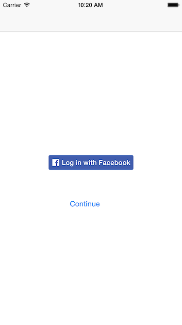
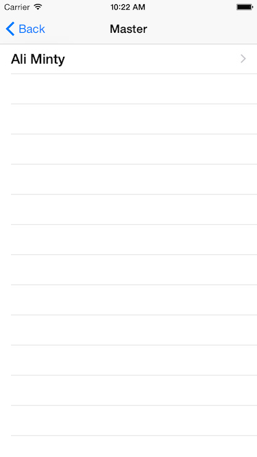
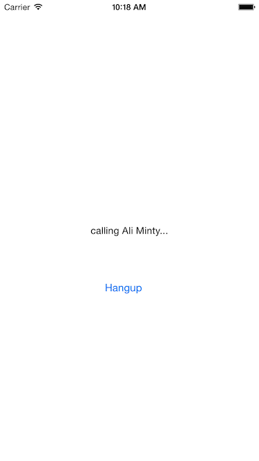

In this tutorial, you will learn how to create an iOS app that lets you call your Facebook friends using [app-to-app calls](https://www.sinch.com/products/voice/data-calling/). First, you will need a basic understanding of the following areas:

>   - XCode and Storyboard
>   - Objective-C
>   - Facebook SDK
>   - CocoaPods

## 1. Setup

First, open a new XCode project for iPhone using the Master-Detail Application template.

Next, use Terminal to navigate to your project’s directory and initialize CocoaPods:

    pod init

Then, add the following pods to your **Podfile**:

    pod 'SinchService'
    pod 'FBSDKCoreKit'
    pod 'FBSDKLoginKit'
    pod 'FBSDKShareKit'

Then, save your **Podfile** and type:

    pod install

After this, you’ll see an XCode workspace file with the extension “**.xcworkspace**”. We’ll need to work out of that file from now on instead of our project file. That way, all of our app’s components will work together in harmony.

In our app, we will first have the user log into Facebook. After this, the user will see a list of friends with the app who they can call. This means that we’ll need a login screen.

First create a new cocoa touch class with subclass UIViewController and call it **LoginViewController**. Then, open **Main.storyboard**, create a new view controller and assign it the LoginViewController custom class. Remove the segue between the navigation controller and master view controller and put you login view between them. Connect the three with appropriate segues to look like this:


## 2. Using Facebook

Let’s add a login button to the login screen. If you need help doing this, you can check out [Facebook’s login documentation](https://developers.facebook.com/docs/facebook-login/ios/v2.3#login-button). Make sure that you enable the “user\_friends” permission.

Now, add a button to our login screen in **Main.storyboard** that will trigger a segue to the master view controller once the user has logged in. Add the button and a IBAction for it in **LoginViewController.h**. Now, in **LoginViewController.m**, implement the IBAction as follows:

```objectivec
- (IBAction)ContinueAction:(id)sender {
    if ([FBSDKAccessToken currentAccessToken]) {
        [[NSNotificationCenter defaultCenter] postNotificationName:@"UserDidLoginNotification"
                      object:nil
                    userInfo:@{@"userId" : [[FBSDKAccessToken currentAccessToken] userID]}];

        [self performSegueWithIdentifier:@"showMaster" sender:nil];
    }
}
```


We’ll need a way to store info for any friend that the user calls or recieves calls from. Create a class called **CFriend** that will store a friend’s name and ID. We’re keeping track of ID’s since these will serve as usernames later on. Now, add to the following code to **CFriend.h** in the interface:

```objectivec
@property (nonatomic, copy) NSString *friendName;
@property (nonatomic, copy) NSString *friendID;

+ (id)addFriendWithName:(NSString *)friendName FriendID:(NSString *)friendID;
```

and the following code to **CFriend.m** in the implementation:

```objectivec
+ (id)addFriendWithName:(NSString *)friendName FriendID:(NSString *)friendID
{
    CFriend *newFriend = [[self alloc] init];
    [newFriend setFriendName:friendName];
    [newFriend setFriendID:friendID];
    return newFriend;
}
```

Import **CFriend.h** at the top of the files **MasterViewController.h** and **DetailedViewController.h**.

In order to get all of the user’s friends with the app, we need to populate the UITableView in the master view controller when it is loaded. We can do this by calling a method in `viewDidLoad`. Add the following method to **MasterViewController.h**:

```objectivec
- (void)getFriends {
    FBSDKGraphRequest *requestFriends = [[FBSDKGraphRequest alloc]
                                         initWithGraphPath:@"me/friends"
                                         parameters:nil
                                         HTTPMethod:@"GET"];
    [requestFriends startWithCompletionHandler:^(FBSDKGraphRequestConnection *connection,
                                                 id result,
                                                 NSError *error) {
        if (!error && result)
        {
            NSArray *allFriendsResultData = [result objectForKey:@"data"];

            if ([allFriendsResultData count] > 0)
            {
                for (NSDictionary *friendObject in allFriendsResultData)
                {
                    NSString *friendName = [friendObject objectForKey:@"name"];
                    NSString *friendID = [friendObject objectForKey:@"id"];

                    CFriend *newFriend = [CFriend addFriendWithName:friendName FriendID:friendID];

                    if (!self.objects) {
                        self.objects = [[NSMutableArray alloc] init];
                    }
                    [self.objects addObject:newFriend];
                    NSIndexPath *indexPath = [NSIndexPath indexPathForRow:_objects.count-1 inSection:0];
                    [self.tableView insertRowsAtIndexPaths:@[indexPath] withRowAnimation:UITableViewRowAnimationAutomatic];
                    [self.tableView reloadData];
                }
            }
        }

    }];
}
```

Then, call the method `getFriends` in `viewDidLoad`:

```objectivec
- (void)viewDidLoad {
    [super viewDidLoad];
    [self getFriends];
}
```

Now, let’s make some more changes in **MasterViewController.m** to display the user’s friends properly.

Go to `tableView:cellForRowAtIndexPath:` and change two of the lines to read as follows:

```objectivec
- (UITableViewCell *)tableView:(UITableView *)tableView cellForRowAtIndexPath:(NSIndexPath *)indexPath {
    UITableViewCell *cell = [tableView dequeueReusableCellWithIdentifier:@"Cell" forIndexPath:indexPath];

    CFriend *object = self.objects[indexPath.row];
    cell.textLabel.text = [NSString stringWithFormat:@"%@", [object friendName]];
    return cell;
}
```

You should now be able to login and see a list of friends who have the app. You can use [Facebook’s test user feature](https://developers.facebook.com/docs/apps/test-users) to test your app out.


## 3. Call Screen

Before we continue, there is a flaw in the current design of our app: we can only access our call screen, **DetailViewController**, from **MasterViewController**. While this is fine for making calls, we want to be able to recieve calls and display the call screen from anywhere in the app.

To fix this, first go to **Main.storyboard** and remove the segue between **MasterViewController** and **DetailViewController**. While in the storyboard, give **DetailViewController** the Storyboard ID `callScreen`. Then, go to **MasterViewController** and add the following code:

```objectivec
-(void)tableView:(UITableView *)tableView didSelectRowAtIndexPath:(NSIndexPath *)indexPath
{
    DetailViewController *controller = [self.storyboard instantiateViewControllerWithIdentifier:@"callScreen"];
    CFriend *callingFriend = self.objects[indexPath.row];
    [controller setDetailItem:callingFriend];

    // 2

    [self presentViewController:controller animated:YES completion:nil];
}
```

Now, the call screen is presented independently, and we can dismiss it whenever we want.

Go to **Main.storyboard** and add two buttons to **DetailViewController**, giving them the titles “Answer” and “Hangup”. Then, add the buttons as “AnswerButton” and “HangupButton” to **DetailedViewController.h**, along with appropriate IBActions named “AnswerAction” and “HangupAction”. Finally, change the `detailItem` to be a pointer to a **CFriend** object. **DetailedViewController.h** should now look like this:

```objectivec
#import <UIKit/UIKit.h>
#import "CFriend.h"

@interface DetailViewController : UIViewController

@property (strong, nonatomic) CFriend *detailItem;
@property (weak, nonatomic) IBOutlet UILabel *detailDescriptionLabel;
@property (weak, nonatomic) IBOutlet UIButton *AnswerButton;
@property (weak, nonatomic) IBOutlet UIButton *HangupButton;

- (IBAction)AnswerAction:(id)sender;
- (IBAction)HangupAction:(id)sender;

@end
```


## 4. Making and Recieving Calls with SinchService

If you haven’t already, go to your [Sinch Dashboard](https://portal.sinch.com/#/login/) and create a new app. Take note of you app’s key and secret.

As we discussed earlier, we want to start a call from anywhere in our app. SinchService will work well for this, as it will let us listen for incomming calls in **AppDelegate**. You can learn more about SinchService [here](https://github.com/sinch/SinchService-iOS).

First, go to **AppDelegate.h** and add the following imports:

```objectivec
#import <Sinch/Sinch.h>
#import <SinchService/SinchService.h>
```

Then, add the following property to the interface

```objectivec
@property (strong, nonatomic) id<SINService> sinch;
```

Now, go to **AppDelegate.m**. Allow the **AppDelegate** to serve as a **SINServiceDelegate** and a **SINCallClientDelegate** by adding to the implementaiton:

```objectivec
@interface AppDelegate () <SINServiceDelegate, SINCallClientDelegate>
@end
```

Then, add the following code to
`application:didFinishLaunchingWithOptions`:

```objectivec
id config = [[SinchService configWithApplicationKey:@"application-key"
                                  applicationSecret:@"application-secret"
                                    environmentHost:@"clientapi.sinch.com"]
             pushNotificationsWithEnvironment:SINAPSEnvironmentAutomatic];

id<SINService> sinch = [SinchService serviceWithConfig:config];
sinch.delegate = self;
sinch.callClient.delegate = self;

void (^onUserDidLogin)(NSString *) = ^(NSString *userId) {
    [sinch logInUserWithId:userId];
    [sinch.push registerUserNotificationSettings];
};

self.sinch = sinch;

[[NSNotificationCenter defaultCenter]
 addObserverForName:@"UserDidLoginNotification"
 object:nil
 queue:nil
 usingBlock:^(NSNotification *note) { onUserDidLogin(note.userInfo[@"userId"]); }];
```

Here, we are initializing the SINService object and setting up NSNotificationCenter. We need to set up NSNotificationCenter so we can log users into the app. We can use their Facebook userID’s as usernames.
 Now we need to handle incoming calls. We’ll do this by implementing the following method:

```objectivec
- (void)client:(id<SINCallClient>)client didReceiveIncomingCall:(id<SINCall>)call {

    UIViewController *top = self.window.rootViewController;

    FBSDKGraphRequest *requestFriends = [[FBSDKGraphRequest alloc]
                                         initWithGraphPath:[call remoteUserId]
                                         parameters:nil
                                         HTTPMethod:@"GET"];
    [requestFriends startWithCompletionHandler:^(FBSDKGraphRequestConnection *connection,
                                                 id result,
                                                 NSError *error) {
        if (!error && result)
        {
            NSString *friendName = [result objectForKey:@"name"];

            DetailViewController *controller = [top.storyboard instantiateViewControllerWithIdentifier:@"callScreen"];
            CFriend *callingFriend = [CFriend addFriendWithName:friendName FriendID:[call remoteUserId]];
            [controller setDetailItem:callingFriend];

            // 1

            [self.window.rootViewController presentViewController:controller animated:YES completion:nil];
        }

    }];
}
```

When the user receives a call, this method is called. Here, we get the caller’s ID, which will be their Facebook userID, and use it to find the caller’s name for us to display. We’ll come back to this method later on to add some more code.

Head over to the header file for our call screen, **DetailViewController.h**, and add this imports:

```objectivec
#import <Sinch/Sinch.h>
#import <FBSDKCoreKit/FBSDKCoreKit.h>
#import <FBSDKLoginKit/FBSDKLoginKit.h>
#import <FBSDKShareKit/FBSDKShareKit.h>
```

Then, allow for delegate assignments by adding to the interface line to make it look like this:

```objectivec
@interface DetailViewController : UIViewController <SINCallClientDelegate, SINCallDelegate>
```

Finally, add the following call property:

```objectivec
@property (nonatomic, readwrite, strong) id<SINCall> call;
```

Now, **DetailedViewController.h** should look something like this:

```objectivec
#import <UIKit/UIKit.h>
#import <Sinch/Sinch.h>
#import "CFriend.h"

@interface DetailViewController : UIViewController <SINCallClientDelegate, SINCallDelegate>

@property (strong, nonatomic) CFriend *detailItem;
@property (weak, nonatomic) IBOutlet UILabel *detailDescriptionLabel;
@property (weak, nonatomic) IBOutlet UIButton *AnswerButton;
@property (weak, nonatomic) IBOutlet UIButton *HangupButton;
@property (nonatomic, readwrite, strong) id<SINCall> call;

- (IBAction)AnswerAction:(id)sender;
- (IBAction)HangupAction:(id)sender;

@end
```

Now that we’re done with **DetailedViewController.h**, let’s go to **DetailedViewController.m**. We need a way to set the call property we just created and set the call’s delegate. We can do this by add the following method:

```objectivec
- (void)setCall:(id<SINCall>)call {
    _call = call;
    _call.delegate = self;
}
```

Let’s go back a bit and call this method whenever we present a new **DetailViewController**. First, go to **AppDelegate.m** to the method `client:didReceiveIncomingCall:` and add the following line where the comment `// 1` is:

```objectivec
[controller setCall:call];
```

This handles the call assignment for calls the user recieves. For calls the user makes, go to the file **MasterViewController.m**. First import **AppDelegate.h**:

```objectivec
#import "AppDelegate.h"
```

Then, add the following method to allow us to use the SinchService callClient from **AppdDelegate**:

```objectivec
- (id<SINCallClient>)callClient {
    return [[(AppDelegate *)[[UIApplication sharedApplication] delegate] sinch] callClient];
}
```

Finally, in the method `tableView:didSelectRowAtIndexPath:`, add the following two lines where the comment `// 2` is:

```objectivec
id<SINCall> call = [self.callClient callUserWithId:[callingFriend friendID]];
[controller setCall:call];
```

Now let’s go back to **DetailViewController.m** to work on how our app handles calls in the call screen.

Go to `viewDidLoad` and remove the following line:

```objectivec
[self configureView];
```

When the call screen is shown, we want to differentiate between incoming and outgoing calls. Add the following code to `viewDidLoad`:

```objectivec
if ([self.call direction] == SINCallDirectionIncoming) {
        self.AnswerButton.hidden = NO;
        self.detailDescriptionLabel.text = [NSString stringWithFormat:@"call from %@", [self.detailItem friendName]];
    } else {
        self.AnswerButton.hidden = YES;
        self.detailDescriptionLabel.text = [NSString stringWithFormat:@"calling %@...", [self.detailItem friendName]];
}
```

Let’s add some funtionality to our buttons. Implement the `AnswerAction` and `HangupAction` as follows:

```objectivec
- (IBAction)AnswerAction:(id)sender {
    [self.call answer];
    self.AnswerButton.hidden = YES;
    self.detailDescriptionLabel.text = @"";

}

- (IBAction)HangupAction:(id)sender {
    [self.call hangup];
}
```

Finally, there are delegate methods for whenever a call establishes or ends. Implement them as follows:

```objectivec
- (void)callDidEstablish:(id<SINCall>)call {
    self.detailDescriptionLabel.text = @"";
}

- (void)callDidEnd:(id<SINCall>)call {
    [self dismissViewControllerAnimated:YES completion:nil];
}
```

Now, whenever the user’s call ends, we dismiss the call screen, taking the user back to wherever he or she was in the app before the call began.




Congratulations, you have create an app to call your Facebook friends using SinchService\! There are even more features that you can add to this project. Managed Push, for example, can help you reach a user when their app is not open using push notificaitons. To learn more on how to use Managed Push with SinchService, check out this [tutorial](https://github.com/sinch/ios-managedpush-with-sinchservice).
