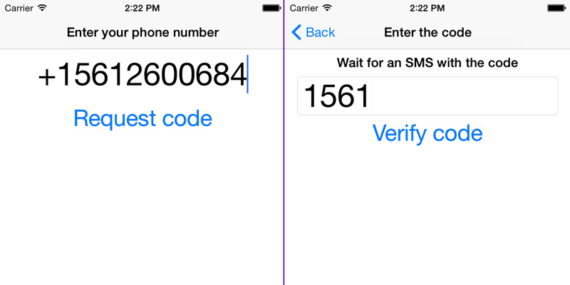

In this tutorial, we are going to explore our Verification SDK for iOS. As of this writing, the method we support for iOS is [SMS verification](doc:verification-ios-sms-verification), which we wrote about in [earlier tutorials](doc:building-an-ios-client-for-number-verification-part-2). With our Verification SDK, you won’t need any backend yourself, or you can implement a simple endpoint to receive that a number is verified. .. You can check out more [Verification Tutorials](https://www.sinch.com/tutorials/?tags%5B%5D=verification&utm_source=sinch&utm_medium=xlink&utm_campaign=verifyall)

## Setup

I created a start project that contains the framework and a couple of screens you can download [here](https://github.com/sinch/ios-verification-tutorial). If you prefer to add it to your app directly, here is how you set it up:

> 1.  Download the SDK [here](https://sinch.readme.io/page/downloads)
> 2.  Add the `SinchVerification.Framework` to your app, OR
> 3.  Use [CocoaPods](http://cocoapods.org) -`pod 'SinchVerification', '0.9-beta1'`

## Verifying a phone number

First off, we need to collect the user’s phone number as we do in the starter project “EnterPhonenumberViewController” and request to send an SMS to that number. Open the **EnterPhonenumberViewController.m** and find the **requestCode** method. Then find the row `[self performSegueWithIdentifier:@"verifyCodeSeg" sender:nil];` and replace it with this code:

*EnterPhonenumberViewController.m*

```objectivec
//start the verification process with the phone number in the field
_verification = [SINVerification
                    SMSVerificationWithApplicationKey:@"YOURKEY"
                    phoneNumber:_phoneNumber.text];
//set up the initiate the process
[_verification initiateWithCompletionHandler:^(BOOL success, NSError *error) {
   [spinner stopAnimating];
   if (success) {
      [self performSegueWithIdentifier:@"verifyCodeSeg" sender:nil];
   }
   else {
      _status.text = [error description];
   }
}];
```

In the code above, we are creating a verification object and starting the two step process of verifying a number. If it fails, display an error message, otherwise continue to the **EnterCode** screen. In the starter project, I also prepared the **prepareForSegue:** method to pass the verification object to the EnterCode controller.

```objectivec
- (void)prepareForSegue:(UIStoryboardSegue *)segue sender:(id)sender {
    VerifyCodeViewController* vc = [segue destinationViewController];
    vc.verification = _verification;
}
```

Here we set the verification object to the current verification. Next up, verify the code sent to the phone. Open up **VerifyCodeViewController.m**, find the method **verifyCode:**, and replace the line `[self performSegueWithIdentifier:@"verifyCodeSeg" sender:nil];` with

**VerifyCodeViewController.m**

```objectivec
[self.verification
 verifyCode:code.text
 completionHandler:^(BOOL success, NSError* error) {
     if (success) {
         [_spinner stopAnimating];
         [self performSegueWithIdentifier:@"confirmedSeg" sender:nil];
         // Phone number was successfully verified, you should
         //probably notify your backend or use the callbacks to store that the phone is
         //verified.
     } else {
         // Ask user to re-attempt verification
         status.text = [error description];
     }
 }];
```

With a few lines of code, you can implement a solid solution to verify phone numbers of your users in iOS. Next up is implementing the callbacks on your server side.


<a class="edit-on-github" target="_blank" href="https://github.com/sinch/docs/blob/master/docs/tutorials/ios/verify-a-phone-number-in-your-ios-app.md">Edit on GitHub</a>