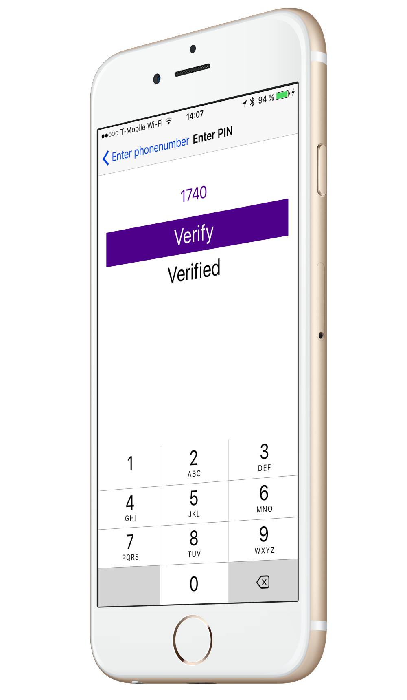

In this tutorial you’ll learn how to verify a user’s phone number using our Swift framework. We support two methods of verifying on iOS:

>   - Standard [SMS PIN Verification](https://www.sinch.com/products/verification/sms/)
>   - [Callout Verification](https://www.sinch.com/products/verification/) where we place a call to the number and the user then presses 1 to confirm that they wanted the call

We also offer [Flash Call Verification](https://www.sinch.com/products/verification/flash-call/), but this is available for Android only.

At the end of this tutorial we will have a basic app that looks like this:


## Getting Started

### Sinch Setup

> 1.  [Create an account](https://portal.sinch.com/#/signup)
> 2.  Create an app and change set authorization to public (for now) 


> 3.  Take note of the application key

Head over to Xcode to get some basic setup.

### Xcode Setup

> 1.  Create a new single view project
> 2.  Add a cocoapods file and install pods
> 3.  A physical device with SIM card

```text
platform :ios, '8.0'
use_frameworks!
pod 'SinchVerification-Swift'
```

## Building the first screen UI

Open up your workspace and go to **main.storyboard** file. Then open up assistant view so also see **ViewController.swift**:

> 1.  Add a textfield and add an outlet called **phoneNumber**. Set the keyboard type of the field to phone number
> 2.  Add an SMS verification button and create an action called **smsVerification**
> 3.  Add a callout verification button and create an action called **calloutVerification**
> 4.  Add a label and call an outlet called **status**
> 5.  Add an activity indicator and an outlet called **spinner**, and then check the box to hide when no animated
> 6.  Embed the ViewController in a navigation controller editor

Add your constraints and the first screen is done. The next thing we are going to do is to add some code to do a callout verification. I want to start with this because the callout verification does not require any additional screens.

## Callout Verification 
The verification flow for a callout is pretty neat. Just imitate a callout verification and when the callback comes to the client you are actually done.

How does it work? Sinch will place a call to the given phone number and when the user picks up we prompt the user to press 1. If they do it’s a success, but if they don’t then it is treated as a fail (or if they don’t pick up etc).

Open up **ViewController.swift** and add an import for
**SinchVerification**:

```swift
import SinchVerification;
```

At the top of your class, add two variables to hold the verification and one to hold the application key.

```swift
var verification:Verification!;
var applicationKey = "your key";
```

Great\! Now we want to start a callout verification once the user clicks on the callout verification button.

```swift
@IBAction func calloutVerification(_ sender: AnyObject) {
       disableUI(true);
       verification = CalloutVerification(applicationKey,
           phoneNumber: phoneNumber.text!);
       verification.initiate { (result: InitiationResult, error: NSError?) -> Void in
           self.disableUI(false);
           self.status.text = (success.success ? "Verified" : error?.localizedDescription);
       }
   }
```

As you can see that’s not a lot of code to make this roll. You might have noticed that I have a **disbleUI(Bool)** call in there, and that’s a small method to disable the UI while waiting for the call. This is important to do because if the user starts multiple verification requests they might get stuck in a loop where they never get verified and the phone just keeps ringing. I implemented a timeout for 30 seconds before I consider it to be a fail and the user can try again.

```swift
func disableUI(_ disable: Bool){
        var alpha:CGFloat = 1.0;
        if (disable) {
            alpha = 0.5;
            phoneNumber.resignFirstResponder();
            spinner.startAnimating();
            self.status.text="";
            let delayTime =
                        DispatchTime.now() +
                        Double(Int64(30 * Double(NSEC_PER_SEC)))
                        / Double(NSEC_PER_SEC)
            DispatchQueue.main.asyncAfter(
            deadline: delayTime, execute:
            { () -> Void in
                self.disableUI(false);
            });
        }
        else{
            self.phoneNumber.becomeFirstResponder();
            self.spinner.stopAnimating();

        }
        self.phoneNumber.isEnabled = !disable;
        self.smsButton.isEnabled = !disable;
        self.calloutButton.isEnabled = !disable;
        self.calloutButton.alpha = alpha;
        self.smsButton.alpha = alpha;
    }
```

Time to add some nicer UI. Add a **viewWillAppear** and set the phone number to first responder.

```swift
override func viewWillAppear(_ animated: Bool) {
        phoneNumber.becomeFirstResponder();
        disableUI(false);

}
```

Nothing too fancy as you can see. Run the app and try it out. Pretty sweet right?

## Adding SMS Verification

Another way of adding verification is the classic SMS PIN method, which I’m sure you have used. The downside of SMS, in my opinion, is that you need the user to enter a code which does add some friction to the user experience.

To accomplish an SMS verification, you will need a new view where a user can enter a code. Add a new ViewController to the solution and call in **EnterCodeViewController.swift**.

Open up **Main.Storyboard** and add a view controller to the board and set the first responder to the newly created Controller

> 1.  Add a textfield and an outlet called **code**
> 2.  Add a button and an action called **verify**
> 3.  Add label and an outlet called **status**
> 4.  Lastly a spinner and an outlet called **spinner**
> 5.  Add a segue from **ViewController.swift** to **EnterCodeViewController.swift** and call it **enterPin**.

Add your constraints and make it look how you want, but it should look something like this:


### Initiating an SMS verification

Initiating an SMS verification is very similar to Callout. The big difference here is when you get the success callback, it doesn’t mean its verified, it just means that we have sent an SMS. What we need to do after that is to send in a code that we get from user input to verify the code. In this case we do that in a separate view controller. So once we have the success, we perform the segue to show the entertain controller.

```swift
@IBAction func smsVerification(_ sender: AnyObject) {
    self.disableUI(true);
    verification = SMSVerification(applicationKey, phoneNumber: phoneNumber.text!)

    verification.initiate { (result: InitiationResult, error:Error?) -> Void in
        self.disableUI(false);
        if (success.success){
            self.performSegue(withIdentifier: "enterPin", sender: sender)

        } else {
            self.status.text = error?.localizedDescription
        }
    }
}
```

To verify a verification, you need to keep the current verification object, so in in **prepareForSegue** we want to pass on the current verification object so we can call verify on it.

```swift
override func prepare(for segue: UIStoryboardSegue, sender: Any!) {
    if (segue.identifier == "enterPin") {
        let enterCodeVC = segue.destination as! EnterCodeViewController;
        enterCodeVC.verification = self.verification;
    }

}
```

Now that’s out of the way, open up **EnterCodeViewController.swift** and go to the action **verify** and set up the UI for making a verification request, and call verify on your verification object.

```swift
@IBAction func verify(sender: AnyObject) {
    spinner.startAnimating();
    verifyButton.isEnabled = false;
    status.text  = "";
    pinCode.isEnabled = false;
    verification.verify(
        pinCode.text!, completion:
        { (success:Bool, error:Error?) -> Void in
            self.spinner.stopAnimating();
            self.verifyButton.isEnabled = true;
            self.pinCode.isEnabled = true;
            if (success) {
                self.status.text = "Verified";
            } else {
                self.status.text = error?.localizedDescription;
            }
    });
}
```

You now have a verified number for your user. With this implementation you only know on the client side that the number is verified. In a real world app, you would need to tell your backend that the number is verified. You could accomplish that in two ways. Either calling that update on the success flow from the client. Or your own callbacks that we have for verification (recommended).

For more details, check out our [verification documentation](doc:verification-rest-callback-api).

<a class="gitbutton pill" target="_blank" href="https://github.com/sinch/docs/blob/master/docs/tutorials/ios/verifying-a-phone-number-in-ios-using-swift-3.md">
                        <span class="icon medium">
                            <svg xmlns="http://www.w3.org/2000/svg" role="img" viewBox="0 0 24 24"><title>GitHub icon</title><path d="M 12 0.297 c -6.63 0 -12 5.373 -12 12 c 0 5.303 3.438 9.8 8.205 11.385 c 0.6 0.113 0.82 -0.258 0.82 -0.577 c 0 -0.285 -0.01 -1.04 -0.015 -2.04 c -3.338 0.724 -4.042 -1.61 -4.042 -1.61 C 4.422 18.07 3.633 17.7 3.633 17.7 c -1.087 -0.744 0.084 -0.729 0.084 -0.729 c 1.205 0.084 1.838 1.236 1.838 1.236 c 1.07 1.835 2.809 1.305 3.495 0.998 c 0.108 -0.776 0.417 -1.305 0.76 -1.605 c -2.665 -0.3 -5.466 -1.332 -5.466 -5.93 c 0 -1.31 0.465 -2.38 1.235 -3.22 c -0.135 -0.303 -0.54 -1.523 0.105 -3.176 c 0 0 1.005 -0.322 3.3 1.23 c 0.96 -0.267 1.98 -0.399 3 -0.405 c 1.02 0.006 2.04 0.138 3 0.405 c 2.28 -1.552 3.285 -1.23 3.285 -1.23 c 0.645 1.653 0.24 2.873 0.12 3.176 c 0.765 0.84 1.23 1.91 1.23 3.22 c 0 4.61 -2.805 5.625 -5.475 5.92 c 0.42 0.36 0.81 1.096 0.81 2.22 c 0 1.606 -0.015 2.896 -0.015 3.286 c 0 0.315 0.21 0.69 0.825 0.57 C 20.565 22.092 24 17.592 24 12.297 c 0 -6.627 -5.373 -12 -12 -12" /></svg>
                        </span>
                        Edit on GitHub!</a>