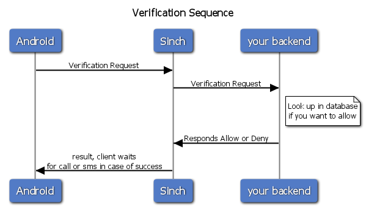
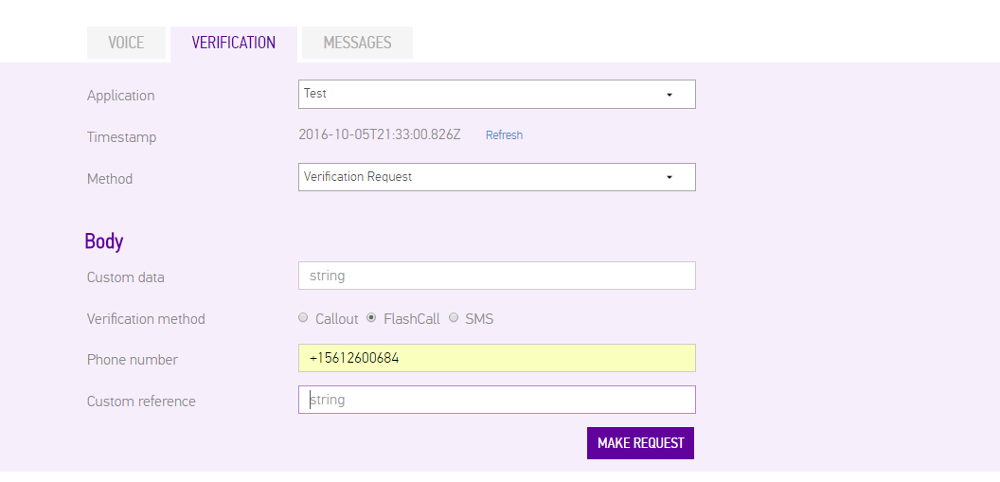
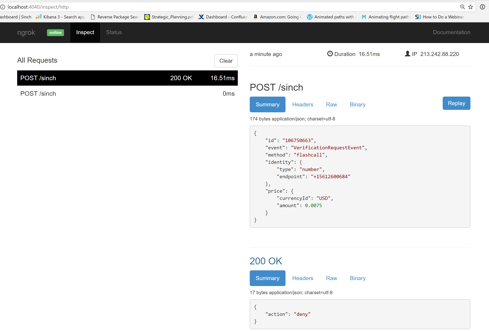
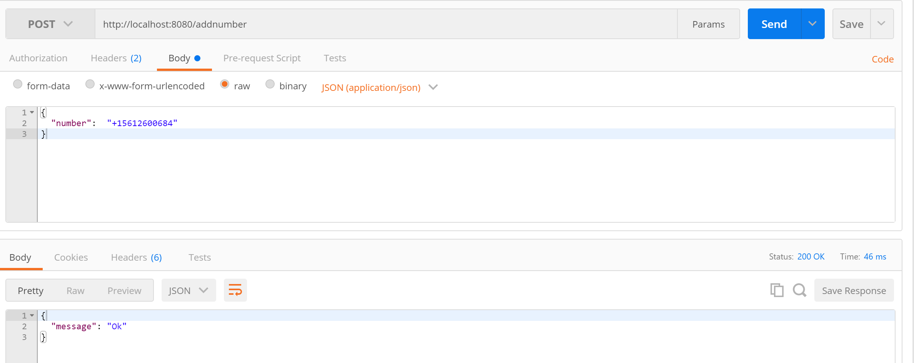
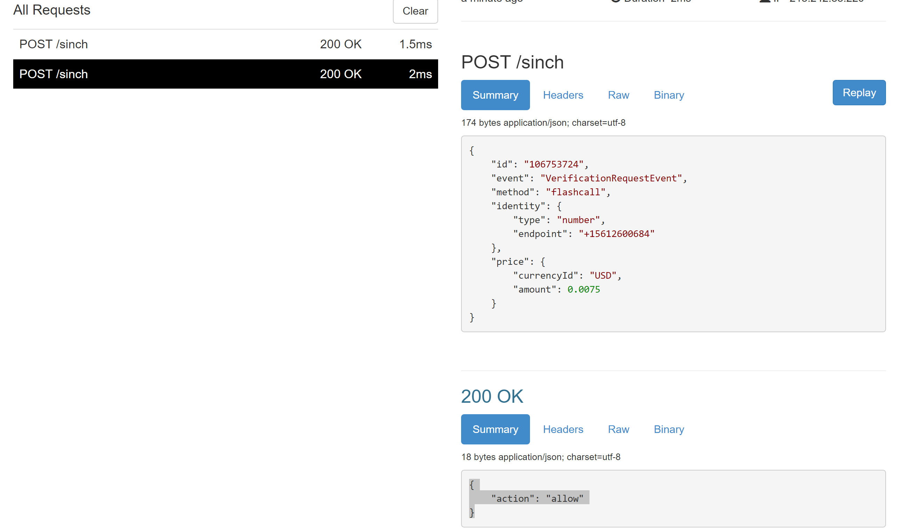

In this tutorial, we’ll show you the different ways you can ensure that your app is secure and nobody is using your account for fraudulent verifications.

## Two different ways of securing your app

Sinch offers 2 ways to secure your app, the first one is the [Callback/webhook](doc:verification-rest-callback-api) way of securing it which we’ll dive into today, and the other is Application Signed requests, but that’s a post for another day.

### Webhooks

This is the recommended way of securing your verification. Using Sinch Verification we send two events to your back end (if configured), one when someone wants to create a verification and one when the client tried to authenticate.

We chose this approach for a couple of reasons, the first was to enable developers to easy try it out with no backend, the second was that we did not want to have the key and secret in-app, and OAuth seemed over complicated for a process that will most likely only occur once.


You can verify that the request is from us by signing the request you receive and comparing the hash with [authorization](doc:verification-rest-verification-api#section-authorization), or if you prefer, ship a custom variable like your Token for your own api requests and validate that in the custom variables.

## Using node to respond to your callbacks

Today I will set up a backend to allow or deny a verification attempt using Node.JS and [Express](http://expressjs.com/) . For testing and generating requests I will use our [api explorer](https://portal.sinch.com/#/apps) that you’ll find in the dashboard


 - Create the app

```shell
npm init
```

Accept all defaults.

```shell
npm install --save express body-parser
```

With this basic setup I can start writing some code. As I previously mentioned, when a verification request is made you get that event posted to an URL. That will be a POST request and contain data similar to below:

```json
{
    "id":"1234567890",
    "event": "VerificationRequestEvent",
    "method": "flashCall",
    "identity": { "type":"number", "endpoint":"+46700000000" },
    "price": { "amount": 0.005, "currencyId":"USD" } ,
    "custom":"your custom data, you can make json if you want"
}
```

There are a few parameters here that I want to point out - The event to know what kind of event is being sent to us - Identity or enough custom data to inform us of whether the requests should be allowed or denied.

In index.js I create some basic config and routes:

index.json

```javascript
var express    = require('express');        // call express
var bodyParser = require('body-parser');

function logResponseBody(req, res, next) {
// intercept all requests and set response type to json, and log it for debug
  res.setHeader('Content-Type', 'application/json');
  console.log(JSON.stringify(req.body, null, 2));
  next();
}

var app = express();
app.use(bodyParser.json());
app.use(bodyParser.urlencoded({ extended: false }));
app.use(logResponseBody);
var port = process.env.PORT || 8080;        // set our port
var router = express.Router();

router.post('/sinch', function(req, res) {
    res.json({ message: 'Here we need to respond correct SVAML' });
});
app.use('/api', router);
app.listen(port);
module.exports = app;
```

Using PostMan, I post to the localhost:8080/sinch and see the message response,not very exciting so here’s what I want to do:

 1.  Create an endpoint that is secured with your own custom login token for users (i.e oauth2 or your custom auth scheme) where I add numbers you want to verify
 1.  Store in a database (in this tutorial I will just use in memory as an example)
 1.  A sinch webhook endpoint that will:
     1.  Look up the number on initate request. Allow if it’s a hit, otherwise deny.
     1.  When a verification is successful, remove it from the list of numbers.

### Endpoint to add numbers

Add a global variable to hold numbers:

```javascript
var numbers = [];
router.post('/addnumber', function (req, res) {
  //your custom api security like an oath bearer token
  //in this tutorials we are going to save the numbers in memory,
  //in production you prob want to either persist it or use a rediscache or similiar
  numbers.push(req.body['number'])
  res.json({ message: 'Ok' });
});
```

The code above doesn’t do anything fancy, just pushes a new number in to the array. I will use this in the web-hook endpoint next.

### Responding to web-hook events

Sinch posts every event to the same endpoint, so the first task is to determine if the event is a Request or Result event. The requestEvent is triggered when someone starts a verification, the result event is triggered every time someone tries to verify a code.

```javascript
router.post('/sinch', function (req, res) {
  //look the type of event VerificationRequestEvent or VerificationResultEvent
  if (req.body['event'] == 'VerificationRequestEvent') {
  }
  else if (req.body['event'] == 'VerificationResultEvent') {
    }
});
```

Next, I will add implementation to handle the RequestEvent by checking if the number is in allowed number array. This is also where you can set the code and make some other changes to the Veriifcation requests. View the docs for more [details](doc:verification-rest-api).

```javascript
router.post('/sinch', function (req, res) {
  //look the type of event VerificationRequestEvent or VerificationResultEvent
  if (req.body['event'] == 'VerificationRequestEvent') {
    if (lookUpNumber(req.body['identity']['endpoint'])) {
      res.json({ action: 'allow' });

    } else {
      res.json({ 'action': 'deny' });
    }
  }
  else if (req.body['event'] == 'VerificationResultEvent') {
  }
});
```

If the function lookUpNumber returns true, allow it, otherwise deny. This is a time when I really miss c\# with its lambda\! It’d be so nice to be able to query the array for the key instead of a custom function. But today I am working with node so let’s implement the custom function.

```javascript
function lookUpNumber(number) {
  for (var p in numbers) {
    if (numbers[p] == number) {
      return true;
    }
  }
  return false;
}
```

That finishes off the implementation for the Request event, and next I want to handle the result event. Look at the result and if it’s a success, remove it from the list (if it fails it should notify the client, but that’s outside the scope of this tutorial)

In the if statement for “VerificationResultEvent” I added the following code:

```javascript
if (req.body['status'] == 'SUCCESSFUL') {
  //remove the number if it was SUCCESSFUL
  removeNumber(req.body['identity']['endpoint']);
  res.status(200); //Sinch realy dosent care if you reply but its a nice gesture to reply to us :D
  res.json();
}
else {
  //take some action in the app to let the user know it failed.
}
```

And the function to search and remove an element in an array:

```javascript
function removeNumber(number) {
  for (var p in numbers) {
    if (numbers[p] == number) {
      numbers.splice(p, 1);
    }
  }
}
```

Now I just need to test\! To do that, I will use [ngrok](https://ngrok.com/), , which if you havent set up, you’ll want to. Check out my [previous post about ngrok](https://www.sinch.com/tutorials/getting-second-number-testing-sinch-callbackswebhooks-ngrok) and why I love it.

Start up ngrok:

```shell
>ngrok http 8080
```


I will head over to my app in the dashboard and change the url to the above url.


Using the dev tools in the portal to hit my number again, and what happens?


Looks like I forgot to add my number to the list of allowed numbers to verify, so with Postman (another awesome tool) I quickly add my number to the list.


Ok, hit the number again and this time I get the expected allow\!


## What’s next?

In order to use our verificaiton SDK, next steps for a real app would be to add logging, support for more types of verificaitons, and of course persistence and real security on my added numbers end points. To add some more security and verify the requests I get from the sinch plattform using our [request module](https://www.npmjs.com/package/sinch-request).

Would you be interested in a complete backend or are you more interested in snippets like today or perhaps even shorter? Let me know in the comments or tweet me at [@cjsinch](https://twitter.com/cjsinch)\!

<div class="magic-block-html"><a class="gitbutton pill" target="_blank" href="https://github.com/sinch/docs/blob/master/docs/tutorials/javascript/securing-your-verifications-when-using-nodejs.md"><span class="icon medium"><svg xmlns="http://www.w3.org/2000/svg" role="img" viewBox="0 0 24 24"><title>GitHub icon</title><path d="M 12 0.297 c -6.63 0 -12 5.373 -12 12 c 0 5.303 3.438 9.8 8.205 11.385 c 0.6 0.113 0.82 -0.258 0.82 -0.577 c 0 -0.285 -0.01 -1.04 -0.015 -2.04 c -3.338 0.724 -4.042 -1.61 -4.042 -1.61 C 4.422 18.07 3.633 17.7 3.633 17.7 c -1.087 -0.744 0.084 -0.729 0.084 -0.729 c 1.205 0.084 1.838 1.236 1.838 1.236 c 1.07 1.835 2.809 1.305 3.495 0.998 c 0.108 -0.776 0.417 -1.305 0.76 -1.605 c -2.665 -0.3 -5.466 -1.332 -5.466 -5.93 c 0 -1.31 0.465 -2.38 1.235 -3.22 c -0.135 -0.303 -0.54 -1.523 0.105 -3.176 c 0 0 1.005 -0.322 3.3 1.23 c 0.96 -0.267 1.98 -0.399 3 -0.405 c 1.02 0.006 2.04 0.138 3 0.405 c 2.28 -1.552 3.285 -1.23 3.285 -1.23 c 0.645 1.653 0.24 2.873 0.12 3.176 c 0.765 0.84 1.23 1.91 1.23 3.22 c 0 4.61 -2.805 5.625 -5.475 5.92 c 0.42 0.36 0.81 1.096 0.81 2.22 c 0 1.606 -0.015 2.896 -0.015 3.286 c 0 0.315 0.21 0.69 0.825 0.57 C 20.565 22.092 24 17.592 24 12.297 c 0 -6.627 -5.373 -12 -12 -12" /></svg></span>Edit on GitHub!</a></div>