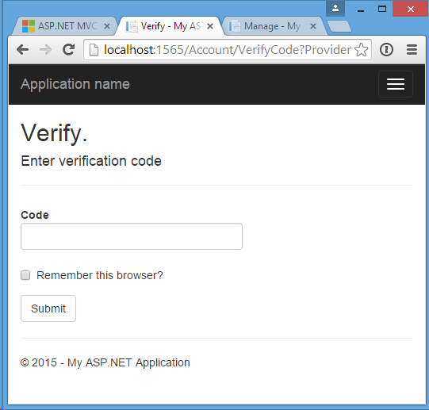

In Part 3 of this tutorial series, we will create an SMS provider for Microsoft Identity that comes shipped with in the .NET framework. It will take about 15 minutes.

## Prerequisites

> 1.  Working knowledge of C\# and REST APIs
> 2.  Visual Studio 2013 or later
> 3.  A [Sinch account](https://portal.sinch.com/#/signup)

## Setup

> 1.  Create a new a project and name it **LoginSample**
> 2.  Select MVC project with basic authentication


## Enable SMS for two-factor authentication with Sinch

> 1.  In the package manager console, enter: `Install-Package Sinch.SMS`
> 2.  Open **IdentityConfig.cs** in the **App_Start** folder and find the **SMSService** class. Add the Sinch implementation to it like this:

```csharp
public Task SendAsync(IdentityMessage message)
{
    Sinch.SMS.Client client = new Client("key", "secret");
    return client.SendSMS(message.Destination, message.Body);
}
```

Remember to replace the **key** and **secret** with your own info from the [dashboard](https://portal.sinch.com/#/login).

## Update the profile page to show number

In a production scenario, you would likely ask for a phone number during the registration process. In this case, we will just add it to the profile page.

> 1.  Open **Views:raw-latex:\`Manage\`:raw-latex:\`Index\`.cshtml** and find the **PhoneNumber** section. Uncomment it:

```html
<dt>Phone Number:</dt>
  <dd>
      @(Model.PhoneNumber ?? "None") [
      @if (Model.PhoneNumber != null)
      {
          @Html.ActionLink("Change", "AddPhoneNumber")
          @: &nbsp;|&nbsp;
          @Html.ActionLink("Remove", "RemovePhoneNumber")
      }
      else
      {
          @Html.ActionLink("Add", "AddPhoneNumber")
      }
      ]
  </dd>
```

> 2.  Also uncomment the two-factor authentication part:

```csharp
@if (Model.TwoFactor)
{
   using (Html.BeginForm("DisableTwoFactorAuthentication", "Manage", FormMethod.Post, new { @class = "form-horizontal", role = "form" }))
   {
       @Html.AntiForgeryToken()
       <text>Enabled
       <input type="submit" value="Disable" class="btn btn-link" />
       </text>
   }
}
else
{
   using (Html.BeginForm("EnableTwoFactorAuthentication", "Manage", FormMethod.Post, new { @class = "form-horizontal", role = "form" }))
   {
       @Html.AntiForgeryToken()
       <text>Disabled
       <input type="submit" value="Enable" class="btn btn-link" />
       </text>
   }
}
```

## Testing the app

Hit **F5** and run the app. If you haven’t already registered an account, click on the username in the top right corner. This will take you to the page where you can manage your profile.


> 1.  Click Add Phone Number; remember to enter it in the international format (i.e **1** 5612600684)
> 2.  Enter the code you received in an SMS
> 3.  Click enable two-factor authentication
> 4.  Log off and log back in; you should now see it below:


> 5.  Click Next and enter the code in the following window.


Now you see how easy it is to enable two-factor authentication on an ASP.NET Identity application using Sinch.

<a class="gitbutton pill" target="_blank" href="https://github.com/sinch/docs/blob/master/docs/tutorials/net/number-verification-aspnet-identity-and-two-factor-authentication-part-3.md">
                        <span class="icon medium">
                            <svg xmlns="http://www.w3.org/2000/svg" role="img" viewBox="0 0 24 24"><title>GitHub icon</title><path d="M 12 0.297 c -6.63 0 -12 5.373 -12 12 c 0 5.303 3.438 9.8 8.205 11.385 c 0.6 0.113 0.82 -0.258 0.82 -0.577 c 0 -0.285 -0.01 -1.04 -0.015 -2.04 c -3.338 0.724 -4.042 -1.61 -4.042 -1.61 C 4.422 18.07 3.633 17.7 3.633 17.7 c -1.087 -0.744 0.084 -0.729 0.084 -0.729 c 1.205 0.084 1.838 1.236 1.838 1.236 c 1.07 1.835 2.809 1.305 3.495 0.998 c 0.108 -0.776 0.417 -1.305 0.76 -1.605 c -2.665 -0.3 -5.466 -1.332 -5.466 -5.93 c 0 -1.31 0.465 -2.38 1.235 -3.22 c -0.135 -0.303 -0.54 -1.523 0.105 -3.176 c 0 0 1.005 -0.322 3.3 1.23 c 0.96 -0.267 1.98 -0.399 3 -0.405 c 1.02 0.006 2.04 0.138 3 0.405 c 2.28 -1.552 3.285 -1.23 3.285 -1.23 c 0.645 1.653 0.24 2.873 0.12 3.176 c 0.765 0.84 1.23 1.91 1.23 3.22 c 0 4.61 -2.805 5.625 -5.475 5.92 c 0.42 0.36 0.81 1.096 0.81 2.22 c 0 1.606 -0.015 2.896 -0.015 3.286 c 0 0.315 0.21 0.69 0.825 0.57 C 20.565 22.092 24 17.592 24 12.297 c 0 -6.627 -5.373 -12 -12 -12" /></svg>
                        </span>
                        Edit on GitHub!</a>