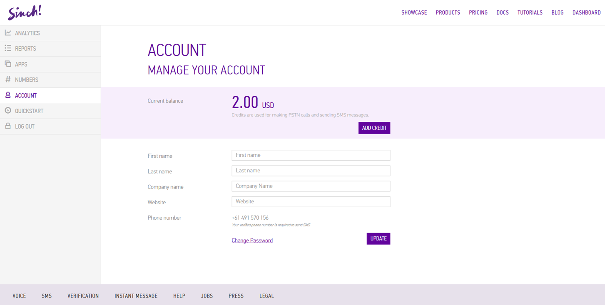
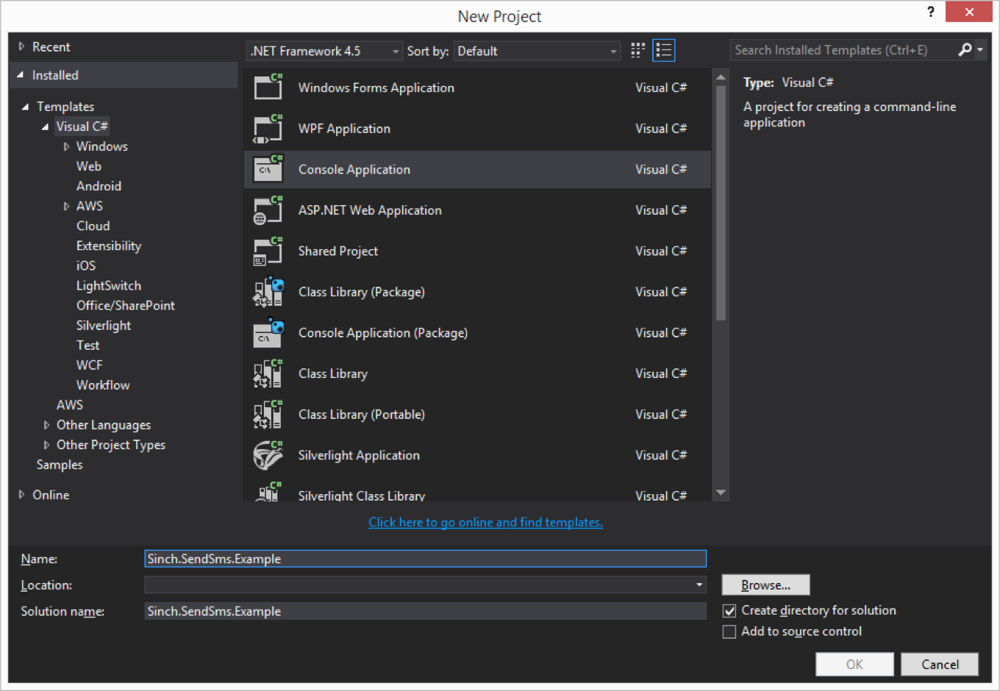
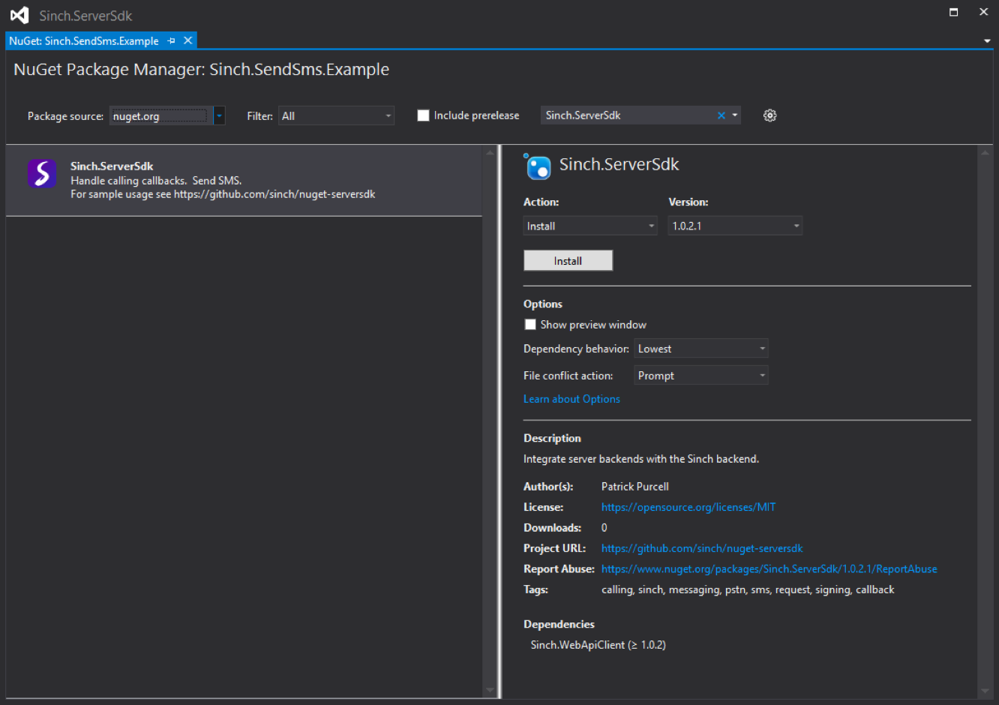

If you thought SMS was old fashioned, think again. 96% of smartphone users still use SMS. It has a 90% read rate in minutes and higher engagement rates than emails and OTT apps, which makes it very reach effective in terms of timeliness. SMS is the one solution, not requiring app installations or friend requests, not relying on tech heavy solutions or the operator at hand.

’Nuff said about the good old short message service for now. In this tutorial we’ll be creating an application to send an SMS. We’ll be using the clientapi environment, and in the clientapi, you can only send messages to verified numbers on your account.

## Setup

In [the dashboard](https://portal.sinch.com/#/login), ensure you have a phone number on the Account page. If not, click “Add a phone number”.


Enter your number and submit the PIN code you will receive in the verification SMS.


You’ll now have the number attached to your Sinch account, and will also have been credited $2 as a bonus for verifying your number\!


Create a new application from the “Apps” tab. Leave the environment to the default: clientapi.


Click on the key symbols and take note of your application’s key and secret, as they’ll be used in the Sinch Server SDK shortly.


Open Visual Studio and create a new Console Application:


Right click on References in Solution Explorer and select **“Manage NuGet Packages…”**.

If you’re using an older version of Visual Studio and don’t see this, you’ll need to add it from here: <http://docs.nuget.org/consume/installing-nuget>.

Search for `Sinch.ServerSdk` and click **“Install”** for **“Sinch.ServerSdk”**.


## MainAsync( ) 
Because of the limitations of the compiler, having an asynchronous `Main()` method is not allowed. To overcome this obstacle, and to make for a more straightforward tutorial, we’ll create this method:

```csharp
private static async Task MainAsync()
{
}
```

Then, we want to add the following line of code to `Main()`:

`MainAsync().GetAwaiter().GetResult();`

Add the following lines to import the SDK namespace: using `Sinch.ServerSdk;`

## Send SMS

To send an SMS, we’ll add the following to `MainAsync()`:

```csharp
var smsApi = SinchFactory.CreateApiFactory("yourkey", "yoursecret").CreateSmsApi();
var sendSmsResponse = await smsApi.Sms("+61491570156", "Hello world.  Sinch SMS here.").Send();
```

Remember to replace the application key and secret with your own, and change the phone number and message accordingly. It might be worth setting up a unique long number or an [SMS short code](https://www.sinch.com/products/messaging/numbers/short-codes/).

## Check status 
Next, we want to check the status of an SMS. Add these couple of lines:

```csharp
var smsMessageStatusResponse = await smsApi.GetSmsStatus(sendSmsResponse.MessageId);
Console.WriteLine(smsMessageStatusResponse.Status);
Console.ReadLine(); 
```

It might be worthwhile putting a `Task.Delay()` before checking the status, as it could take a second or two for the SMS to be delivered. Checking immediately will most likely lead to a status of **“Pending”**.

## Celebrate


You’re done. As usual, you can download the complete, working example project on [Github](https://github.com/sinch/nuget-serversdk-tutorial). Go charm those 96%\!

## Full program code

```csharp
using System;
using System.Threading.Tasks;
using Sinch.ServerSdk;

namespace Sinch.SendSms.Example
{
    internal class Program
    {
        private static void Main()
        {
            MainAsync().GetAwaiter().GetResult();
        }

        private static async Task MainAsync()
        {
            var smsApi = SinchFactory.CreateApiFactory("00000000-0000-0000-0000-000000000000", "AAAAAAAAAAAAAAAAAAAAAA==").CreateSmsApi();
            var sendSmsResponse = await smsApi.Sms("+61491570156", "Hello world.  Sinch SMS here.").Send();

            await Task.Delay(TimeSpan.FromSeconds(10)); // May take a second or two to be delivered.

            var smsMessageStatusResponse = await smsApi.GetSmsStatus(sendSmsResponse.MessageId);
            Console.WriteLine(smsMessageStatusResponse.Status);
            Console.ReadLine();
        }
    }
}
```

<a class="gitbutton pill" target="_blank" href="https://github.com/sinch/docs/blob/master/docs/tutorials/net/send-an-sms-with-the-sinch-net-server-side-sdk.md">
                        <span class="icon medium">
                            <svg xmlns="http://www.w3.org/2000/svg" role="img" viewBox="0 0 24 24"><title>GitHub icon</title><path d="M 12 0.297 c -6.63 0 -12 5.373 -12 12 c 0 5.303 3.438 9.8 8.205 11.385 c 0.6 0.113 0.82 -0.258 0.82 -0.577 c 0 -0.285 -0.01 -1.04 -0.015 -2.04 c -3.338 0.724 -4.042 -1.61 -4.042 -1.61 C 4.422 18.07 3.633 17.7 3.633 17.7 c -1.087 -0.744 0.084 -0.729 0.084 -0.729 c 1.205 0.084 1.838 1.236 1.838 1.236 c 1.07 1.835 2.809 1.305 3.495 0.998 c 0.108 -0.776 0.417 -1.305 0.76 -1.605 c -2.665 -0.3 -5.466 -1.332 -5.466 -5.93 c 0 -1.31 0.465 -2.38 1.235 -3.22 c -0.135 -0.303 -0.54 -1.523 0.105 -3.176 c 0 0 1.005 -0.322 3.3 1.23 c 0.96 -0.267 1.98 -0.399 3 -0.405 c 1.02 0.006 2.04 0.138 3 0.405 c 2.28 -1.552 3.285 -1.23 3.285 -1.23 c 0.645 1.653 0.24 2.873 0.12 3.176 c 0.765 0.84 1.23 1.91 1.23 3.22 c 0 4.61 -2.805 5.625 -5.475 5.92 c 0.42 0.36 0.81 1.096 0.81 2.22 c 0 1.606 -0.015 2.896 -0.015 3.286 c 0 0.315 0.21 0.69 0.825 0.57 C 20.565 22.092 24 17.592 24 12.297 c 0 -6.627 -5.373 -12 -12 -12" /></svg>
                        </span>
                        Edit on GitHub!</a>