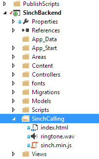

Our recommended way for authenticating with Sinch is by using delegated security. This is especially important when you are using the WebSDK, since there is no good way of hiding your application security.

Sinch delegated security means that we will trust you to authenticate your users with your preferred method and that you are protecting your own backend API.

## User flow for signing a request using delegated security


As you can see here, Sinch will trust that you protect your secret on your backend. As a developer, there are a couple of great benefits to doing it this way:

> 1.  No user sync is required to add Sinch services to your backend
> 2.  You are free to use any service or roll your own for user storage
> 3.  You keep your customer data and authentication in one place without disclosing any information to a third party

## Implementing the sign request in C#

For this tutorial, you are going to use a C\# backend and WebAPI endpoint that will verify your user and return a userToken. In this example, I am using a vanilla MVC 5 project with all the latest updates and WebAPI enabled. The implementation is pretty straightforward, and you will implement an API call that accepts a username and password and returns a Sinch token.

If you are new to MVC 5, check out this tutorial on how to get started: [MVC 5 App with Facebook, Twitter, LinkedIn and Google OAuth2 Sign-on](http://www.asp.net/mvc/tutorials/mvc-5/create-an-aspnet-mvc-5-app-with-facebook-and-google-oauth2-and-openid-sign-on). It is not necessary to add the external providers; you just need the internal provider for this tutorial.

## Prepare the project

If you don’t have it already, add the `owin` package for WebAPI by running this command in the package manager console: `Install-Package Microsoft.AspNet.WebApi.Owin` Then, run it and register a user. Add a new empty WebAPI controller and call it **SinchAuthController**.

Create the following method and return type to secure the access to the chat and ensure the identity you need to:

```csharp
[HttpPost]
public async Task<LoginObject> Sign(string username, string password) {}
public class LoginObject {
    [JsonProperty("userTicket")]
    public string UserTicket { get; set; }
}
```

Next, verify the username and password and create a loginObject with an authTicket:

```csharp
[HttpPost]
public async Task<LoginObject> AuthUser(string username, string password) {
    ///1. Verfiy user
    var signinManager = Request.GetOwinContext().Get<ApplicationSignInManager>();
    var result = await signinManager
        .PasswordSignInAsync(username, password, false, shouldLockout: false);
    if (result == SignInStatus.Success) {
        /// 2. Create return type and sign the request
        LoginObject loginObject = new LoginObject();
        loginObject.UserTicket = Signature(username);
        return loginObject;
    } else {
        ///wrong username and password
        throw new HttpResponseException(HttpStatusCode.Forbidden);
    }
}
```

## Create the assigned UserTicket

A valid UserTicket consists of a base64 encoded UserTicket (described below), and a hash signed with the application secret of that data in the format: `UserTicket = TicketData + ":" + TicketSignature`. First, add the following classes:

```csharp
public class UserTicket {
    [JsonProperty("identity")]
    public Identity Identity { get; set; }
    [JsonProperty("applicationkey")]
    public string ApplicationKey { get; set; }
    [JsonProperty("created")]
    public string Created { get; set; }
}

public class Identity {
    [JsonProperty("type")]
    public string Type { get; set; }
    [JsonProperty("endpoint")]
    public string Endpoint { get; set; }
}
```

You could of course use JSON directly, but I prefer my objects in this format. Most properties are self explanatory, but I want to point out that the type in the Identity type can be email, username, or a phone number. For this example, I am going to use email. The email must be a valid email format, and the same goes if you specify a phone number ([E.164 number formatting](http://en.wikipedia.org/wiki/E.164)).

```csharp
public string Signature(string userId) {
    UserTicket userTicket = new UserTicket();
    userTicket.Identity = new Identity { Type = "username", Endpoint = userId };
    userTicket.ApplicationKey = "<yourkey>";
    userTicket.Created = DateTime.UtcNow.ToString("O", CultureInfo.InvariantCulture);
    Debug.WriteLine(DateTime.UtcNow.ToString("O", CultureInfo.InvariantCulture));
    var json = JsonConvert.SerializeObject(userTicket);
    var ticketData = Convert.ToBase64String(System.Text.Encoding.UTF8.GetBytes(json));
    var sha256 = new HMACSHA256(Convert.FromBase64String(<yoursecret>));
    var signature = Convert.ToBase64String(sha256.ComputeHash(Encoding.UTF8.GetBytes(json)));
    Debug.WriteLine(json);
    return ticketData + ":" + signature;
}
```

## Try it out

To try it out, add the files from our [JS calling tutorial](doc:using-sinch-js-sdk-to-call-a-phone-number) to a folder named `SinchCalling`.


Open up the index.html and find:

```javascript
//Use Sinch SDK to authenticate a user
sinchClient.start(signInObj, function () {
    //On success, show the UI
    showUI();
}).fail(handleError);
});
```

Remove that and change it to:

```javascript
$.post('http://localhost/SinchBackend/Api/Auth/?username=' +
        signInObj.username +
        '&password='+signInObj.password,
        function(authTicket) {
            sinchClient.start(authTicket, function () {
    //On success, show the UI
    showUI();
}).fail(handleError);
});
```

Now, launch a browser and give it a go.

Download our demo backend [here](https://github.com/sinch/net-backend-sample).

**Read more:**

>   - [Using Sinch JS SDK to call a phone number](doc:using-sinch-js-sdk-to-call-a-phone-number)

<a class="edit-on-github" href="https://github.com/sinch/docs/blob/master/docs/tutorials/net/using-delegated-security-with-your-own-application-server-using-c-and-the-sinch-sdk.md">Edit on GitHub</a>