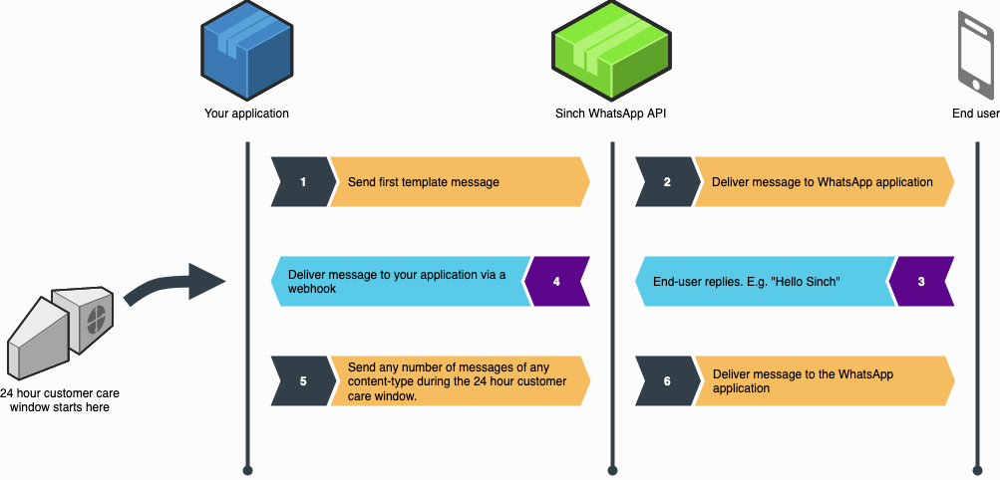

To help take some of the burden away when sending messages, Sinch provisions and manages the required cloud compute, storage and database environments of WhatsApp Business, while offering high availability and throughput. This API is the first of many planned channels in our Multichannel Messaging API suite, so watch this space\!

To help you evaluate our WhatsApp Business beta API, we’ve created a sandbox environment which enables you to send messages to your phone.

## Preparation

> 1.  Sign-up with Sinch [here](https://dashboard.sinch.com/signup) to get an account if you don’t already have one.
> 2.  Send the word “tutorial” via SMS, to +13253059420 for US, or +447537453580 for UK and follow the instructions.

## About WhatsApp setup and templates

Sending your first message to WhatsApp Business is like provisioning a US Short Code, but in some ways it’s stricter.

If you reach out to your customer first, you’ll need to choose a defined message template from one of 10 categories. There is no limit to the number of templates you can submit, but approvals take up to 72 hours. In this tutorial you’ll be using a pre-made bot that’s had templates approved already, so you can start right way.

**WhatsApp message flow**


> 1.  Customer opt-in is essential before sending any messages. In our sandbox environment you can only opt in on your phone, so in this tutorial just follow the instructions in the SMS messages you receive to enroll.
> 2.  Businesses can only start a conversation with a defined message template.
> 3.  Once you get a reply from your customer, a “conversation” starts. You can then send “session” rich content messages for 24 hours.
> 4.  Every time a customer replies to one of your messages, a new 24-hour cycle starts.
> 5.  If a “session” expires, you’ll need to re-initiate a conversation, starting with a defined message template again.
> 6.  Customers can start a rich content conversation with a business at any time   - this opens up a new 24-hour session.

Right, that’s all the boring stuff out of the way, lets send some messages\!

## The code

### 1. Opt-in

> **Note**
>
>  - In our sandbox environment, we use WhatsApp to provision a key for you. With our sandbox app you can only send messages to your phone.
>  - If you have not already done so, send the word “tutorial”via SMS, to +13253059420 for US, or +447537453580 for UK, and follow the instructions. At the end of the opt-in process you will receive the API-key needed to send messages to WhatsApp.

### 2. Send a templated message to your number

Now you’re ready to start a conversation by sending a templated message, in this case it’s a simple “hello from Sinch”.

```javascript
var botId = 'your-received-bot-id';
var phoneNbr = 'your-phone-number-which-is-whatsapp-enabled';
var bearerToken = 'your-received-bearer-token';

var url = 'https://us1.whatsapp.api.sinch.com/whatsapp/v1/' + botId + '/messages';
var data = {
  to: [phoneNbr],
  message: {
    type: 'template',
    template_name: 'sinch_tutorial',
    params: ['<recipient_name>']
  }
};

var postReq = {
  method: 'POST',
  headers: {
    'Authorization': 'Bearer ' + bearerToken,
    'Content-Type': 'application/json'
  },
  body: JSON.stringify(data),
  json: true
};

fetch(url, postReq)
  .then(data => {
    return data.json()
  })
  .then(res => {
    console.log(res)
  })
  .catch(error => console.log(error));
```

### 3. Receive a reply to your message

In a real-world scenario, you’d have a web-hook setup connected to a bot framework or call center to react to any incoming messages, but for the sake of simplicity in this tutorial, reply to the message that just landed in your WhatsApp app.

### 4. Send a custom message to your phone

With WhatsApp there’s a few different message types, you can read more about them [here](https://www.sinch.com/docs/whatsapp/index.html#message).

#### Send a text message

```javascript
var botId = 'your-received-bot-id';
var phoneNbr = 'your-phone-number-which-is-whatsapp-enabled';
var bearerToken = 'your-received-bearer-token';

var url = 'https://us1.whatsapp.api.sinch.com/whatsapp/v1/' + botId + '/messages';
var data = {
  to: [phoneNbr],
  message: {
    type: 'text',
    text: 'Greetings from Sinch'
  }
};

var postReq = {
  method: "POST",
  headers: {
    'Authorization': 'Bearer ' + bearerToken,
    'Content-Type': 'application/json'
  },
  body: JSON.stringify(data),
  json: true
};


fetch(url, postReq)
  .then(data => {
    return data.json()
  })
  .then(res => {
    console.log(res)
  })
  .catch(error => console.log(error));
```

#### Send an image message

This example shows you how to send an image. Please note that images / videos can be a maximum of 5MB in size and gif files are not supported.

```javascript
var botId = 'your-received-bot-id';
var phoneNbr = 'your-phone-number-which-is-whatsapp-enabled';
var bearerToken = 'your-received-bearer-token';

var url = 'https://us1.whatsapp.api.sinch.com/whatsapp/v1/' + botId + '/messages';
var data = {
  to: [phoneNbr],
  message: {
    type: 'image',
    url: 'https://banner2.kisspng.com/20180602/ocl/kisspng-cats-and-the-internet-lolcat-rage-comic-pet-crazy-cat-5b1287743fec89.5449465715279409802619.jpg'
  }
};

var postReq = {
  method: "POST",
  headers: {
    'Authorization': 'Bearer ' + bearerToken,
    'Content-Type': 'application/json'
  },
  body: JSON.stringify(data),
  json: true
};


fetch(url, postReq)
  .then(data => {
    return data.json()
  })
  .then(res => {
    console.log(res)
  })
  .catch(error => console.log(error));
```

If you enjoyed this tutorial and would like to start sending messages to your customers, please email <sales@sinch.com> and we’ll help you set up a full business account where you’ll be able to specify more templates and receive replies.

<a class="gitbutton pill" target="_blank" href="https://github.com/sinch/docs/blob/master/docs/tutorials/javascript/send-your-first-whatsapp-message.md"><span class="fab fa-github"></span>Edit on GitHub</a>