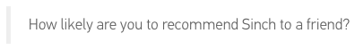
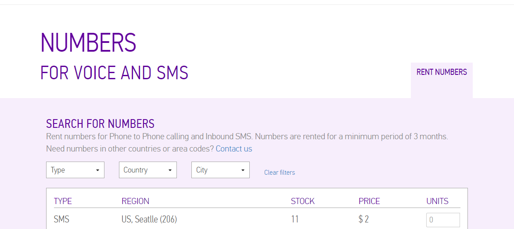

As you probably already know, every time we resolve a support request we ask you if you would share Sinch with a friend. Soon, we’ll even ask you about tutorials like the one you’re checking out now. Why?

Well, we want to know we are doing the right thing for you dear developer. *And* my boss Daniel will give me the evil eye -


\- if we don’t. By using a system called Net Promoter Score (NPS), [Delighted](https://delighted.com/) helps us keep track of how likely you guys are to recommend us. For you who haven’t heard of NPS, you might think I’m a little bit greedy, but here’s how it works:

NPS is based on a proven single question, and 2 part answers.



First, you’ll answer with a 0-10 numerical rating which makes our data quantifiable over time. Then you’re asked to write an open-ended follow up which adds some really valuable context to the rating. Depending on the score, you’ll either fall into the Promoters’ category (9s and 10s), the Passives’ (7s and 8s), or the Detractors’ (6s and below). The NPS is calculated by *% of Promoters - % of Detractors*, which’ll generate a score between -100 to 100. The system essentially tells us whether we’re a slam dunk or [not](http://www.reactiongifs.com/r/slam-dunk.gif).

*For more info, check out* [Delighted’s NPS page](https://delighted.com/net-promoter-score) *or try out their awesome* [API](https://delighted.com/docs/api\)) *yourself.*

## Hail or bail

In September this year, I did a talk at [API World](http://integrate2015.sched.org/speaker/christian64?iframe=no&w=i:0;&sidebar=yes&bg=no&utm_source=Sinch+Partners&utm_campaign=a442daf0b7-Newsletter_September_v29_16_2015&utm_medium=email&utm_term=0_424b5acd88-a442daf0b7-132935801#.VgKvaSCqpBd) and I thought it would be cool to ask for feedback via SMS. Therefore, I made a small NuGet for interacting with the [Delighted API](https://www.nuget.org/packages/Delighted.Api/0.1.1.1). I want to show you how to super easy get an incoming SMS and forward that data to delighted.

You can download the code from [Github](https://github.com/sinch/csharp-nps-sms-delighted) or deploy directly to your azure account:

https://azuredeploy.net/?repository=https://github.com/sinch/csharp-nps-sms-delighted

### Prerequisites

> 1.  [Sinch account and an SMS enabled number](https://portal.sinch.com/#/signup)
> 2.  [A Delighted account](https://delighted.com/)
> 3.  Some cash on your account
> 4.  A web API project

### Set up your account

[Login to your dashboard](https://portal.sinch.com/#/login), click on numbers and rent one (make sure it’s an SMS enabled number).



Choose your app - or create one and click on the little pen - add the number you just rented to the app, and configure the callback URL. The callback URL is where Sinch is going to post incoming messages, and you can read more about that in [the documentation](doc:sms-rest-callback).

### CODE!

Finally, some code. In your web API project, add a class in your Models folder and call it **SMSCallbackModel.cs**. SMS are pretty simple compared to Calling callbacks - the SMS is delivered and there’s no response required.

The request contains more info, but we only care about the sender and the actual message for this purpose. So lets add a couple of properties:

```csharp
public class SMSCallbackModel {
    public Identity From { get; set; }
    public string Message { get; set; }
}

public class Identity {
    public string Endpoint { get; set; }
}
```

This is simple enough, just the Message and the From as an endpoint.

### Adding the Controller

Next, lets add the controller, create a new Empty API controller and call it **SMSController.cs**. In this step, we also want the Delighted NuGet so install that in PM.

```ruby
PM> Install-Package Delighted.Api
```

Open up SMSController and add the following code:

```csharp
public async Task<HttpResponseMessage> Index(SMSCallbackModel model) {
    var client = new Delighted.Api.Client("yourkey");
    var person = await client.AddPerson(new Person {
    Email = model.From.Endpoint + "@fakedomain.com",
    Send = false
    });
    if (person != null) {
        int score;
        int.TryParse(model.Message, out score);
        await client.AddResult(new AddResult() {
                    Score = score,
                    PersonId = person.Id.ToString(),
                });
    }
    return new HttpResponseMessage(HttpStatusCode.OK);
}
```

*Wonder why we create an email from the phonenumber? Delighted’s driven by email, plus we want to check that the creation went smoothly, becuase we need the PersonID to create a survey response.*

Cool, this shoud be good to go\! Deploy and send an SMS to the number you rented with a number from 0-10.

YAY, I suppsed it worked?

Now, one of the things I really value with the feedback system is of course getting comments from you guys, so I wanted to add that. Let’s change the code (here is where it becomes a little hacky since we are trying to get a number and the rest as a comment from an SMS)\!


### Recieving SMS

I’ve decided to ask the audience to send an SMS with a score and a comment. I also want to track the event with a property on the person.

```csharp
public async Task<HttpResponseMessage> Index(SMSCallbackModel model) {
    var client = new Delighted.Api.Client("yourkey");
    var person = await client.AddPerson(new Person {
    Email = model.From.Endpoint + "@sinch.com",
    Send = false
    });
    if (person != null) {
        int score;
        //just check if the score is 10, else take the firs character
        if (model.Message.Substring(0, 2) == "10") {
            score = 10;
            } else {
            int.TryParse(model.Message.Substring(0, 1), out score);
        }
        //If the mesage has enought lenght get the rest of message as a comment
        string comment = model.Message.Length > 2 ? model.Message.Substring(score == 10 ? 2 : 1) : "";
        //Safty to not add fake zeros        
        if (model.Message != "0" && score == 0)
            return new HttpResponseMessage(HttpStatusCode.OK);
        //Add a property that we can filter for in Delighted  
        var dic = new Dictionary<string, string>();
        dic.Add("survey_origin", "APIWorld");
        await client.AddResult(new AddResult() {
            Score = score,
            Comment = comment,
            PersonId = person.Id.ToString(),
            Properties = dic
                });
    }
    return new HttpResponseMessage(HttpStatusCode.OK);
}
```

Deploy and send an SMS to the number with the text *10 awesome*. That should show up in your portal now? You’ll also be able to filter by events.

Now dear developer, go dunk\!
