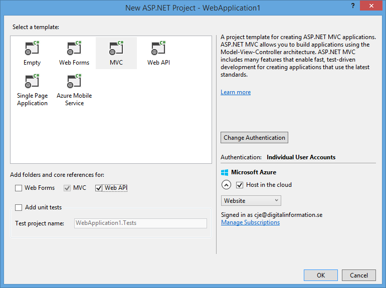
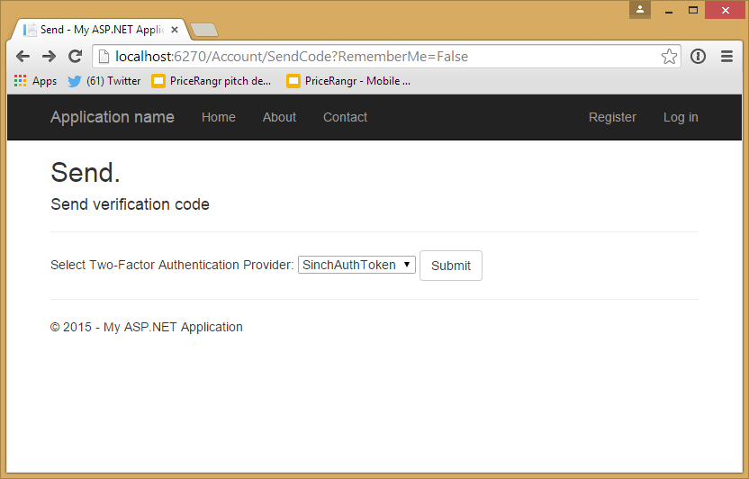
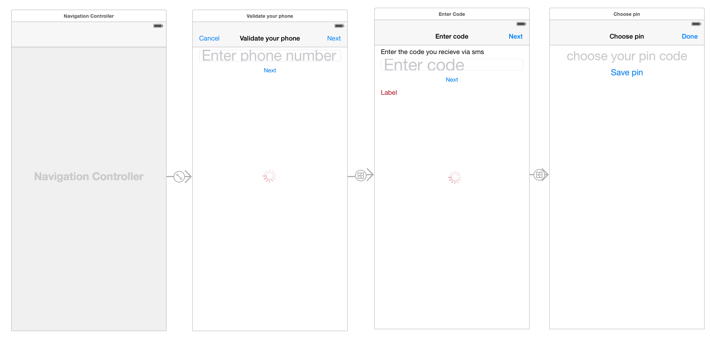
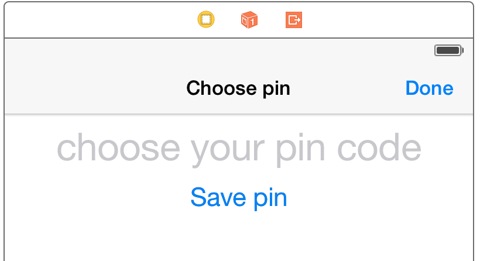

> **Update**
>
> To verify numbers even easier, check out our [Verification SDK](https://www.sinch.com/products/verification/sms/)

In previous tutorials, you learned to verify numbers and use [two-factor authentication (2FA)](https://www.sinch.com/opinion/what-is-two-factor-authentication/) on both web and an iOS device. In this tutorial, we are going to build a 2FA system that only sends one SMS per app install to enable 2FA for web—think Google Authenticator, BankID or even Facebook login on iOS.

Building such a system helps you:

> 1.  Save money on your 2FA by eliminating SMS on every single login
> 2.  Drive downloads to your app by making it simple and quick to log in to your service

See the flow below. This tutorial is implementing the RFC 6238 that Google Authenticator uses.

## Appflow


The goal is to have a template project using Sinch for SMS and SMS free 2FA that you can use in production for you website.

This tutorial will take 60 to 120 minutes to finish; the finished sample can be [downloaded here](https://github.com/sinch/net-two-factor-auth/archive/master.zip).

## Prerequisites

>   - A solid understanding of .NET, MVC and WebAPI

### Setup

> 1.  Create a new a project
> 2.  Select MVC project with basic authentication and WebAPI  


> 3.  In PM console, update your packages `pm>update-package`
> 4.  In PM console, install Sinch.SMS `pm>Install-Package Sinch.SMS`
> 5.  In PM console, install OTPSharp `pm>Install-Package OtpSharp`

## Modifying ApplicationUser class

In this tutorial, we are going to add a custom 2FA provider that is based on IUserTokenProvider. But first, we want to add some properties to the ApplicationUser object. First, in PM console, run `Enable-Migrations` and add below to ApplicationUser:

```csharp
public bool IsSinchAuthEnabled { get; set; }
public string SinchAuthSecretKey { get; set; }
```

In package manager console, run `update-database`.

## Implementing your own TokenProvider

Create a new class and name it SinchAuthTokenProvider:

```csharp
public class SinchAuthTokenProvider
: IUserTokenProvider<ApplicationUser, string>
{
    public Task<string> GenerateAsync(string purpose, UserManager<ApplicationUser, string> manager, ApplicationUser user)
    {
        return Task.FromResult((string)null);
    }

    public Task<bool> ValidateAsync(string purpose, string token, UserManager<ApplicationUser, string> manager, ApplicationUser user)
    {
        long timeStepMatched = 0;

        var otp = new Totp(Base32Encoder.Decode(user.SinchAuthSecretKey));
        bool valid = otp.VerifyTotp(token, out timeStepMatched, new VerificationWindow(2, 2));

        return Task.FromResult(valid);
    }

    public Task NotifyAsync(string token, UserManager<ApplicationUser, string> manager, ApplicationUser user)
    {
        return Task.FromResult(true);
    }

    public Task<bool> IsValidProviderForUserAsync(UserManager<ApplicationUser, string> manager, ApplicationUser user)
    {
        return Task.FromResult(user.IsSinchAuthEnabled);
    }
}
```

In the code above, we don’t need to implement the GenerateAsync because that will be provided by a service when you verify your phone number later on. NotifyAsync will be implemented later to send a push to the user in the app, urging them to launch the app.

### Register a new 2FA provider

Open **App\_Start:raw-latex:\`IdentityConfig\`.cs** comment out SMS and email token providers. Add SinchAuth:

```csharp
// Register two-factor authentication providers. This application uses phone and emails as a step of receiving a code for verifying the user
// You can write your own provider and plug it in here.
//manager.RegisterTwoFactorProvider("Phone Code", new PhoneNumberTokenProvider<ApplicationUser>
//{
//    MessageFormat = "Your security code is {0}"
//});
//manager.RegisterTwoFactorProvider("Email Code", new EmailTokenProvider<ApplicationUser>
//{
//    Subject = "Security Code",
//    BodyFormat = "Your security code is {0}"
//});
manager.RegisterTwoFactorProvider("SinchAuthToken", new SinchAuthTokenProvider());
```

## Enabling SMS code to be sent out when phone is added to the account

Find SMSService in **IdentityConfig.cs**:

```csharp
public class SmsService : IIdentityMessageService {
    public Task SendAsync(IdentityMessage message) {
        Sinch.SMS.Client client = new Client("key", "secret");
        return client.SendSMS(message.Destination, message.Body);
    }
}
```

Change the key and secret to the key you have in your [dashboard](http://sinch.com/dashboard).

## Adding UI to let the user select to use SinchAuth

Open the user management index view (**Views:raw-latex:\`Manage\`:raw-latex:\`Index\`.cshtml**). Remove the comments around 2FA and make it look like the below code. Also, uncomment the phone number field because we will use the phone number to identify a user.

```html
<dt>Two-Factor Authentication:</dt>
<dd>
    @if (Model.TwoFactor)
        {
            using (Html.BeginForm("DisableTwoFactorAuthentication", "Manage", FormMethod.Post, new { @class = "form-horizontal", role = "form" }))
            {
                @Html.AntiForgeryToken()
                <text>Enabled
                <input type="submit" value="Disable" class="btn btn-link" />
                </text>
            }
        }
        else
        {
            using (Html.BeginForm("EnableTwoFactorAuthentication", "Manage", FormMethod.Post, new { @class = "form-horizontal", role = "form" }))
            {
                @Html.AntiForgeryToken()
                <text>Disabled
                <input type="submit" value="Enable" class="btn btn-link" />
                </text>
            }
        }
</dd>
```

Change **EnableTwoFactorAuthentication** action to look like this:

```csharp
[HttpPost]
[ValidateAntiForgeryToken]
public async Task<ActionResult> EnableTwoFactorAuthentication()
{
    await UserManager.SetTwoFactorEnabledAsync(User.Identity.GetUserId(), true);
    var user = await UserManager.FindByIdAsync(User.Identity.GetUserId());
    if (user != null)
    {
        user.IsSinchAuthEnabled = true;
        byte[] secretKey =
            KeyGeneration.GenerateRandomKey(OtpHashMode.Sha512);
        user.SinchAuthSecretKey = Base32Encoder.Encode(secretKey);
        await UserManager.UpdateAsync(user);

        await SignInManager.SignInAsync(user, isPersistent: false, rememberBrowser: false);
    }
    return RedirectToAction("Index", "Manage");
}
```

This will set the SinchAuth to be true. Add the key that the phone will get later. Change **DisableTwoFactorAuthentication** action to below:

```csharp
[HttpPost]
[ValidateAntiForgeryToken]
public async Task<ActionResult> DisableTwoFactorAuthentication()
{
    await UserManager.SetTwoFactorEnabledAsync(User.Identity.GetUserId(), false);
    var user = await UserManager.FindByIdAsync(User.Identity.GetUserId());
    if (user != null) {
        user.IsSinchAuthEnabled = false;
        user.SinchAuthSecretKey = null;
        await SignInManager.SignInAsync(user, isPersistent: false, rememberBrowser: false);
    }
    return RedirectToAction("Index", "Manage");
}
```

### Run it

Run the application by pressing **F5**, and log in again. You should now be presented with this:


Press *Next* and get this:


That’s not ideal, and in this sample, we are only going to support one, so as soon as someone tries to log in, we will skip directly to verify code. But first, let’s prepare an API to handle the mobile client.

## Adding API endpoints to verify phone and tokens

Again, we are going to verify the number twice in the app to ensure the user is in possession of the SIM card both times, since it might not happen on the same day. (If you are to use WebAPI for the rest of your project, you should really add WebAPI security to the whole WebAPI. [Read more here](http://www.asp.net/web-api/overview/security/individual-accounts-in-web-api).)

Create a WebAPI controller and name it VerifyController. Let’s add some plumbing code for Asp.Net identity and a response object for when you verify a code.

```csharp
public class VerifyController : ApiController {
    private ApplicationSignInManager _signInManager;
    private ApplicationUserManager _userManager;
    public VerifyController(ApplicationUserManager userManager, ApplicationSignInManager signInManager) {
        UserManager = userManager;
        SignInManager = signInManager;
    }
    public ApplicationSignInManager SignInManager {
        get
        {
            return _signInManager ?? Request.GetOwinContext().Get<ApplicationSignInManager>();
        }
        private set {
            _signInManager = value;
        }
    }
    public ApplicationUserManager UserManager {
        get
        {
            return _userManager ?? Request.GetOwinContext().GetUserManager<ApplicationUserManager>();
        }
        private set {
            _userManager = value;
        }
    }

    /// <summary>
    /// Method to start a phonenumber verification process.
    /// </summary>
    /// <param name="phoneNumber">Phonenumber in international format 15555551231</param>
    /// <returns>200 ok and delivers an sms to the handset</returns>
    [HttpGet]
    [Route("/api/requestcode/{phonenumber}")]
    public async Task<HttpResponseMessage> RequestCode(string phoneNumber){    
    }

    /// <summary>
    /// Endpoint for verifying code recieved by sms
    /// </summary>
    /// <param name="phoneNumber">Phonenumber in international format 15555551231</param>
    /// <param name="code">code</param>
    /// <returns>object with a VerifyCodeResponse</returns>
    [HttpGet]
    [Route("/api/verifycode/{phonenumber}/{phoneNumber}/{code}")]
    public async Task<VerifyCodeResponse> VerifyCode(string phoneNumber, string code) {
    }

    /// <summary>
    /// Use this to send in the RFC token from the authenticator funtion in the app
    /// </summary>
    /// <param name="token"></param>
    /// <param name="phoneNumber"></param>
    /// <returns></returns>
    [HttpPost]
    [Route("/api/token/")]
    public async Task<HttpResponseMessage> VerifyToken(string token, string phoneNumber)
    {
        return null;
    }
}

public class VerifyCodeResponse
{
    [JsonProperty(PropertyName = "secret")]
    public string Secret { get; set; }
}
```

Let’s implement the above methods and go through them one by one, starting with **ReqeustCode**, which will be the first step in the number verification process.

```csharp
[HttpGet]
[Route("api/requestcode/{phonenumber}")]
public async Task<HttpResponseMessage> RequestCode(string phoneNumber) {
    var number = phoneNumber.Trim();
    var user = UserManager.Users.First(u => u.PhoneNumber == phoneNumber);
    var code = await UserManager.GenerateChangePhoneNumberTokenAsync(user.Id, number);
    if (UserManager.SmsService != null)
    {
        var message = new IdentityMessage
        {
            Destination = number,
            Body = "Your security code is: " + code
        };
        await UserManager.SmsService.SendAsync(message);
    }
    return new HttpResponseMessage(HttpStatusCode.OK);
}
```

Next, let’s implement the method to verify the code sent by SMS and return the secret to the to client.

```csharp
public async Task<VerifyCodeResponse> VerifyCode(string phoneNumber, string code) {
    var user = UserManager.Users.FirstOrDefault(u => u.PhoneNumber == phoneNumber);
    if (user == null)
        throw new HttpException(404, "User not found");
    VerifyCodeResponse vcr = new VerifyCodeResponse();
    var result = await UserManager.VerifyChangePhoneNumberTokenAsync(user.Id, code, phoneNumber);
    if (result)
    {
        vcr.Secret = user.SinchAuthSecretKey;
        return vcr;
    }
    else
    {
        throw new HttpException(404, "Wrong code");
    }

}
```

We need to implement the method where we will verify a generated token from the handset. For this phase, because we are not verifying the code from the browser, we are going to generate a one-time link for the browser to log in once the code is verified.

```csharp
public class OneTimeLink {
    public string UserId { get; set; }
    public Guid Guid { get; set; }
}

public class OneTimeLinks {
    private static List<OneTimeLink> _oneTimelinks { get; set; }

    public static OneTimeLink GetByUserId(string userId) {
        if (_oneTimelinks == null)
            return null;
        return _oneTimelinks.FirstOrDefault(m => m.UserId == userId);
    }
    public static bool VerifyLink(string userId, Guid guid) {
        if (_oneTimelinks == null)
            return false;
        if (_oneTimelinks.Any(m => m.Guid == guid && m.UserId == userId)) {
            //if it checked out remove the link its now not valid anymore
            _oneTimelinks.Remove(_oneTimelinks.First(m => m.Guid == guid && m.UserId == userId));
            return true;
        } else {
            return false;
        }
    }
    public static void AddLink(string userId) {
        if (_oneTimelinks == null)
            _oneTimelinks = new List<OneTimeLink>();
        _oneTimelinks.Add(new OneTimeLink {
            UserId = userId,
            Guid = Guid.NewGuid()
        });
    }
}
```

We will use the above code by adding an entry to the list once a TOPT token is verified:

```csharp
[HttpPost]
[Route("api/verifytoken/")]
public async Task<HttpResponseMessage> VerifyToken(string token, string phoneNumber)
{
    long timeStepMatched = 0;
    var user = UserManager.Users.First(u => u.PhoneNumber == phoneNumber);
    var otp = new Totp(Base32Encoder.Decode(user.SinchAuthSecretKey));
    bool valid = otp.VerifyTotp(token, out timeStepMatched, new VerificationWindow(2, 2));
    if (!valid) // return error if token is invalid
        return new HttpResponseMessage(HttpStatusCode.Forbidden);
    //Add link and return ok to the client    
    OneTimeLinks.AddLink(user.Id);
    return new HttpResponseMessage(HttpStatusCode.OK);
}
```

Now let’s add an endpoint to check for links for the webclient to the verifycontroller. Later we will use this to see if we want to try and authenticate user and GUID.

```csharp
[HttpGet]
[Route("Verify/StatusCheck")]
public async Task<object> StatusCheck()
{
    var userId = await SignInManager.GetVerifiedUserIdAsync();
    if (string.IsNullOrEmpty(userId))
    {
        return Json(new {status="Error"});
    }
    var link = OneTimeLinks.GetByUserId(userId);
    if ( link == null) {
        return Json(new {status="Waiting"});
        }
    else
    {
    return Json(new {status="Ok", guid=link.Guid});    
    }
}
```

### Change the UI of the 2FA

Next up, change the flow of the UI reflect so that no code will be entered in the WebUI, but rather just continue to a logged in state as soon as you verify a TOTP code.

Open up AccountController and change the below methods:

Change SendCode (string returnUrl, bool RememberMe) to below

```csharp
[AllowAnonymous]
public async Task<ActionResult> SendCode(string returnUrl, bool rememberMe)
{
    var userId = await SignInManager.GetVerifiedUserIdAsync();
    if (userId == null)
    {
        return View("Error");
    }
    return View();
}
```

To check status of the OTP in the view, open SendCode.cshtml and change it to the below. Prompt the user to launch the mobile app and enter code:

```html
@model Part4.Models.SendCodeViewModel
@{
    ViewBag.Title = "Send";
}
<h2>@ViewBag.Title.</h2>
Open you app and generate a verify your identity
@section Scripts {
    <script>
        function checkStatus() {
            $.getJSON('@Url.Action("StatusCheck", "Verify")', function(data) {
                if (data['status'] == 'Ok') {
                    document.location = '@Url.Action("VerifyTOTP")?guid=' + data["guid"] + '&returnUrl=@Model.ReturnUrl';
                } else {
                    setTimeout(checkStatus, 1000);
                }
            });
        }
        $().ready(function() {
            checkStatus();
        });
    </script>
}
```

Check if there has been a one-time link added to the list. If that is the case, redirect to a new location and verify the GUID, user ID and sign-in.

Open AccountController and add the VerifyOTP action:

```csharp
[AllowAnonymous]
public async Task<ActionResult> VerifyTOTP(string guid, string returnUrl)
{
   var userId = await SignInManager.GetVerifiedUserIdAsync();

   if (string.IsNullOrEmpty(userId))
   {
       return View("Error");
   }
   if (OneTimeLinks.VerifyLink(userId, Guid.Parse(guid)))
   {
       await SignInManager.SignInAsync(UserManager.FindById(userId), false, false);
       return RedirectToLocal(returnUrl);    
   }
   else
   {
       return View("Error");
   }
}
```

Congratulations on making it this far\! Now you have a pretty solid solution to help you continue to build your website.

##What’s next on server-side?
If you would like to use this in production, enable oath on WebAPI because you will most likely use this as your backend for mobile as well. You can read about how to do that [here](http://www.asp.net/web-api/overview/security/individual-accounts-in-web-api).

**Ready for more?** Okay, let’s build the iOS client that you can use to to log in to your service.

### Building a 2FA TOTP iOS client

In this tutorial, we are verifying the phone number twice: first when you create your account and again when you install the app. This ensures you are in possession of the SIM card both times. In subsequent requests, no SMS will be sent. You’ll have to send the shared secret over to the device one time—a big security risk—but won’t have to enter any code or scan a QR code. If you prefer not to send the encrypted key over the internet, you could have the user manually enter or send the shared secret with SMS, using a URL to launch it.

The generation of the TOPT code is from [this excellent repo](https://github.com/yazid/iOS-TOTP). Yazid did a superb job of cleaning out Google’s bloated sample code.

To get up to speed, create a new project as we did in [Part 2](doc:building-an-ios-client-for-number-verification-part-2), but name it NumberValidatorWithOTP. When you are done with that, come back here (or copy the repo and name refactor).

### Preparation

If you renamed your project, you need to change startValidation method and load the correct bundle. Change the name of the line:

```objectivec
NSBundle* bundle = [NSBundle  bundleWithIdentifier:@"com.sinch.NumberValidator"];
```

to:

```objectivec
NSBundle* bundle = [NSBundle  bundleWithIdentifier:@"com.sinch.NumberValidatorWithOTP"];
```

Next, you need to change the methods in httpClient to reflect your requestCode *("/api/requestcode/{phone number})* and verifyCode *(/api/verifycode/{phoneNumber}/{code})* endpoints from above.

```objectivec
-(void)requestCode:(NSString *)phoneNumber completion:(void (^)(NSError *))completion
{
    sessionManager = [NSURLSession sharedSession];
    NSString* url = [@"http://yourserver/api/" stringByAppendingString:phoneNumber];
    [[sessionManager downloadTaskWithURL:[NSURL URLWithString:url] completionHandler:^(NSURL *location, NSURLResponse *response, NSError *error) {
        if (completion)
        {
            completion(error);
        }

    }] resume];
}

-(void)validateCode:(NSString *)phoneNumber :(NSString *)code completion:(void (^)(NSError *))completion{
    sessionManager = [NSURLSession sharedSession];
    NSString* url = [NSString stringWithFormat:@"http://yourserver/api/verifycode/%@&/%@", phoneNumber, code];
    [[sessionManager downloadTaskWithURL:[NSURL URLWithString:url] completionHandler:^(NSURL *location, NSURLResponse *response, NSError *error) {
        if (completion)
            completion(error);
    }] resume];
}
```

### Let the user choose a PIN

We don’t want to store a PIN code in NUSUSERDEFAULTS because it’s a bit insecure. Instead, we are going to use Apple’s keychain wrapper to store both a PIN code and the shareSecret, add a file called SimpleKeychain and copy the following into **.h** file

```objectivec
#import <Foundation/Foundation.h>

@class SimpleKeychainUserPass;

@interface SimpleKeychain : NSObject

+ (void)save:(NSString *)service account:(NSString *)account data:(id)data;
+ (id)load:(NSString *)service account:(NSString *)account;
+ (void)delete:(NSString *)service account:(NSString *)account;

@end
```

(source: [btjones at github](https://gist.github.com/btjones/10287581) )

and the implementation

```objectivec
+ (NSMutableDictionary *)getKeychainQuery:(NSString *)service account:(NSString *)account {
    return [NSMutableDictionary dictionaryWithObjectsAndKeys:
            (__bridge id)kSecClassGenericPassword, (__bridge id)kSecClass,
            service, (__bridge id)kSecAttrService,
            account, (__bridge id)kSecAttrAccount,
            (__bridge id)kSecAttrAccessibleAfterFirstUnlock, (__bridge id)kSecAttrAccessible,
            nil];
}

+ (void)save:(NSString *)service account:(NSString *)account data:(id)data {
    NSMutableDictionary *keychainQuery = [self getKeychainQuery:service account:account];
    SecItemDelete((__bridge CFDictionaryRef)keychainQuery);
    [keychainQuery setObject:[NSKeyedArchiver archivedDataWithRootObject:data] forKey:(__bridge id)kSecValueData];
    SecItemAdd((__bridge CFDictionaryRef)keychainQuery, NULL);
}

+ (id)load:(NSString *)service account:(NSString *)account {
    id ret = nil;
    NSMutableDictionary *keychainQuery = [self getKeychainQuery:service account:account];
    [keychainQuery setObject:(id)kCFBooleanTrue forKey:(__bridge id)kSecReturnData];
    [keychainQuery setObject:(__bridge id)kSecMatchLimitOne forKey:(__bridge id)kSecMatchLimit];
    CFDataRef keyData = NULL;
    if (SecItemCopyMatching((__bridge CFDictionaryRef)keychainQuery, (CFTypeRef *)&keyData) == noErr) {
        @try {
            ret = [NSKeyedUnarchiver unarchiveObjectWithData:(__bridge NSData *)keyData];
        }
        @catch (NSException *e) {
            NSLog(@"Unarchive of %@ failed: %@", service, e);
        }
        @finally {}
    }
    if (keyData) CFRelease(keyData);
    return ret;
}

+ (void)delete:(NSString *)service account:(NSString *)account {
    NSMutableDictionary *keychainQuery = [self getKeychainQuery:service account:account];
    SecItemDelete((__bridge CFDictionaryRef)keychainQuery);
}
```

(Source: [btjones at github](https://gist.github.com/btjones/10287581)) Read more at Apple if you want to dive deeper into this code.

When an SMS PIN code is verified, we want the user to choose a personal PIN code to unlock the secret.

Open **httpClient.m** and change the sharedHttpClient to:

```objectivec
+(HttpClient *)sharedHttpClient
{

    static dispatch_once_t onceToken;
    dispatch_once(&onceToken, ^{
        currentHttpClientInstance = [[self alloc] init];
        currentHttpClientInstance->sessionManager = [NSURLSession sharedSession];
        //new sessin config
        NSURLSessionConfiguration *sessionConfig =
        [NSURLSessionConfiguration defaultSessionConfiguration];
        [sessionConfig setHTTPAdditionalHeaders:
         @{@"Accept": @"application/json"}];

    });
    return currentHttpClientInstance;
}
```

Configure the http client to accept json as the returned data.

Now, change the validateCode protocol and method to handle NSDATA as parameter and implement the forwarding of the of the data.

```objectivec
-(void)validateCode:(NSString *)phoneNumber :(NSString *)code completion:(void (^)(NSData* data, NSError * error))completion{
    sessionManager = [NSURLSession sharedSession];
    NSString* url = [NSString stringWithFormat:@"http://yourserver/api/verifycode/%@&/%@", phoneNumber, code];
    [[sessionManager dataTaskWithURL:[NSURL URLWithString:url] completionHandler:^(NSData *data, NSURLResponse *response, NSError *error) {
        if (completion)
            dispatch_async(dispatch_get_main_queue(), ^{
            completion(data, error);
            });
    }] resume];
}
```

The above code forwards the data as well to the completion block. If you recall, this is called in the **EntercodeController**. In this controller, we want to change the flow a bit to display another controller where the user enters a personal PIN code and saves it on the device tighter with the shared secret.

## Choose a PIN UI

Let’s add and change the current UI to let us set a PIN. When we are done, it should look like below:


> 1.  Create a controller and call it **ChoosePinController**
> 2.  Open up the ValidationStoryBoard.storyboard and add a new view
>     1.  Change the titles of the Done button on the entered view to Next
>     2.  Add a segue from the FileOwner to the new view and call it choosePinSeg
>     3.  Set the ViewController of the new view to ChoosePinController
>     4.  Add a text field to the view like below and set the keyboard type to numberPad
>     5.  Add a button and set the title to Save PIN

Your view should now look like this:


## Hook up the text field and buttons

Add an outlet and action for the text field and button **ChoosePinController**. At the same time, add a property that will hold the sharedSecret and the phone number while the user chooses a PIN.

```objectivec
@property (weak, nonatomic) IBOutlet UITextField *pinCode;
@property NSString* sharedSecret;
@property NSString* phoneNumber;
- (IBAction)savePin:(id)sender;
```

Open up **ChoosePinController.m**. Now to make the keyboard display as soon as the view appears, add the below:

```objectivec
-(void)viewDidAppear:(BOOL)animated
{
    [pinCode becomeFirstResponder];
}
```

Next, we are going to save the PIN code and shared secret securely. We also want to make sure the PIN code is at least six characters. Add and import to **SimpleKeychain.h.h** and **NSNotificationEvents.h**:

```objectivec
-(void)savePin:(id)sender
{
    if (pinCode.text.length < 6)
    {
        [[[UIAlertView alloc] initWithTitle:@"Pin code to short" message:@"Pin code needs to be at least 6 digits" delegate:nil cancelButtonTitle:@"Ok" otherButtonTitles:nil] show];
        return;
    }
    ///store both pin and secret securely
    NSDictionary* instanceData =
        @{pinCodeKey:pinCode.text,
        sharedSecretKey:sharedSecret,
        PhoneNumberKey: phoneNumber};
    [SimpleKeychain save:instanceDataKey
                        account:instanceDataKey
                        data:instanceData];
    [[NSNotificationCenter defaultCenter]
        postNotificationName:NumberValidationDidCancelNotification
        object:self
        userInfo:@{PhoneNumberKey: self.phoneNumber}];
    [self dismissViewControllerAnimated:YES completion:nil];
}
```

Now you will get a build error. Add the externs to **NSNotificationEvents.h**:

```objectivec
UIKIT_EXTERN NSString* const pinCodeKey;
UIKIT_EXTERN NSString* const sharedSecretKey;
UIKIT_EXTERN NSString* const instanceDataKey;
```

Define them in **ValidationHelper.m**:

```objectivec
NSString* const pinCodeKey= @"pinCode";
NSString* const sharedSecretKey = @"sharedSecret";
NSString* const instanceDataKey = @"instanceData";
```

Now this controller is ready. Let’s change EnterCodeViewController to show this screen after the code is verified. Open **EnterCodeViewController.m** and change the action to done.

```objectivec
- (IBAction)done:(id)sender {
    [spinner startAnimating];
    errorLabel.text = @"";
    [[HttpClient sharedHttpClient]
        validateCode:phoneNumber
        :code.text
        completion:^(NSData *data, NSError *error) {
        [self.spinner stopAnimating];
        if (!error)
        {
            //save away the secret
            NSError *JSONError = nil;
            NSDictionary *responseData = [NSJSONSerialization
                                          JSONObjectWithData:data
                                          options:0
                                          error:&JSONError];
            if (JSONError)
            {
                NSLog(@"Serialization error: %@", JSONError.localizedDescription);
            }
            else
            {
                sharedSecret = [responseData objectForKey:@"secret"];
                [self performSegueWithIdentifier:@"choosePinSeg" sender:nil];
            }
        }
        else
        {
            errorLabel.text = @"Invalid code";
        }
    }];
}
```

Uncomment the -prepareForSegue method and implement the following to prepare choosePin controller:

```objectivec
-(void)prepareForSegue:(UIStoryboardSegue *)segue sender:(id)sender {
    if ([segue.identifier isEqualToString:@"choosePinSeq"]) {
        ChoosePinViewController* vc = [segue destinationViewController];
        vc.phoneNumber = self.phoneNumber;
        vc.sharedSecret = sharedSecret;
    }
}
```

Now the phone is verified. We have stored a user-generated PIN code and shared secret in a secure place. Next we want to implement the view to generate a code and send to the web service.

## Implementing the 2FA view

> 1.  Add a new storyboard and call it **TOTP.storyboard**
> 2.  Add text field and Next buttons like in the screenshot  


> 3.  Create a UIVIewController and call it **TOTPController**
> 4.  Set the file owner of the new created view to TOTPController and add outlets and actions to the buttons and text field.
> 5.  Embed the controller in a navigation controller and set the storyboard of the navigation controller to TOTP (it will be used to launch the process in ValidationHelper later)

```objectivec
- (IBAction)next:(id)sender;
@property (weak, nonatomic) IBOutlet UITextField *pinCode;
- (IBAction)cancel:(id)sender;
@property (weak, nonatomic) IBOutlet UIActivityIndicatorView *spinner;
```

Now we only have to implement the functionality to generate a TOTP code after verifying the PIN from the user. Open **TOTPViewController.m** and make the Enter PIN text field focus.

```objectivec
@synthesize spinner, pinCode;
-(void)viewDidAppear:(BOOL)animated
{
    [super viewDidAppear:animated];
    [pinCode becomeFirstResponder];

}
```

Now the keyboard will pop up when the view loads. Next, dismiss the controller if the user presses Cancel.

```objectivec
- (IBAction)cancel:(id)sender {
    [self dismissViewControllerAnimated:YES completion:nil];
}
```

## Verifying user pincode

Still in the **TOTPcontroller.m** add an import for **SimplekeyChain.h** and **httpClient.h**

```objectivec
- (IBAction)next:(id)sender {
    NSDictionary* data = [SimpleKeychain load:instanceDataKey account:instanceDataKey];
    if ([[data objectForKey:pinCodeKey] isEqualToString:pinCode.text]) //pincode ok
    {
            //generate a totptoken and send to server
    }
    else
    {
        [[[UIAlertView alloc] initWithTitle:@"Wrong pin code" message:@"Wrong pincode" delegate:nil cancelButtonTitle:@"Ok" otherButtonTitles:nil] show];

    }
}
```

### Generating a TOTP token on the client

Yazid has cleaned up Google’s [sample implementation of TOTP generation](https://github.com/yazid/iOS-TOTP). 'Clone it and add the files in the classes folder to your project. (Don’t forget to star his project\!) Try to build and remove all a \[release\] statements since we are using ARC.

```objectivec
MF_Base32Additions.h
MF_Base32Additions.m
OTPGenerator.h  
OTPGenerator.m  
TOTPGenerator.h
TOTPGenerator.m
```

Add an import to **TOTPGEnerator.h** and **MF\_Base32Additions.h** to your **TOPTViewController**.

Create an action called generatePin:

```objectivec
-(NSString*)generatePin:(NSString*)secret
{
    NSData *secretData =  [NSData dataWithBase32String:secret];
    long timestamp = (long)[[NSDate date] timeIntervalSince1970];
    if(timestamp % 30 != 0){
        timestamp -= timestamp % 30;
    }
    NSInteger digits = 6;
    NSInteger period = 30;
    TOTPGenerator *generator = [[TOTPGenerator alloc] initWithSecret:secretData algorithm:kOTPGeneratorSHA1Algorithm digits:digits period:period];

    NSString *token = [generator generateOTPForDate:[NSDate dateWithTimeIntervalSince1970:timestamp]];
    return token;
}
```

In the next action, generate the token and send it to the server for verification. If the token is OK, the website will log in. If not, nothing will happen.

```objectivec
- (IBAction)next:(id)sender {
    NSDictionary* data = [SimpleKeychain load:instanceDataKey account:instanceDataKey];
    NSString* storedPin = [data objectForKey:pinCodeKey];
    if ([storedPin isEqualToString:pinCode.text]) {
    //pincode ok
       //generate a totptoken and send to server
        NSString* token = [self
            generatePin:[data objectForKey:sharedSecretKey]];
        [[HttpClient sharedHttpClient] verifyToken:token
                                   withPhonenumber:[data objectForKey:PhoneNumberKey]
                                        completion:^(NSError *error) {
                                            [self dismissViewControllerAnimated:YES
                                                completion:nil];
}];
    }
    else {
        [[[UIAlertView alloc]
            initWithTitle:@"Wrong pin code"
            message:@"Wrong pincode"
            delegate:nil
            cancelButtonTitle:@"Ok"
            otherButtonTitles:nil] show];        
    }
}
```

That httpClient verifyToken doesn’t exist. Let’s implement it, as you might remember it doesn’t return anything but status “OK” if everything is OK. Nothing can really go wrong in the client.

**httpClient.h**

```objectivec
-(void)verifyToken:(NSString *)token withPhonenumber:(NSString*)phoneNumber completion:(void (^)(NSError * error))completion;
```

**httpClient.m**

```objectivec
-(void)verifyToken:(NSString *)token withPhonenumber:(NSString*)phoneNumber completion:(void (^)(NSError * error))completion
{
    sessionManager = [NSURLSession sharedSession];
    NSString* url = [NSString stringWithFormat:@"http://yourserver/api/verifytoken?token=%@&phoneNumber=%@"", token, phoneNumber];
    NSMutableURLRequest * urlRequest = [NSMutableURLRequest requestWithURL:[NSURL URLWithString:url]];
    [urlRequest setHTTPMethod:@"POST"];
    [[sessionManager dataTaskWithRequest:urlRequest completionHandler:^(NSData *data, NSURLResponse *response, NSError *error) {

        if (completion)
        {
            dispatch_async(dispatch_get_main_queue(), ^{
                completion(error);
            });
        }
    }] resume];

}
```

Hang in there; we’re almost done\! The last thing we need is a method in our ValidationHelper to initiate the verification process. **ValidationHelper.h**

```objectivec
#import <Foundation/Foundation.h>
@interface ValidationHelper : NSObject
+(ValidationHelper *)sharedValidationHelper;
-(void)startValidation;
-(void)showTOTP; //new
@end
```

**ValidationHelper.m**

```objectivec
-(void)showTOTP
{
    UIWindow* window  = [[[UIApplication sharedApplication] delegate] window];
    NSBundle* bundle = [NSBundle bundleWithIdentifier:@"com.sinch.NumberValidatorWithOTP"];
    UIStoryboard *storyboard = [UIStoryboard storyboardWithName:@"TOTP" bundle:bundle];
    UINavigationController *vc = (UINavigationController *)[storyboard instantiateViewControllerWithIdentifier:@"totp"];
    [vc setNavigationBarHidden:NO];
    [[window rootViewController] presentViewController:vc animated:true completion:^{
        NSLog(@"presented");
    }];
}
```

### More ideas to improve the experience

>   - Send an push to the phone when there is an authentication request from the website
>   - Implement functionality to prompt both website and mobile that a wrong token was generated
>   - Add Bluetooth low energy (BLE) support so it will log in automatically when the phone is close to the computer
