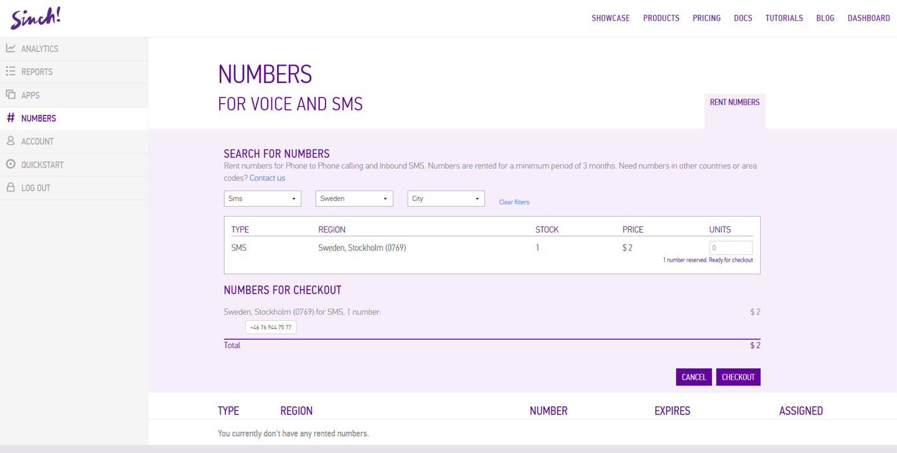
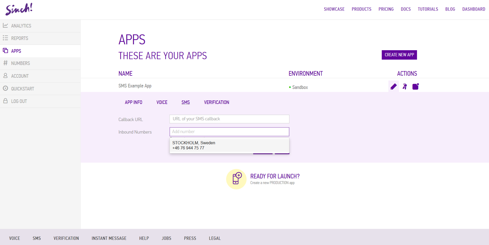
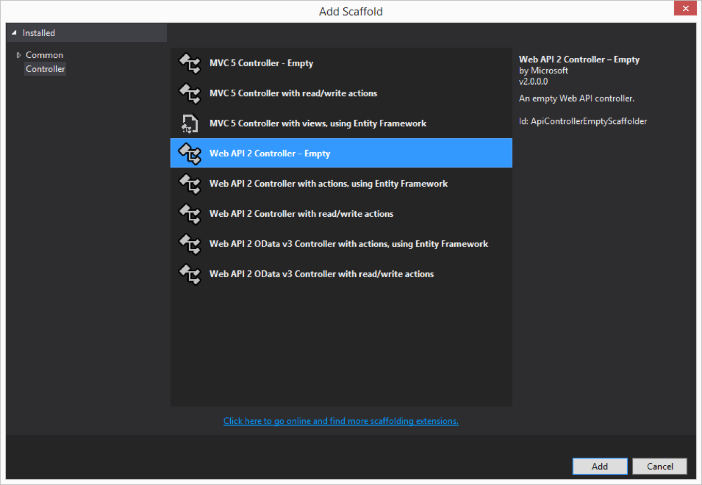

In this second part of the tutorial, we’ll be using the Sinch .Net server-side SDK to receive SMS to your Web API application. If you haven’t already, [check out the first part here](doc:send-an-sms-with-the-sinch-net-server-side-sdk).

## Rent number

Your application will need a phone number for the SMS to be sent to. You can rent numbers through the Sinch dashboard.

Rent a number and make sure the Type is SMS:


Assign this number to the application that should receive the SMS. Click the Pen symbol, then SMS, and select the number you’ve just rented. Click Save.


## Visual Studio

Next, we’ll create a new ASP.NET Web Application in Visual Studio.


Select the Empty ASP.NET 4.5 Template, and select the checkbox for a core reference to Web API:


Right click on References in Solution Explorer and select **“Manage NuGet Packages…”**.

If you’re using an older version of Visual Studio and don’t see this, you’ll need to add it to your Visual Studio from here: <http://docs.nuget.org/consume/installing-nuget>

##Code 
Now, we want to install the Sinch Callback.WebApi package, as well as the Sinch Server SDK NuGet package. Search for `Sinch.ServerSdk.Callback.WebApi` and click **“Install”** for `Sinch.ServerSdk.Callback.WebApi`.


Then, we’ll add a new Controller using the “Web API 2 Controller – Empty” scaffold. Name it **“IncomingMessagesController”**.


Import the following namespace:

`using Sinch.ServerSdk.Messaging.Models;`

Next, we’ll add a post method. Within this method is where you action the SMS sent to the rented number.

The Web API template will make the default route for this method `[POST] /api/incomingmessages`.

Mark the controller as needing validation by adding the “SinchCallback” attribute:

```csharp
[SinchCallback]
public void Post([FromBody]IncomingMessageEvent value)
{
}
```

If this application were hosted now, and the callback URL set on the Sinch dashboard, it would work as expected. However, it would be insecure because anyone could post to that endpoint and mimic an SMS to the number.

## Add validation

To validate that the messages received are only from Sinch and haven’t been tampered with in any way, we’ll add the following to the Global.asax.cs file:

```csharp
using Sinch.ServerSdk;
using Sinch.ServerSdk.Callback.WebApi;
```

Then, append this to the end of the `Application_Start()` method, replacing the application key and secret with your own.

```csharp
var factory = new SinchFactory("00000000-0000-0000-0000-000000000000", "AAAAAAAAAAAAAAAAAAAAAA==");
GlobalConfiguration.Configuration.MessageHandlers.Add(new CallbackMessageHandler(factory));
```

The final step is to register this method as the SMS callback URL on the Sinch dashboard. Host the web application somewhere (AWS, Azure, self-host etc.), and then add the route to the API endpoint as the **“Callback URL”**.


## Chill

And that’s it. Now any request to this Web API application will be validated by the Sinch CallbackMessageHandler to ensure that they are legitimate.

