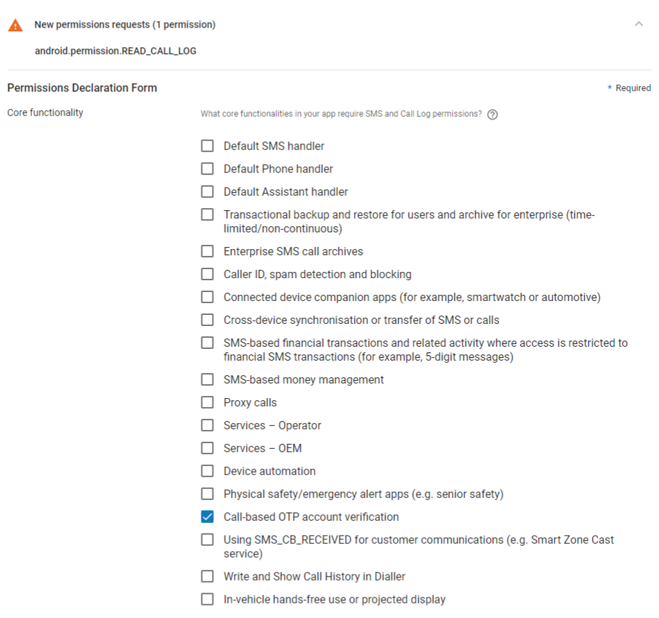

The Sinch Verification SDK makes verifying phone numbers easy. This SDK supports the verification of phone numbers via SMS or flash calls.

This document provides an overview for developers integrating with Sinch Verification SDK for the first time. Please see the [Reference Documentation](http://www.sinch.com/docs/verification/android/reference/) for a comprehensive description of all the classes.

> **WARNING: Important notice #1 - migration to 1.6.x and using using Flash Calls on Android 9**    
>
> Due to newly introduced [restrictions for accessing SMS and call logs](https://support.google.com/googleplay/android-developer/answer/9047303?hl=en), users of older versions of this SDK (`1.5.3` and older) need to remove following permissions from their app manifests, when migration to new version of this SDK (`1.6.0` and newer):
> 
> ```xml
> <uses-permission android:name="android.permission.READ_SMS" />
> <uses-permission android:name="android.permission.RECEIVE_SMS" />
> <uses-permission android:name="android.permission.READ_CALL_LOG" />
> ```


> **WARNING: Important notice #2 - using flash calls on Android 9 and newer versions**    
>
> Removing `<uses-permission android:name="android.permission.READ_CALL_LOG" />` will effectively break flash call feature on Android 9 and newer. If you plan to use flash call feature, you’ll need to keep this permission in your manifest. Since this is one of the permissions restricted in normal use, you’ll have to declare how this permission will be used in your app. Below you’ll find a screenshot that shows properly selected use case for flash calls.




<a class="gitbutton pill" target="_blank" href="https://github.com/sinch/docs/blob/master/docs/verification/verification-for-android.md">
                        <span class="icon medium">
                            <svg xmlns="http://www.w3.org/2000/svg" role="img" viewBox="0 0 24 24"><title>GitHub icon</title><path d="M 12 0.297 c -6.63 0 -12 5.373 -12 12 c 0 5.303 3.438 9.8 8.205 11.385 c 0.6 0.113 0.82 -0.258 0.82 -0.577 c 0 -0.285 -0.01 -1.04 -0.015 -2.04 c -3.338 0.724 -4.042 -1.61 -4.042 -1.61 C 4.422 18.07 3.633 17.7 3.633 17.7 c -1.087 -0.744 0.084 -0.729 0.084 -0.729 c 1.205 0.084 1.838 1.236 1.838 1.236 c 1.07 1.835 2.809 1.305 3.495 0.998 c 0.108 -0.776 0.417 -1.305 0.76 -1.605 c -2.665 -0.3 -5.466 -1.332 -5.466 -5.93 c 0 -1.31 0.465 -2.38 1.235 -3.22 c -0.135 -0.303 -0.54 -1.523 0.105 -3.176 c 0 0 1.005 -0.322 3.3 1.23 c 0.96 -0.267 1.98 -0.399 3 -0.405 c 1.02 0.006 2.04 0.138 3 0.405 c 2.28 -1.552 3.285 -1.23 3.285 -1.23 c 0.645 1.653 0.24 2.873 0.12 3.176 c 0.765 0.84 1.23 1.91 1.23 3.22 c 0 4.61 -2.805 5.625 -5.475 5.92 c 0.42 0.36 0.81 1.096 0.81 2.22 c 0 1.606 -0.015 2.896 -0.015 3.286 c 0 0.315 0.21 0.69 0.825 0.57 C 20.565 22.092 24 17.592 24 12.297 c 0 -6.627 -5.373 -12 -12 -12" /></svg>
                        </span>
                        Edit on GitHub!</a>