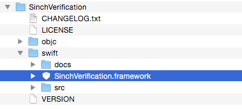
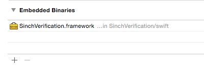
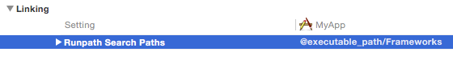
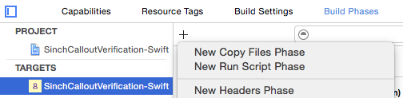
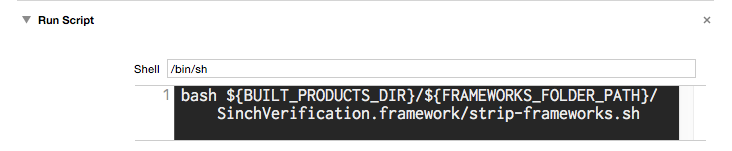
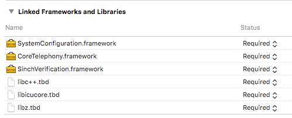

The Sinch Verification iOS SDK is also available for [Swift](https://developer.apple.com/).

## Example usage
```swift
import SinchVerification;

do {

    let input = "<user input>"

    // Get user's current region by carrier info
    let defaultRegion = DeviceRegion.currentCountryCode()

    let phoneNumber = try PhoneNumberUtil().parse(input, defaultRegion:defaultRegion)
    let phoneNumberE164 = PhoneNumberUtil().format(phoneNumber, format: PhoneNumberFormat.E164)

    let verification = SMSVerification(applicationKey:"<APP KEY>", phoneNumber: phoneNumberInE164)

    verification.initiate { (result: InitiationResult, error: NSError?) -> Void in
        // handle outcome
    }

    let code = "<user input code from SMS>"

    verification.verify(code, completion: { (success: Bool, error:NSError?) -> Void in
        // handle outcome
    })

} catch let error as PhoneNumberParseError {
    // Handle phone number parsing error, i.e. invalid user input.
}
```


## Importing the Sinch Verification Swift SDK

### Import as CocoaPod

If you are using [CocoaPods](http://www.cocoapods.org), add the following to your Podfile:
```objectivec
platform :ios, '8.0'

target '<your target>' do
    use_frameworks!
    pod 'SinchVerification-Swift'
end
```


> **Note**    
>
> The directive \`\`use\_frameworks\!\`\` is necessary to make cocoapods add the framework to '*Embedded Binaries*'

#### Note on uploading to App Store / iTunes Connect

If you integrate the Sinch SDK via *CocoaPods*, you must not check the option "Include bitcode" when uploading the application binary. The reason is a [bug in CocoaPods](https://github.com/CocoaPods/CocoaPods/issues/4624). In the upload dialog in Xcode Organizer it should look something like this:


### Import SinchVerification.framework as *Embedded Binaries*

1.  In the Sinch Verification SDK package (SinchVerification-iOS-{VERSION}.tar) there is a *SinchVerification.framework* bundle in the directory named `swift`:



2.  Add it to the Xcode target build settings section *Embedded Binaries* (under *General*):



3.  In the Xcode target build settings, verify that the setting *Runpath Search Paths* is set to `@executable_path/Frameworks`.



4.  Setup to run `strip-frameworks.sh` as a *"Run Script Phase"*
Create a new *"Run Script Phase"* in your application target's *"Build Phases"* and paste the following snippet:

```shell
bash ${BUILT_PRODUCTS_DIR}/${FRAMEWORKS_FOLDER_PATH}/SinchVerification.framework/strip-frameworks.sh
```







(This step is required to work around an [App Store / iTunes Connect bug](http://www.openradar.meradar?id=6409498411401216))

5.  Make sure that *libc++*, *libz* and *libicucore* are linked (See [here](doc:verification-ios-first-time-setup))



**That's it\!**

Now the SDK can be imported as follows (from any of your .swift files)
```swift
import SinchVerification
```


> **Note**    
>
> This import method requires iOS Deployment Target iOS 8.0 or above
       "https://files.readme.io/0f8e419-swift-run-script-contents.png",
        "swift-run-script-contents.png",
        732,
        151,
        "#cecece"
      ]
    }
  ]
}

(This step is required to work around an [App Store / iTunes Connect bug](http://www.openradar.meradar?id=6409498411401216))

5.  Make sure that *libc++*, *libz* and *libicucore* are linked (See [here](doc:verification-ios-first-time-setup))


**That's it\!**

Now the SDK can be imported as follows (from any of your .swift files)
```swift
import SinchVerification
```


> **Note**    
>
> This import method requires iOS Deployment Target iOS 8.0 or above

<div class="magic-block-html"><a class="gitbutton pill" target="_blank" href="https://github.com/sinch/docs/blob/master/docs/verification/verification-for-ios/verification-ios-swift-sdk.md"><span class="icon medium"><svg xmlns="http://www.w3.org/2000/svg" role="img" viewBox="0 0 24 24"><title>GitHub icon</title><path d="M 12 0.297 c -6.63 0 -12 5.373 -12 12 c 0 5.303 3.438 9.8 8.205 11.385 c 0.6 0.113 0.82 -0.258 0.82 -0.577 c 0 -0.285 -0.01 -1.04 -0.015 -2.04 c -3.338 0.724 -4.042 -1.61 -4.042 -1.61 C 4.422 18.07 3.633 17.7 3.633 17.7 c -1.087 -0.744 0.084 -0.729 0.084 -0.729 c 1.205 0.084 1.838 1.236 1.838 1.236 c 1.07 1.835 2.809 1.305 3.495 0.998 c 0.108 -0.776 0.417 -1.305 0.76 -1.605 c -2.665 -0.3 -5.466 -1.332 -5.466 -5.93 c 0 -1.31 0.465 -2.38 1.235 -3.22 c -0.135 -0.303 -0.54 -1.523 0.105 -3.176 c 0 0 1.005 -0.322 3.3 1.23 c 0.96 -0.267 1.98 -0.399 3 -0.405 c 1.02 0.006 2.04 0.138 3 0.405 c 2.28 -1.552 3.285 -1.23 3.285 -1.23 c 0.645 1.653 0.24 2.873 0.12 3.176 c 0.765 0.84 1.23 1.91 1.23 3.22 c 0 4.61 -2.805 5.625 -5.475 5.92 c 0.42 0.36 0.81 1.096 0.81 2.22 c 0 1.606 -0.015 2.896 -0.015 3.286 c 0 0.315 0.21 0.69 0.825 0.57 C 20.565 22.092 24 17.592 24 12.297 c 0 -6.627 -5.373 -12 -12 -12" /></svg></span>Edit on GitHub!</a></div>