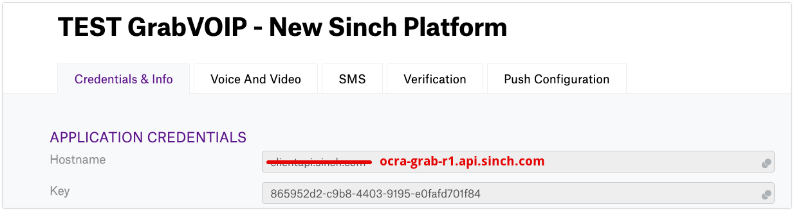

## Migration Instructions

Our new data calling platform brings a lot of improvements, regarding performance, code efficiency, security and latency. Been a trully cloud based product, our services are deployed all over the globe, using the latest cloud technologies available to optimize our voice and video data flow.

Despite all the changes and improvements we have done, we tryed as much as possible to keep those changes as transparent as possible to our customers, however, few changes will be needed, as described bellow.

### **New Platform Integration Phase**

During the initial integration and test phase (we are calling **_Phase 1_**) only new sinch users (users created with the new Cloud SDKs - Sinch Cloud Users) will be used, and only calls between this new users will work. _{Proposed period end February - Mid/end of March}_

After **_Phase 1_**, Sinch will promote a batch user migration, that will replicate users from the OLD Data Calling Platform into the NEW Data Calling Cloud Platform. This will allow calls between New (or migrated) users, Old to Old platform users and Old to New platform users (we are calling it **_Phase 2_**).

During **_Phase 1_** and **_Phase 2_** there will be probably new RC versions created, with fixes and improvements, based on Grab's inputs.

In order to simplify the configuration and add an extra control layer for this initial integration and test phases, we have created a NEW SINCH APPLICATION on Grab's account, called:

> **warning**
> Please use only this new app to test the new SDKs!

## Changes:

### APN:

- Upload New APNs Key (.p8 file) instead of APN Certificates.

During the test phase of the new platform customer's will need to upload their APNS key file to a private S3 bucket (credentials will be shared directly - Contact jorge.siqueira@sinch.com)

Before production release, the keys will be upladed via Sinch portal.

Our new Sinch Push Service has changed the way we stablish a trusted connection to APNs.
Instead of using APN [Certificates-based](https://developer.apple.com/documentation/usernotifications/setting_up_a_remote_notification_server/establishing_a_certificate-based_connection_to_apns?language=objc) to connect Sinch's Push service to APNs, our new platform now uses APN [Token-based](https://developer.apple.com/documentation/usernotifications/setting_up_a_remote_notification_server/establishing_a_token-based_connection_to_apns?language=objc) connections.

#### How to create a key

### FCM:

- No Changes required

### SDK Changes:

Release Candidate SDK versions

[IOS 5.0 SDK - RC1](https://download.sinch.com/ios/5.0.0/Sinch-iOS-5.0.0-RC1-c44fd98d.tar.bz2)
| Release Candidate 1 - Do not use in Production!

Other Downloads:
[SDK Checksum](https://download.sinch.com/ios/5.0.0/Sinch-iOS-5.0.0-RC1-c44fd98d.tar.bz2)

[ANDROID 4.0 SDK - RC1](https://download.sinch.com/android/4.0.0/sinch-android-rtc-4.0.0_87.zip)
| Release Candidate 1 - Do not use in Production!

Other Downloads:
[SDK Checksum](https://download.sinch.com/android/4.0.0/sinch-android-rtc-4.0.0_87.SHA256SUMS) |
[Debug Symbols](https://download.sinch.com/android/4.0.0/sinch-android-rtc-4.0.0-87_debug-symbols.zip)

### Authentication Changes:

- Check Changes on our [Application Authentication](doc:voice-ios-cloud-application-authentication) session

- FOr full details, please check our [IOS](doc:voice-ios-cloud-first-time-setup) and [Android](doc:voice-android-cloud-first-time-setup) documentation.

and Android new docs on GitHub

### REST API / Endpoint Changes

- Need to Double Check, if the API's will change, due to onPrem and Cloud changes!!!
