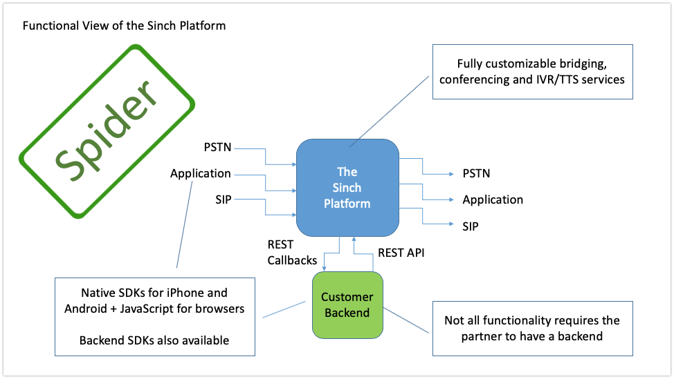
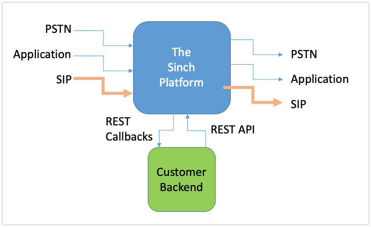

## Overview

When using Sinch for voice calling, the Sinch platform can be seen as a big telephony switch. It receives incoming phone calls (also known as _incoming call “legs”_), sets up outgoing phone calls (also known as _outgoing call “legs”_), and bridges the two. In Sinch SIP trunking service the _incoming call legs_ and _outgoing call legs_ is to your own SIP infrastructure such as a SIP IP-PBX, SBC or similar equipment. Using SIP trunking together with [Callback API](doc:voice-rest-api-callback-api) you can combine all different types of _incoming calls_ and _outgoing calls_ the Sinch platform supports, including for example Call recording and conference rooms.

## Sending calls to Sinch platform from your SIP infrastructure (SIP-terminated calls)

SIP-terminated calls are calls that are being routed from your SIP infrastructure to the Sinch platform through a SIP interconnection/trunk.

Sinch has multiple geographical regions. You can configure your SIP infrastructure to use any of Sinch geographical locations.

> Europe:
> euc1.sip.sinch.com
>
> North America:
> use1.sip.sinch.com
>
> South America:
> sae1.sip.sinch.com
>
> Southeast Asia:
> apse1.sip.sinch.com
>
> Australia:
> apse2.sip.sinch.com

For redundancy, Sinch uses the above FQDNs. This will return to you at least one active and working SIP endpoint to send your traffic to. When using these FQDNs as a Termination URI that is used by your communications infrastructure to direct SIP traffic towards Sinch. For each region we have 2 IP addresses that are used for reliability purposes (see IP address in whitelists section). Each of these IP addresses represents a unique public edge for our SIP Trunking services, distributed across multiple Availability Zones for reliability purposes. Sinch strongly recommends to use this FQDN names for sending traffic towards Sinch. If using an FQDN is not possible, make sure you are not restricted to use only one single IP address. Make sure to utilize all IP addresses and failover in case one IP is not responding.

Once the call arrives in the Sinch platform, your backend will get an Incoming Call Event callback, notifying of the incoming call. You can control how you would like the call to be connected by responding to this event, for details in how and what you can respond check out [Callback API](doc:voice-rest-api-callback-api). If no callback is specified in Sinch dashboard, Sinch will try to terminate your call to PSTN using _To address_ in your incoming SIP message as destination phone number.

Both UDP or TCP are supported for calls terminating to Sinch.

Allowed caller ID number (CLI) for terminating calls. You must specify a caller ID number that corresponds to a Sinch DID on your account or a phone number verified in your Sinch dashboard. If this isn't set, Sinch will set _private_ as your caller ID number going out to PSTN network.

In order to use a trunk for termination it must have a Termination SIP URI and at least one authentication scheme, see below.

### Authentication

You need to authenticate your SIP infrastructure to make outbound calls via the Sinch SIP trunk:

> Host: \{region\}.sip.sinch.com
>
> Username/Authenticationname: Your Sinch Application Key
>
> Password: Your Sinch Application Secret

### SIP termination example

Example SIP INVITE sent to Sinch with SIP termination:

> Request-Line: INVITE sip:+12345678900@sip-euc1.sinch.com SIP/2.0
>
> From: <sip:+19876543210@sip.sinch.com>;tag=as09cb5a21
>
> To: <sip:+12345678900@sip-euc1.sinch.com>
>
> Contact: <sip:+19876543210@52.214.25.57:5060>

Make sure that any phone number sent via SIP to Sinch are always E.164-formatted (e.g _+12345678900_).

## Receiving calls from Sinch platform to your SIP infrastructure

You can route any type of call from the Sinch platform to your SIP server. You can automatically forward calls to your SIP server using the SIP forwarding option in the Sinch Portal (setting available under Apps >> Voice and Video >> Connect Calls). If you need more control, you can instruct a call to be connected to your SIP server by responding to the Incoming Call Event callback with the [ConnectSIP](doc:voice-rest-api-callback-api#section-connectsip) action.

PICTURE? (SPIDER, foucous in this callleg?)

If you want a private header in incoming calls to your SIP infrastructre use [SetCookie](doc:voice-rest-api-callback-api#section-setcookie) instruction in your callback response X-headers.

    {
        "name" : "SetCookie",
        "key" : "X-My-Header",
        "value" : "This is my header"
    }

### SIP origination example

Example SIP INVITE sent to your SIP infrastructure:

> Request-Line: INVITE sip:+123456789@company.com SIP/2.0
>
> Record-Route: <sip:18.184.175.4;ftag=as386cfb27;lr=on>
>
> Via: SIP/2.0/UDP 18.184.175.4:5060;branch=z9hG4bKd43d.c0cbe68202c12a896a67e9451d13adc2.0
>
> From: <sip:+46733478561@18.194.168.245>;tag=as386cfb27
>
> To: <sip:4690001@52.214.25.57>
>
> Contact: <sip:+46733478561@18.194.168.245:5060>
>
> X-My-Header: This is my header

## IP whitelisting

You must whitelist _ALL_ of Sinch IP addresses and ports on your firewall for SIP signalling and RTP media traffic.

### SIP

You need to allow your SIP server to receive traffic from this IP. Sinch recommends that you whitelist all of its IP addresses.

  

    <table>
      <thead>
        <tr class="header">
          <th align="left">Geographical location</th>
          <th align="left">IP address</th>
        </tr>
      </thead>
      <tbody>
        <tr class="odd">
          <td align="left">Europe</td>
          <td align="left">18.184.175.4/32   18.196.245.254/32</td>
        </tr>
        <tr class="even">
          <td align="left">North America</td>
          <td align="left">34.194.41.43/32   34.197.97.9/32</td>
        </tr>
        <tr class="odd">
          <td align="left">South America</td>
          <td align="left">52.67.242.103/32   54.233.100.129/32</td>
        </tr>
        <tr class="even">
          <td align="left">Southeast Asia</td>
          <td align="left">52.74.7.178/32   54.251.177.8/32</td>
        </tr>
        <tr class="odd">
          <td align="left">Australia</td>
          <td align="left">13.210.20.49/32   13.210.220.180/32</td>
        </tr>
      </tbody>
    </table>
  

### RTP

Sinch scales its media resources on demand and therefore has no fixed set of IP addresses where it sends media from. Media always comes from the same port range though.

> RTP ports used: 10000 - 20000

### Codecs

Sinch currently supports the following codecs:

> G.711u
> G.711a
> Opus
> G.729
