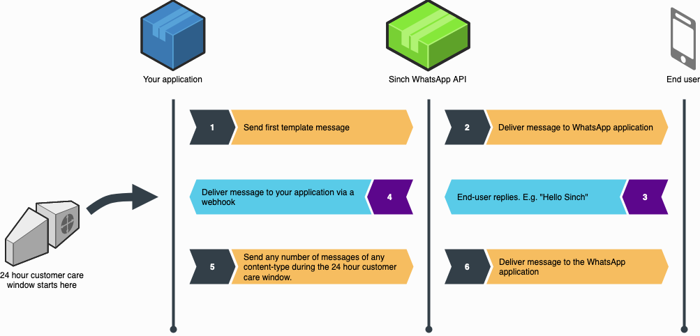

The message endpoint is used as the primary endpoint of the API and this is where all the messages are sent through.

**WhatsApp message flow**



1.  Customer opt-in is essential before sending any messages.
2.  Businesses can only start a conversation with a defined message template.
3.  Once you get a reply from your customer, a *customer care session* starts. You can then send “session” rich content messages for 24 hours.
4.  Every time a customer replies to one of your messages, a new 24-hour cycle starts.
5.  If a “session” expires, you’ll need to re-initiate a conversation, starting with a defined message template again.
6.  Customers can start a rich content conversation with a business at any time  
    -   this opens up a new 24-hour session.

## Supported Content-Types

The Sinch WhatsApp API supports several media types. In the table below you can find what content-types are supported by the API.

## Send a WhatsApp message

#### Request
`POST whatsapp/v1/{bot-id}/messages`

JSON object parameters:

| Name    | Description                                                          | JSON Type    | Default    | Constraints           | Required |
| ------- | -------------------------------------------------------------------- | ------------ | ---------- | --------------------- | :------: |
| to      | List of MSISDNs and group IDs                                        | String array | N/A        | 1 to 20 elements      | Yes      |
| message | Message object                                                       | Object       | N/A        | Valid Message object  | Yes      |
| callback| Callback URL to overwrite configured callback URL for status updates | String       | N/A        | Valid URL             | No       |


### Message object types

The types of messages that can be sent are one of the following:


#### Template message

JSON object parameters:

| Name          | Description                                                          | JSON Type    | Default    | Constraints           | Required |
| ------------- | -------------------------------------------------------------------- | ------------ | ---------- | --------------------- | :------: |
| type          | Constant value `template`                                            | String       | N/A        | N/A                   | Yes      |
| template_name | Name of the template                                                 | String       | N/A        | N/A                   | Yes      |
| language      | Language to send the template in                                     | String       | `en`       | Language codes and locales (e.g `en`, `en_us`) | No       |
| params        | Parameters to inject into the template.                              | String       | N/A        | N/A                   | Yes      |
| ttl           | Time to live of the template message. If the receiver has not opened the template message before the time to live expires, the message will be deleted and a failed callback will be sent. The time to live can be specified in ISO-8601 Duration format or in seconds as a string. | String       | 30 Days    | Valid URL             | No      |

**Sample**
```json
{
  "to": [
    "46732001122",
    "group:447506616260-1565342732"
  ],
  "message": {
    "type": "template",
    "template_name": "sinch_test_greeting",
    "language": "en",
    "params": [
      "Nick"
    ],
    "ttl": "P1D"
  }
}
```

#### Text message

JSON object parameters:

| Name        | Description                                                          | JSON Type    | Default    | Constraints           | Required |
| ----------- | -------------------------------------------------------------------- | ------------ | ---------- | --------------------- | :------: |
| type        | Constant value `text`                                                | String       | N/A        | N/A                   | Yes      |
| preview_url | Message object                                                       | Boolean      | false      | `true` or `false`     | No       |
| text        | The text message content                                             | String       | N/A        | Valid URL             | Yes      |

**Sample**
```json
{
  "to": [
    "46732001122",
    "group:447506616260-1565342732"
  ],
  "message": {
    "type": "text",
    "preview_url": false,
    "text": "Greetings from Sinch"
  }
}
```

#### Image message

JSON object parameters:

| Name        | Description                                                          | JSON Type    | Default    | Constraints           | Required |
| ----------- | -------------------------------------------------------------------- | ------------ | ---------- | --------------------- | :------: |
| type        | Constant value `image`                                               | String       | N/A        | N/A                   | Yes      |
| url         | Public url of the image file                                         | String       | N/A        | `image/jpeg` or `image/png` | Yes      |
| caption     | Optional caption that will be displayed underneath the image.        | String       | None       | N/A                   | No       |

**Sample**
```json
{
  "to": [
    "46732001122",
    "group:447506616260-1565342732"
  ],
  "message": {
    "type": "image",
    "url": "https://example.com/image.jpg",
    "caption": "Example Image"
  }
}
```

#### Video message

JSON object parameters:

| Name        | Description                                                          | JSON Type    | Default    | Constraints           | Required |
| ----------- | -------------------------------------------------------------------- | ------------ | ---------- | --------------------- | :------: |
| type        | Constant value `video`                                               | String       | N/A        | N/A                   | Yes      |
| url         | Public url of the video file (mp4)                                   | String       | N/A        | `mp4`, H.264 video codec and AAC audio codec | Yes      |
| caption     | Optional caption that will be displayed underneath the video.        | String       | None       | N/A                   | No       |

**Sample**
```json
{
  "to":[
    "46732001122",
    "group:447506616260-1565342732"
  ],
  "message":{
    "type": "video",
    "url": "https://example.com/video.mp4",
    "caption": "Example Video"
  }
}
```

#### Document message

JSON object parameters:

| Name        | Description                                                          | JSON Type    | Default    | Constraints           | Required |
| ----------- | -------------------------------------------------------------------- | ------------ | ---------- | --------------------- | :------: |
| type        | Constant value `video`                                               | String       | N/A        | N/A                   | Yes      |
| url         | Public url of the document file                                      | String       | N/A        | `application/pdf`, `application/msword`, `application/vnd.ms-powerpoint`, `application/vnd.ms-excel`, `text/plain` | Yes      |
| caption     | Optional caption that will be displayed as the document title.       | String       | None       | N/A                   | No       |

**Sample**
```json
{
  "to": [
    "46732001122",
    "group:447506616260-1565342732"
  ],
  "message": {
    "type": "document",
    "url": "https://example.com",
    "caption": "Example study",
    "filename": "document.pdf"
  }
}
```

#### Audio message

JSON object parameters:

| Name        | Description                                                          | JSON Type    | Default    | Constraints           | Required |
| ----------- | -------------------------------------------------------------------- | ------------ | ---------- | --------------------- | :------: |
| type        | Constant value `video`                                               | String       | N/A        | N/A                   | Yes      |
| url         | Public url of the document file                                      | String       | N/A        | `audio/acc`, `audio/mp4`, `audio/amr`, `audio/mpeg`, `audio/ogg`, codecs=opus | Yes      |

**Sample**
```json
{
  "to": [
    "46732001122",
    "group:447506616260-1565342732"
  ],
  "message": {
    "type": "audio",
    "url": "https://example.com/song.mp3"
  }
}
```


#### Location message

JSON object parameters:

| Name        | Description                                                          | JSON Type    | Default    | Constraints           | Required |
| ----------- | -------------------------------------------------------------------- | ------------ | ---------- | --------------------- | :------: |
| type        | Constant value `location`                                            | String       | N/A        | N/A                   | Yes      |
| lat         | The latitude position as a float number.                             | Number       | N/A        | [-90, 90]             | Yes      |
| lng         | The longitude position as a float number.                            | Number       | N/A        | [-180, 180]           | Yes      |
| name        | The name for the location. Will be displayed in the message.         | String       | N/A        | N/A                   | No       |
| address     | The address for the location. Will be displayed in the message.      | String       | N/A        | N/A                   | No       |

**Sample**
```json
{
  "to": [
    "46732001122",
    "group:447506616260-1565342732"
  ],
  "message": {
    "type": "location",
    "lat": 55.7047,
    "lng": 13.191,
    "name": "Sinch Ideon Lund",
    "address": "Scheelevägen 17"
  }
}
```
#### Contacts message

JSON object parameters:

| Name        | Description                                                          | JSON Type    | Default    | Constraints           | Required |
| ----------- | -------------------------------------------------------------------- | ------------ | ---------- | --------------------- | :------: |
| type        | Constant value `contacts`                                            | String       | N/A        | N/A                   | Yes      |
| contacts    | List of contact cards                                                | Object array | N/A        | Valid contact cards   | Yes      |

**Contact card**

|Name       | Description                                                        | JSON Type     | Default    | Constraints           | Required |
|-----------|------------------------------------------------------------------- |---------------| ---------- | --------------------- | :------: |
|name       | List of contact full name information                              | Object array  | N/A        | Valid contact name    | Yes      |
|addresses  | List of contact address(e)                                         | Object array  | N/A        | N/A                   | No       |
|birthday   | Contact's birthday, YYYY-MM-DD formatted string                    | String        | N/A        | N/A                   | No       |
|email      | List of of contact email address(es)                               | Object array  | N/A        | N/A                   | No       |
|org        | List of contact organization information                           | Object array  | N/A        | N/A                   | No       |
|phones     | List of contact phone number(s)                                    | Object array  | N/A        | N/A                   | No       |
|urls       | List of contact URL(s)                                             | Object array  | N/A        | N/A                   | No       |

**Contact address**

|Name         | Description                                                        | JSON Type     | Default    | Constraints           | Required |
|-------------|--------------------------------------------------------------------|---------------| ---------- | --------------------- | :------: |
|city         | City name                                                          | String        | N/A        | N/A                   | Yes      |
|type         | Type of address, `HOME`, `WORK`                                    | String        | N/A        | N/A                   | No       |
|street       | Street number and address                                          | String        | N/A        | N/A                   | No       |
|state        | State abbreviation                                                 | String        | N/A        | N/A                   | No       |
|zip          | ZIP code                                                           | String        | N/A        | N/A                   | No       |
|country      | Full country name                                                  | String        | N/A        | N/A                   | No       |
|country_code | Two-letter country abbreviation                                    | String        | N/A        | N/A                   | No       |

**Contact email**

|Name         | Description                                                        | JSON Type     | Default    | Constraints           | Required |
|-------------|--------------------------------------------------------------------|---------------| ---------- | --------------------- | :------: |
|email        | Email address                                                      | String        | N/A        | N/A                   | Yes      |
|type         | Type of email address, `HOME`, `WORK`                              | String        | N/A        | N/A                   | No       |

**Contact name**

|Name           | Description                                                        | JSON Type     | Default    | Constraints           | Required |
|---------------|--------------------------------------------------------------------|---------------| ---------- | --------------------- | :------: |
|formatted_name | Full name as it normally appears                                   | String        | N/A        | N/A                   | Yes      |
|first_name     | First name                                                         | String        | N/A        | N/A                   | No       |
|last_name      | Last name                                                          | String        | N/A        | N/A                   | No       |
|middle_name    | Middle name                                                        | String        | N/A        | N/A                   | No       |
|suffix         | Name suffix                                                        | String        | N/A        | N/A                   | No       |
|prefix         | Name prefix                                                        | String        | N/A        | N/A                   | No       |

**Contact organization**

|Name           | Description                                                        | JSON Type     | Default    | Constraints           | Required |
|---------------|--------------------------------------------------------------------|---------------| ---------- | --------------------- | :------: |
|company        | Name of the contact's company                                      | String        | N/A        | N/A                   | Yes      |
|department     | Name of the contact's department                                   | String        | N/A        | N/A                   | No       |
|title          | Contact's business title                                           | String        | N/A        | N/A                   | No       |

**Contact phone number**

|Name         | Description                                                           | JSON Type     | Default    | Constraints           | Required |
|-------------|-----------------------------------------------------------------------|---------------| ---------- | --------------------- | :------: |
|phone        | Automatically populated with the WhatsApp phone number of the contact | String        | N/A        | N/A                   | Yes      |
|type         | Type of phone number, `CELL`, `MAIN`, `HOME`, `WORK`, `IPHONE`        | String        | N/A        | N/A                   | No       |

**Contact URL**

|Name         | Description                                                           | JSON Type     | Default    | Constraints           | Required |
|-------------|-----------------------------------------------------------------------|---------------| ---------- | --------------------- | :------: |
|url          | URL                                                                   | String        | N/A        | N/A                   | Yes      |
|type         | Type of URL `HOME`,  `WORK`                                           | String        | N/A        | N/A                   | No       |


**Sample**
```json
{
  "to": [
    "46732001122",
    "group:447506616260-1565342732"
  ],
  "message": {
    "type": "contacts",
    "contacts": [
      {
        "addresses": [
          {
            "city": "Menlo Park",
            "country": "United States",
            "country_code": "us",
            "state": "CA",
            "street": "1 Hacker Way",
            "type": "HOME",
            "zip": "94025"
          }
        ],
        "birthday": "2012-08-18",
        "emails": [
          {
            "email": "test@fb.com",
            "type": "WORK"
          }
        ],
        "name": {
          "first_name": "John",
          "formatted_name": "John Smith",
          "last_name": "Smith"
        },
        "org": {
          "company": "WhatsApp",
          "department": "Design",
          "title": "Manager"
        },
        "phones": [
          {
            "phone": "+1 (650) 555-1234",
            "type": "WORK",
            "wa_id": "16505551234"
          }
        ],
        "urls": [
          {
            "url": "https://www.facebook.com",
            "type": "WORK"
          }
        ]
      }
    ]
  }
}
```

#### Response

`201 Created`

The response body is a JSON object with the same format as a [delivery report callback](doc:whatsapp-callback#section-delivery-report-callback).

```json
{
  "type": "whatsapp",
  "statuses":[
    {
      "message_id":"f1690238-9c72-49c3-b1c6-b701f8765732",
      "recipient":"+46732001122",
      "status":"success",
      "state":"queued"
    },
  ]
}
```

`400 Bad Request`

There was an error with your request. The body is a JSON object described in the [introduction](doc:whatsapp-introduction#section-http-errors).

`401 Unauthorized`

There was an authentication error with your request. Either you're using incorrect credentials or you're attempting to authenticate
in a region where your bot does not reside. The body is a JSON object described in the [introduction](doc:whatsapp-introduction#section-http-errors).
